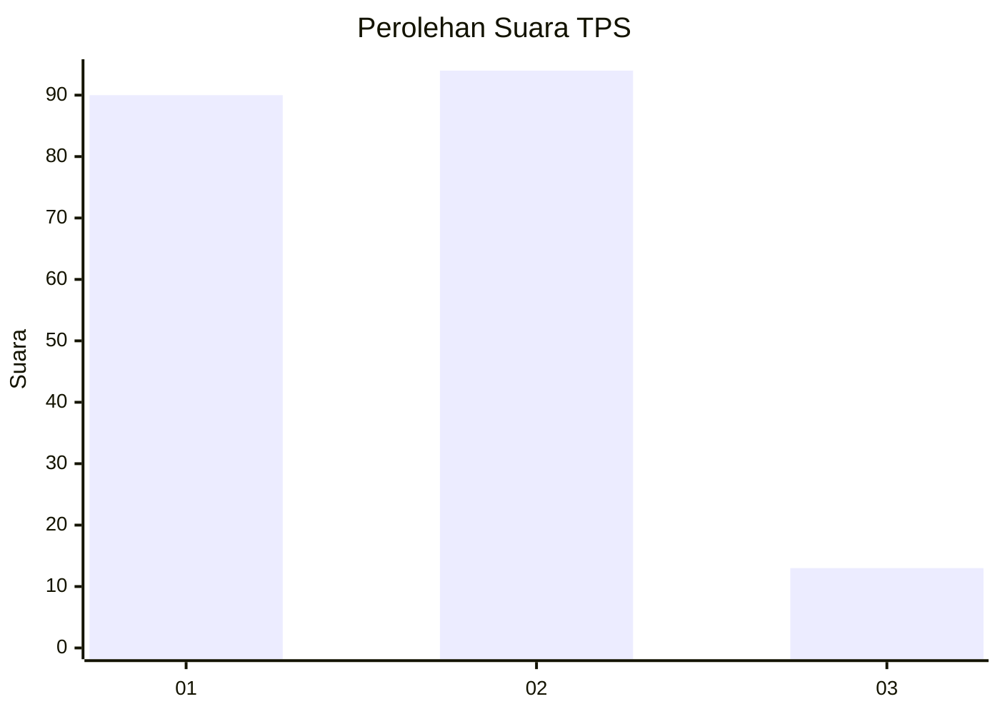
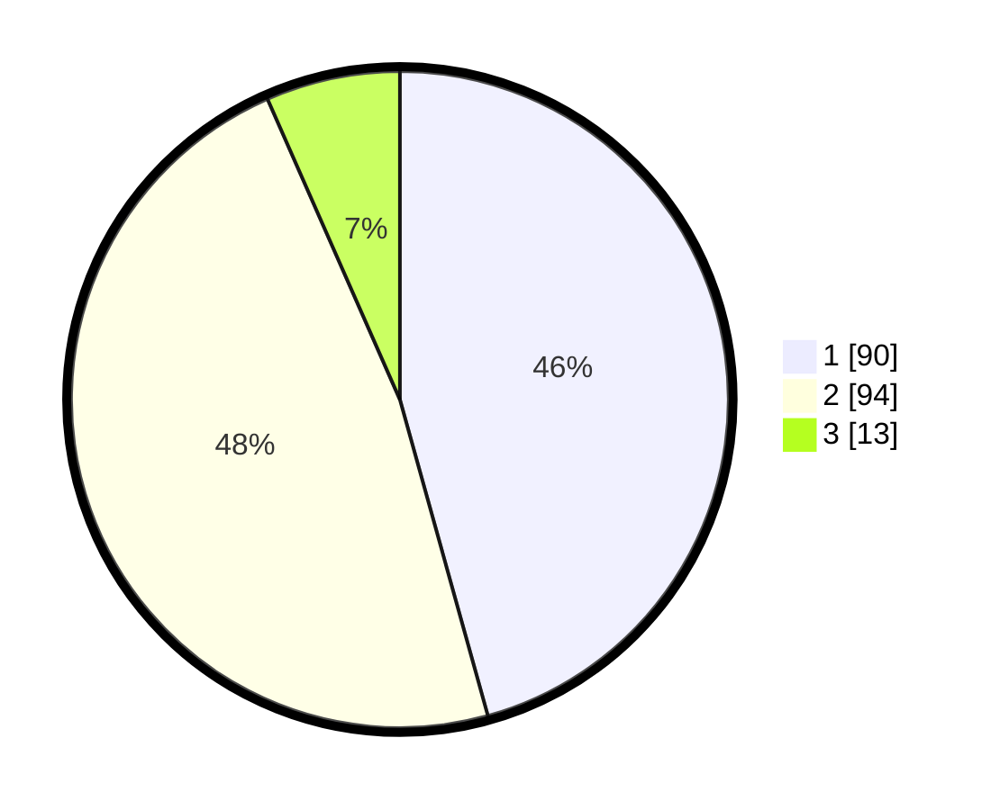

# Hasil

## Grafik

## Tabel

| No. | Nama Paslon    | Suara | Suara (raw) | Persentase |
|:--- |:-------------- | -----:| -----------:| ----------:|
| 1   | ANIES MUHAIMIN | 90    | [90][p-1]   | 45,69      |
| 2   | PRABOWO GIBRAN | 94    | [94][p-2]   | 47,72      |
| 3   | GANJAR MAHFUD  | 13    | [13][p-3]   | 6,60       |

[p-1]: https://github.com/gigit-pemilu/pemilu-2024/blob/main/pilpres/hitung-suara/sub/32-jawa-barat/sub/07-ciamis/sub/31-sindangkasih/sub/2001-sindangkasih/sub/001-tps/sub/paslon-1.txt
[p-2]: https://github.com/gigit-pemilu/pemilu-2024/blob/main/pilpres/hitung-suara/sub/32-jawa-barat/sub/07-ciamis/sub/31-sindangkasih/sub/2001-sindangkasih/sub/001-tps/sub/paslon-2.txt
[p-3]: https://github.com/gigit-pemilu/pemilu-2024/blob/main/pilpres/hitung-suara/sub/32-jawa-barat/sub/07-ciamis/sub/31-sindangkasih/sub/2001-sindangkasih/sub/001-tps/sub/paslon-3.txt

## Foto C Plano

https://sirekap-obj-formc.kpu.go.id/d504/pemilu/ppwp/32/07/31/20/01/3207312001001-20240214-141238--a23e9b88-8ee2-492a-b798-fe57b0d734bf.jpg

https://sirekap-obj-formc.kpu.go.id/d504/pemilu/ppwp/32/07/31/20/01/3207312001001-20240214-141119--012d4121-b5c3-41a9-826b-eb6470f0c5da.jpg

https://sirekap-obj-formc.kpu.go.id/d504/pemilu/ppwp/32/07/31/20/01/3207312001001-20240214-141328--ed1b96cd-33cf-4908-bee8-f6cc3be62639.jpg

## Metadata

| Key        | Value               |
| ---------- | ------------------- |
| Time Stamp | 2024-02-16 10:00:28 |

