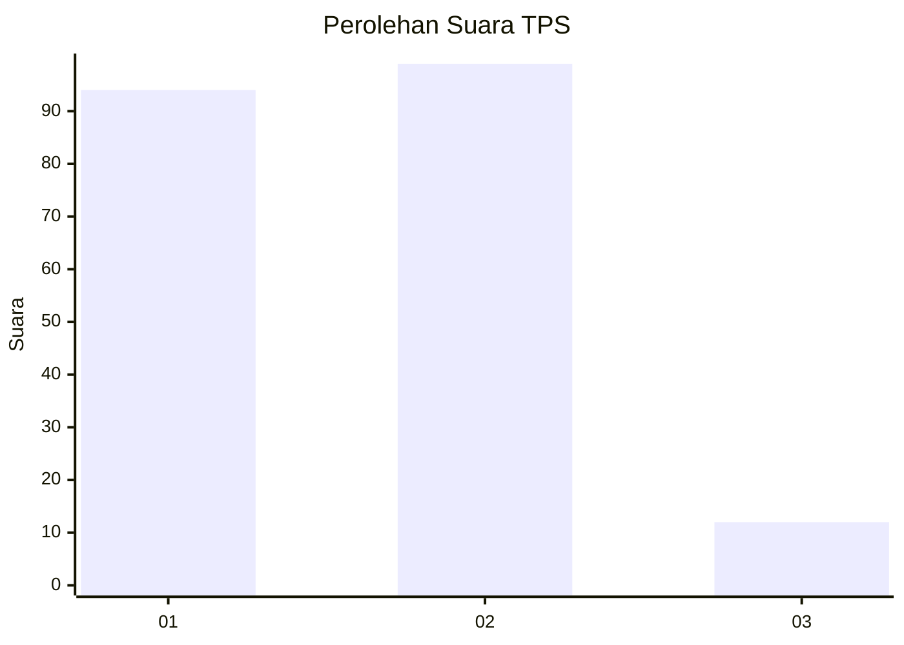
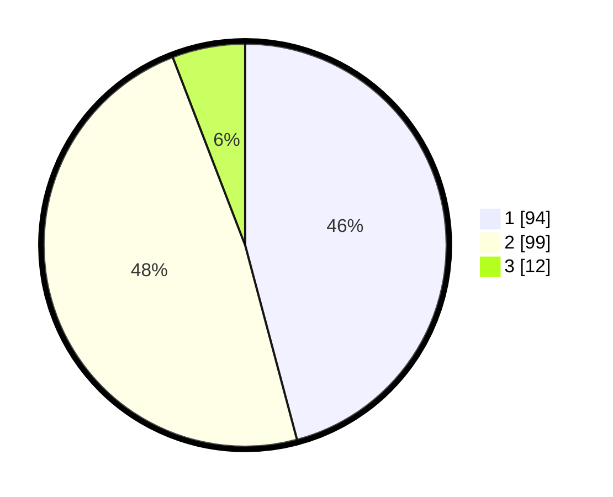

# Hasil

## Grafik

## Tabel

| No. | Nama Paslon    | Suara | Suara (raw) | Persentase |
|:--- |:-------------- | -----:| -----------:| ----------:|
| 1   | ANIES MUHAIMIN | 94    | [94][p-1]   | 45,85      |
| 2   | PRABOWO GIBRAN | 99    | [99][p-2]   | 48,29      |
| 3   | GANJAR MAHFUD  | 12    | [12][p-3]   | 5,85       |

[p-1]: https://github.com/gigit-pemilu/pemilu-2024-32-jawa-barat/blob/main/pilpres/hitung-suara/sub/32-jawa-barat/sub/07-ciamis/sub/31-sindangkasih/sub/2001-sindangkasih/sub/006-tps/sub/paslon-1.txt
[p-2]: https://github.com/gigit-pemilu/pemilu-2024-32-jawa-barat/blob/main/pilpres/hitung-suara/sub/32-jawa-barat/sub/07-ciamis/sub/31-sindangkasih/sub/2001-sindangkasih/sub/006-tps/sub/paslon-2.txt
[p-3]: https://github.com/gigit-pemilu/pemilu-2024-32-jawa-barat/blob/main/pilpres/hitung-suara/sub/32-jawa-barat/sub/07-ciamis/sub/31-sindangkasih/sub/2001-sindangkasih/sub/006-tps/sub/paslon-3.txt

## Foto C Plano

https://sirekap-obj-formc.kpu.go.id/8e31/pemilu/ppwp/32/07/31/20/01/3207312001006-20240214-212757--7d3f0cff-8129-48c5-8fa2-a171c50297de.jpg

https://sirekap-obj-formc.kpu.go.id/8e31/pemilu/ppwp/32/07/31/20/01/3207312001006-20240214-211636--2d28eb5b-ed1c-4c5e-b86d-961a71c0d28f.jpg

https://sirekap-obj-formc.kpu.go.id/8e31/pemilu/ppwp/32/07/31/20/01/3207312001006-20240214-203811--54b1282c-1e17-42ed-b16a-5ed6b6d956bf.jpg

## Metadata

| Key        | Value               |
| ---------- | ------------------- |
| Time Stamp | 2024-02-15 00:41:44 |

