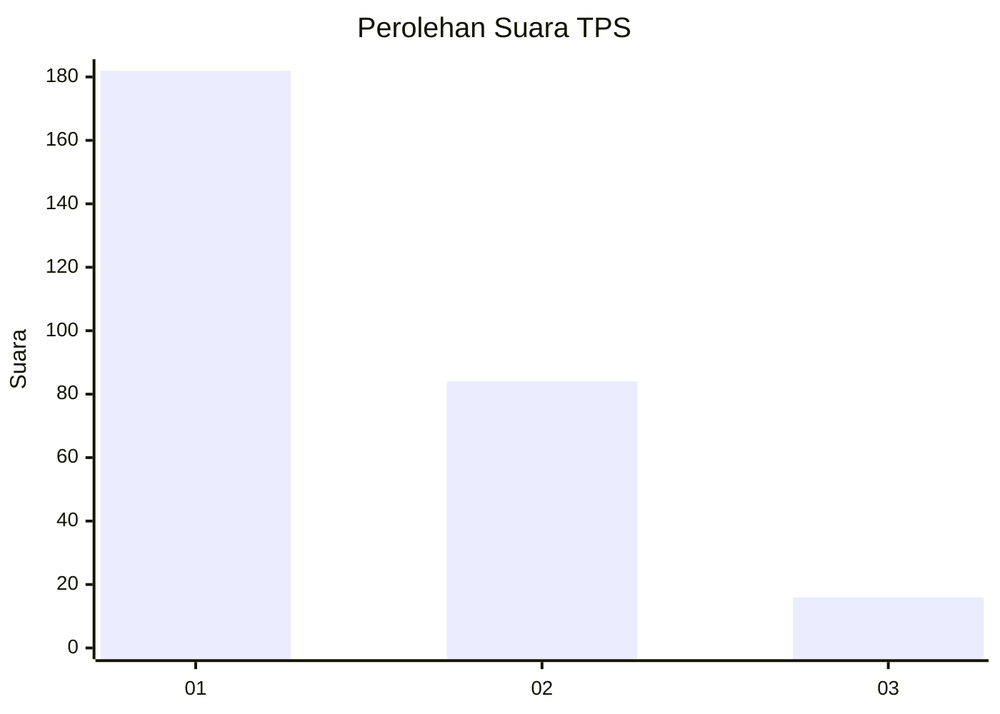
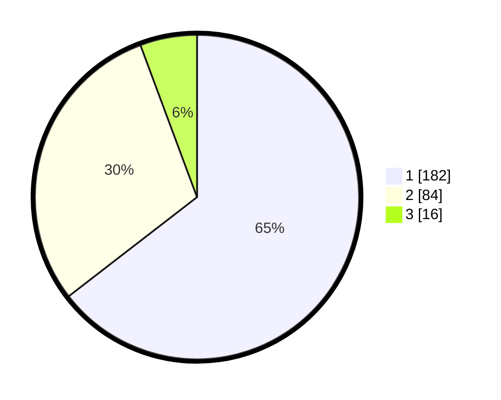

# Hasil

## Grafik

## Tabel

| No. | Nama Paslon    | Suara | Suara (raw) | Persentase |
|:--- |:-------------- | -----:| -----------:| ----------:|
| 1   | ANIES MUHAIMIN | 182   | [182][p-1]  | 64,54      |
| 2   | PRABOWO GIBRAN | 84    | [84][p-2]   | 29,79      |
| 3   | GANJAR MAHFUD  | 16    | [16][p-3]   | 5,67       |

[p-1]: https://github.com/gigit-pemilu/pemilu-2024-32-jawa-barat/blob/main/pilpres/hitung-suara/sub/32-jawa-barat/sub/07-ciamis/sub/31-sindangkasih/sub/2003-budiasih/sub/001-tps/sub/paslon-1.txt
[p-2]: https://github.com/gigit-pemilu/pemilu-2024-32-jawa-barat/blob/main/pilpres/hitung-suara/sub/32-jawa-barat/sub/07-ciamis/sub/31-sindangkasih/sub/2003-budiasih/sub/001-tps/sub/paslon-2.txt
[p-3]: https://github.com/gigit-pemilu/pemilu-2024-32-jawa-barat/blob/main/pilpres/hitung-suara/sub/32-jawa-barat/sub/07-ciamis/sub/31-sindangkasih/sub/2003-budiasih/sub/001-tps/sub/paslon-3.txt

## Foto C Plano

https://sirekap-obj-formc.kpu.go.id/290d/pemilu/ppwp/32/07/31/20/03/3207312003001-20240214-215935--07ffd878-6f35-462f-9f32-3aaa8403eebf.jpg

https://sirekap-obj-formc.kpu.go.id/290d/pemilu/ppwp/32/07/31/20/03/3207312003001-20240214-220049--145e24fa-41c4-4d31-802a-30e1c611a772.jpg

https://sirekap-obj-formc.kpu.go.id/290d/pemilu/ppwp/32/07/31/20/03/3207312003001-20240214-220141--7874ae73-5939-44a9-b477-b6760f953a48.jpg

## Metadata

| Key        | Value               |
| ---------- | ------------------- |
| Time Stamp | 2024-02-16 00:00:26 |

