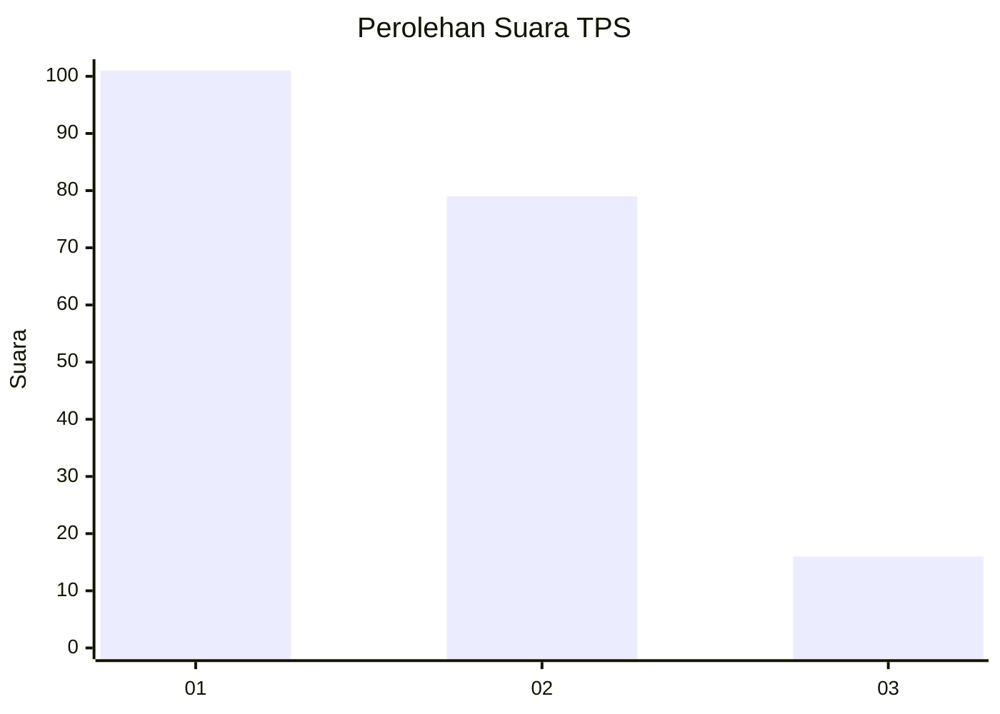
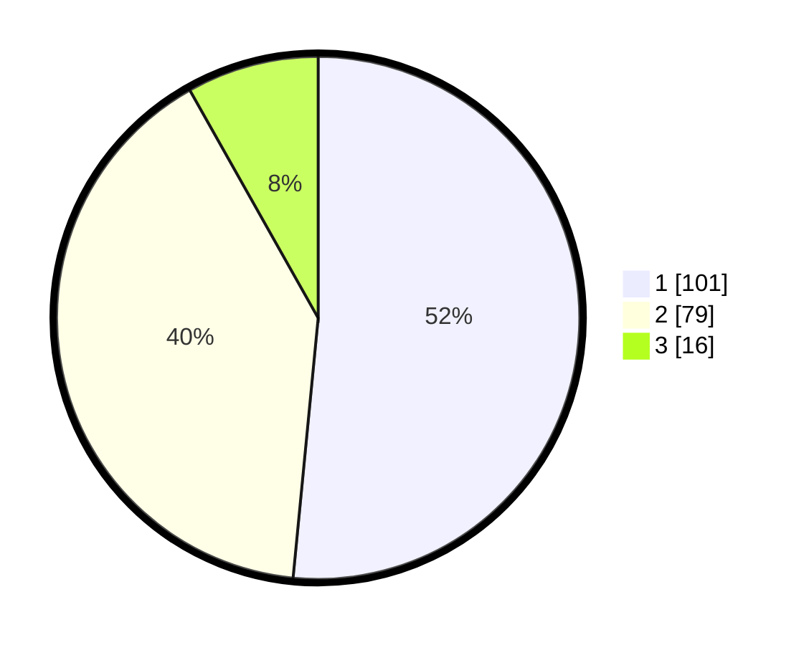

# Hasil

## Grafik

## Tabel

| No. | Nama Paslon    | Suara | Suara (raw) | Persentase |
|:--- |:-------------- | -----:| -----------:| ----------:|
| 1   | ANIES MUHAIMIN | 101   | [101][p-1]  | 51,53      |
| 2   | PRABOWO GIBRAN | 79    | [79][p-2]   | 40,31      |
| 3   | GANJAR MAHFUD  | 16    | [16][p-3]   | 8,16       |

[p-1]: https://github.com/gigit-pemilu/pemilu-2024/blob/main/pilpres/hitung-suara/sub/32-jawa-barat/sub/07-ciamis/sub/32-baregbeg/sub/2001-baregbeg/sub/001-tps/sub/paslon-1.txt
[p-2]: https://github.com/gigit-pemilu/pemilu-2024/blob/main/pilpres/hitung-suara/sub/32-jawa-barat/sub/07-ciamis/sub/32-baregbeg/sub/2001-baregbeg/sub/001-tps/sub/paslon-2.txt
[p-3]: https://github.com/gigit-pemilu/pemilu-2024/blob/main/pilpres/hitung-suara/sub/32-jawa-barat/sub/07-ciamis/sub/32-baregbeg/sub/2001-baregbeg/sub/001-tps/sub/paslon-3.txt

## Foto C Plano

https://sirekap-obj-formc.kpu.go.id/3a6e/pemilu/ppwp/32/07/32/20/01/3207322001001-20240215-033408--8a19c4e2-6147-4aaa-b335-819711da25a3.jpg

https://sirekap-obj-formc.kpu.go.id/3a6e/pemilu/ppwp/32/07/32/20/01/3207322001001-20240215-033455--5dac34c6-59ca-4bac-b2c9-58ed45152ca2.jpg

https://sirekap-obj-formc.kpu.go.id/3a6e/pemilu/ppwp/32/07/32/20/01/3207322001001-20240215-033512--cb50ace3-acf9-4190-af14-68b94427421a.jpg

## Metadata

| Key        | Value               |
| ---------- | ------------------- |
| Time Stamp | 2024-02-15 23:29:50 |

