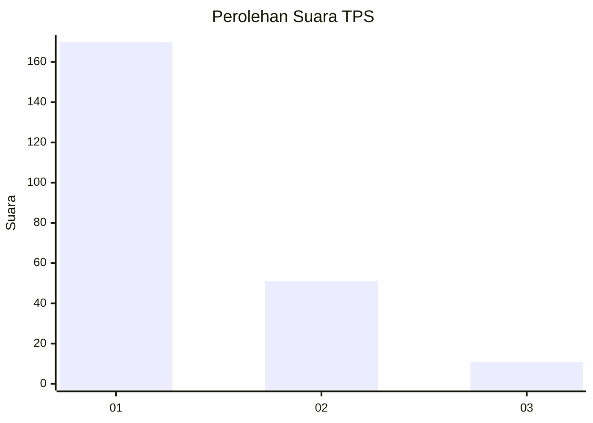
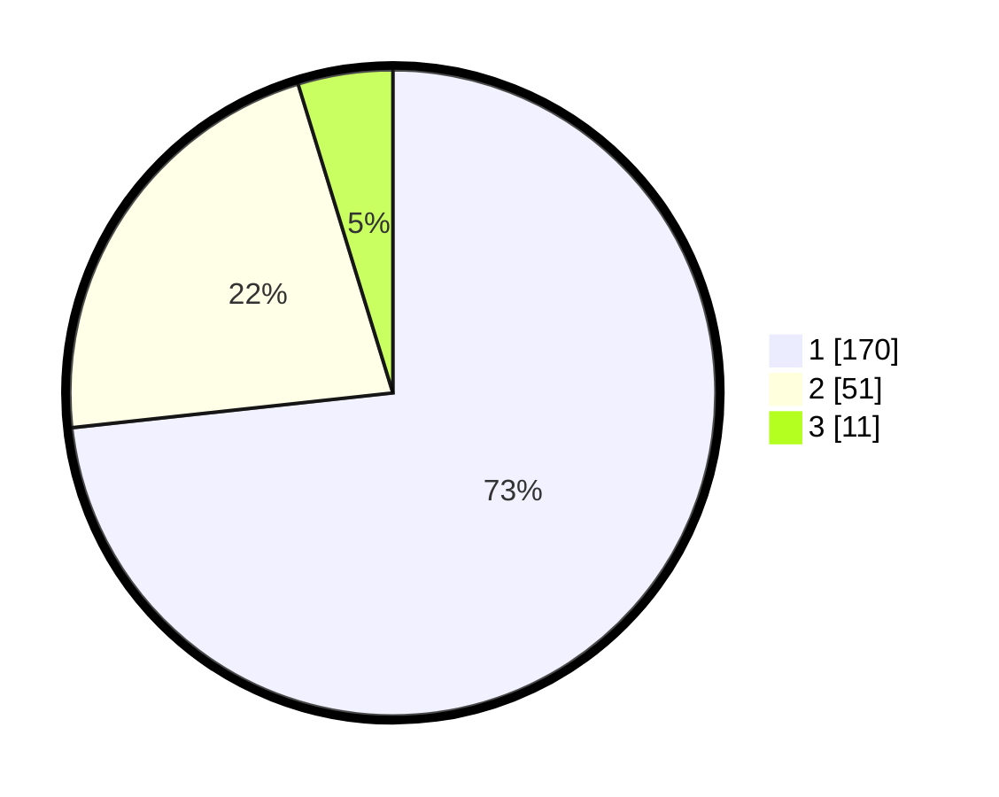

# Hasil

## Grafik

## Tabel

| No. | Nama Paslon    | Suara | Suara (raw) | Persentase |
|:--- |:-------------- | -----:| -----------:| ----------:|
| 1   | ANIES MUHAIMIN | 170   | [170][p-1]  | 73,28      |
| 2   | PRABOWO GIBRAN | 51    | [51][p-2]   | 21,98      |
| 3   | GANJAR MAHFUD  | 11    | [11][p-3]   | 4,74       |

[p-1]: https://github.com/gigit-pemilu/pemilu-2024-32-jawa-barat/blob/main/pilpres/hitung-suara/sub/32-jawa-barat/sub/07-ciamis/sub/32-baregbeg/sub/2002-sukamaju/sub/003-tps/sub/paslon-1.txt
[p-2]: https://github.com/gigit-pemilu/pemilu-2024-32-jawa-barat/blob/main/pilpres/hitung-suara/sub/32-jawa-barat/sub/07-ciamis/sub/32-baregbeg/sub/2002-sukamaju/sub/003-tps/sub/paslon-2.txt
[p-3]: https://github.com/gigit-pemilu/pemilu-2024-32-jawa-barat/blob/main/pilpres/hitung-suara/sub/32-jawa-barat/sub/07-ciamis/sub/32-baregbeg/sub/2002-sukamaju/sub/003-tps/sub/paslon-3.txt

## Foto C Plano

https://sirekap-obj-formc.kpu.go.id/e4e3/pemilu/ppwp/32/07/32/20/02/3207322002003-20240214-213123--817a8409-9b85-4c0d-9e74-defa5966cff9.jpg

https://sirekap-obj-formc.kpu.go.id/e4e3/pemilu/ppwp/32/07/32/20/02/3207322002003-20240214-213320--41ed78f9-c423-45f2-9689-850d346a623a.jpg

https://sirekap-obj-formc.kpu.go.id/e4e3/pemilu/ppwp/32/07/32/20/02/3207322002003-20240214-213725--d679268a-7def-4cc6-8bfd-5d12b052651e.jpg

## Metadata

| Key        | Value               |
| ---------- | ------------------- |
| Time Stamp | 2024-02-15 23:29:50 |

