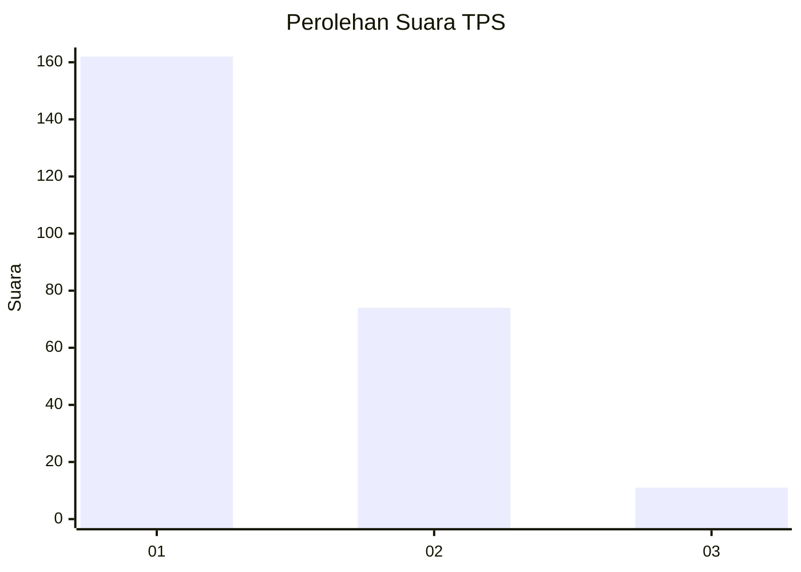
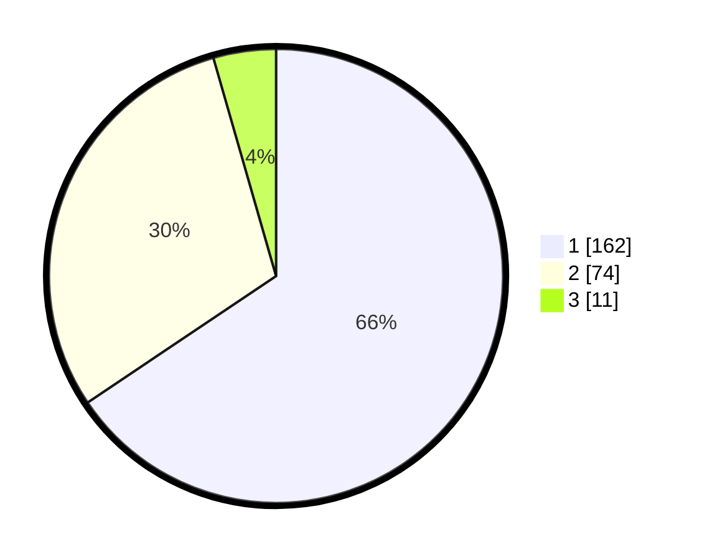

# Hasil

## Grafik

## Tabel

| No. | Nama Paslon    | Suara | Suara (raw) | Persentase |
|:--- |:-------------- | -----:| -----------:| ----------:|
| 1   | ANIES MUHAIMIN | 162   | [162][p-1]  | 65,59      |
| 2   | PRABOWO GIBRAN | 74    | [74][p-2]   | 29,96      |
| 3   | GANJAR MAHFUD  | 11    | [11][p-3]   | 4,45       |

[p-1]: https://github.com/gigit-pemilu/pemilu-2024/blob/main/pilpres/hitung-suara/sub/32-jawa-barat/sub/07-ciamis/sub/32-baregbeg/sub/2009-sukamulya/sub/020-tps/sub/paslon-1.txt
[p-2]: https://github.com/gigit-pemilu/pemilu-2024/blob/main/pilpres/hitung-suara/sub/32-jawa-barat/sub/07-ciamis/sub/32-baregbeg/sub/2009-sukamulya/sub/020-tps/sub/paslon-2.txt
[p-3]: https://github.com/gigit-pemilu/pemilu-2024/blob/main/pilpres/hitung-suara/sub/32-jawa-barat/sub/07-ciamis/sub/32-baregbeg/sub/2009-sukamulya/sub/020-tps/sub/paslon-3.txt

## Foto C Plano

https://sirekap-obj-formc.kpu.go.id/9751/pemilu/ppwp/32/07/32/20/09/3207322009020-20240214-205604--3ae462f3-1007-4f5e-bb94-3c5be37dbb90.jpg

https://sirekap-obj-formc.kpu.go.id/9751/pemilu/ppwp/32/07/32/20/09/3207322009020-20240214-205535--2695ad73-7c1a-4ae5-b7ba-364cbc6f99a5.jpg

https://sirekap-obj-formc.kpu.go.id/9751/pemilu/ppwp/32/07/32/20/09/3207322009020-20240214-205509--f0b3252a-c125-42c9-934b-5f3cdf34b5cb.jpg

## Metadata

| Key        | Value               |
| ---------- | ------------------- |
| Time Stamp | 2024-02-15 23:29:50 |

