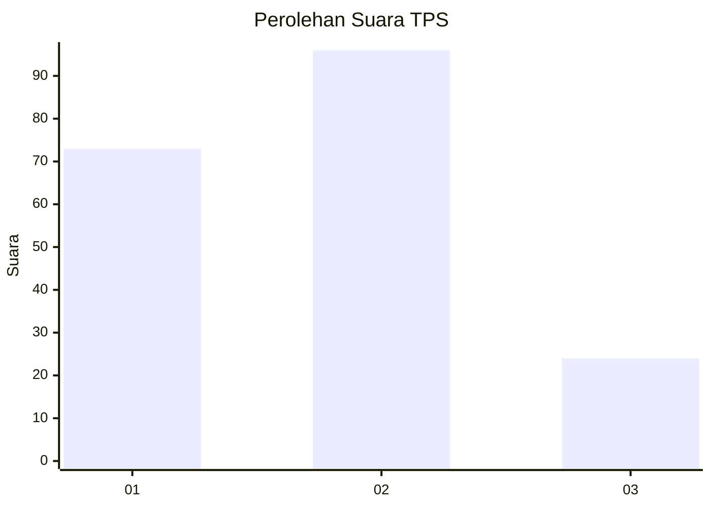
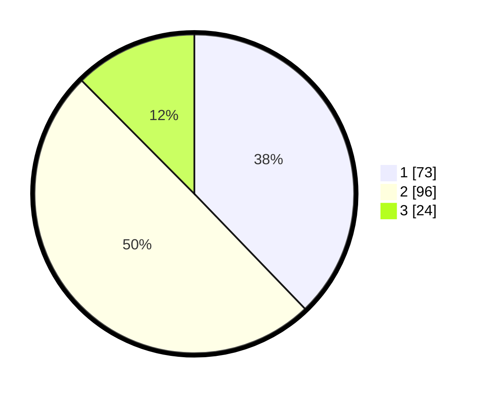

# Hasil

## Grafik

## Tabel

| No. | Nama Paslon    | Suara | Suara (raw) | Persentase |
|:--- |:-------------- | -----:| -----------:| ----------:|
| 1   | ANIES MUHAIMIN | 73    | [73][p-1]   | 37,82      |
| 2   | PRABOWO GIBRAN | 96    | [96][p-2]   | 49,74      |
| 3   | GANJAR MAHFUD  | 24    | [24][p-3]   | 12,44      |

[p-1]: https://github.com/gigit-pemilu/pemilu-2024-32-jawa-barat/blob/main/pilpres/hitung-suara/sub/32-jawa-barat/sub/07-ciamis/sub/33-sukamantri/sub/2001-sukamantri/sub/004-tps/sub/paslon-1.txt
[p-2]: https://github.com/gigit-pemilu/pemilu-2024-32-jawa-barat/blob/main/pilpres/hitung-suara/sub/32-jawa-barat/sub/07-ciamis/sub/33-sukamantri/sub/2001-sukamantri/sub/004-tps/sub/paslon-2.txt
[p-3]: https://github.com/gigit-pemilu/pemilu-2024-32-jawa-barat/blob/main/pilpres/hitung-suara/sub/32-jawa-barat/sub/07-ciamis/sub/33-sukamantri/sub/2001-sukamantri/sub/004-tps/sub/paslon-3.txt

## Foto C Plano

https://sirekap-obj-formc.kpu.go.id/a37c/pemilu/ppwp/32/07/33/20/01/3207332001004-20240214-232747--485b2160-e350-41e9-bb4e-8b895eff357a.jpg

https://sirekap-obj-formc.kpu.go.id/a37c/pemilu/ppwp/32/07/33/20/01/3207332001004-20240214-232814--4e565501-2eb5-412b-a48d-3b3f5f2459a2.jpg

https://sirekap-obj-formc.kpu.go.id/a37c/pemilu/ppwp/32/07/33/20/01/3207332001004-20240214-232837--7552416f-859d-462a-887c-4b76c376bab2.jpg

## Metadata

| Key        | Value               |
| ---------- | ------------------- |
| Time Stamp | 2024-02-15 12:00:28 |

