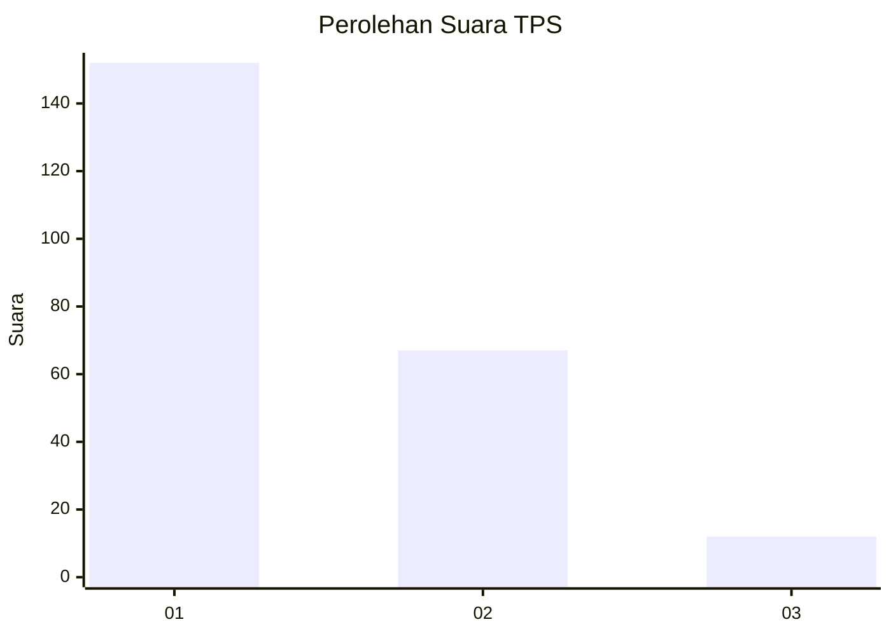
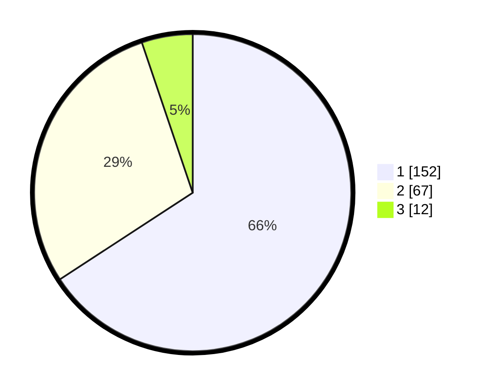

# Hasil

## Grafik

## Tabel

| No. | Nama Paslon    | Suara | Suara (raw) | Persentase |
|:--- |:-------------- | -----:| -----------:| ----------:|
| 1   | ANIES MUHAIMIN | 152   | [152][p-1]  | 65,80      |
| 2   | PRABOWO GIBRAN | 67    | [67][p-2]   | 29,00      |
| 3   | GANJAR MAHFUD  | 12    | [12][p-3]   | 5,19       |

[p-1]: https://github.com/gigit-pemilu/pemilu-2024-32-jawa-barat/blob/main/pilpres/hitung-suara/sub/32-jawa-barat/sub/07-ciamis/sub/34-lumbung/sub/2005-awiluar/sub/013-tps/sub/paslon-1.txt
[p-2]: https://github.com/gigit-pemilu/pemilu-2024-32-jawa-barat/blob/main/pilpres/hitung-suara/sub/32-jawa-barat/sub/07-ciamis/sub/34-lumbung/sub/2005-awiluar/sub/013-tps/sub/paslon-2.txt
[p-3]: https://github.com/gigit-pemilu/pemilu-2024-32-jawa-barat/blob/main/pilpres/hitung-suara/sub/32-jawa-barat/sub/07-ciamis/sub/34-lumbung/sub/2005-awiluar/sub/013-tps/sub/paslon-3.txt

## Foto C Plano

https://sirekap-obj-formc.kpu.go.id/2b75/pemilu/ppwp/32/07/34/20/05/3207342005013-20240215-011759--80dd586a-bf22-4016-9ff1-f275faa0b1b5.jpg

https://sirekap-obj-formc.kpu.go.id/2b75/pemilu/ppwp/32/07/34/20/05/3207342005013-20240215-004038--223f801f-db39-4a3c-930e-444d6949ee02.jpg

https://sirekap-obj-formc.kpu.go.id/2b75/pemilu/ppwp/32/07/34/20/05/3207342005013-20240215-004157--b92865c9-bf44-443a-9d28-8e43b748ddda.jpg

## Metadata

| Key        | Value               |
| ---------- | ------------------- |
| Time Stamp | 2024-02-15 22:30:27 |

