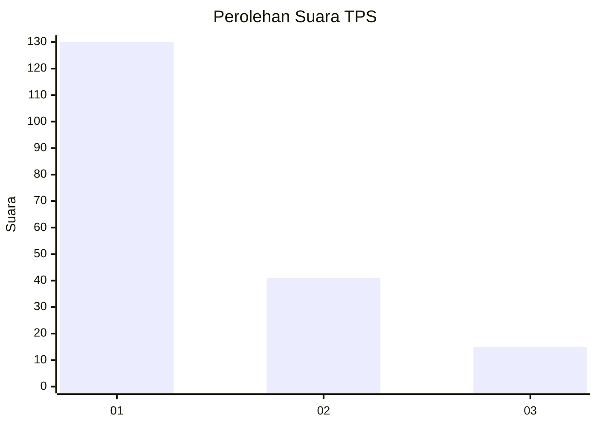
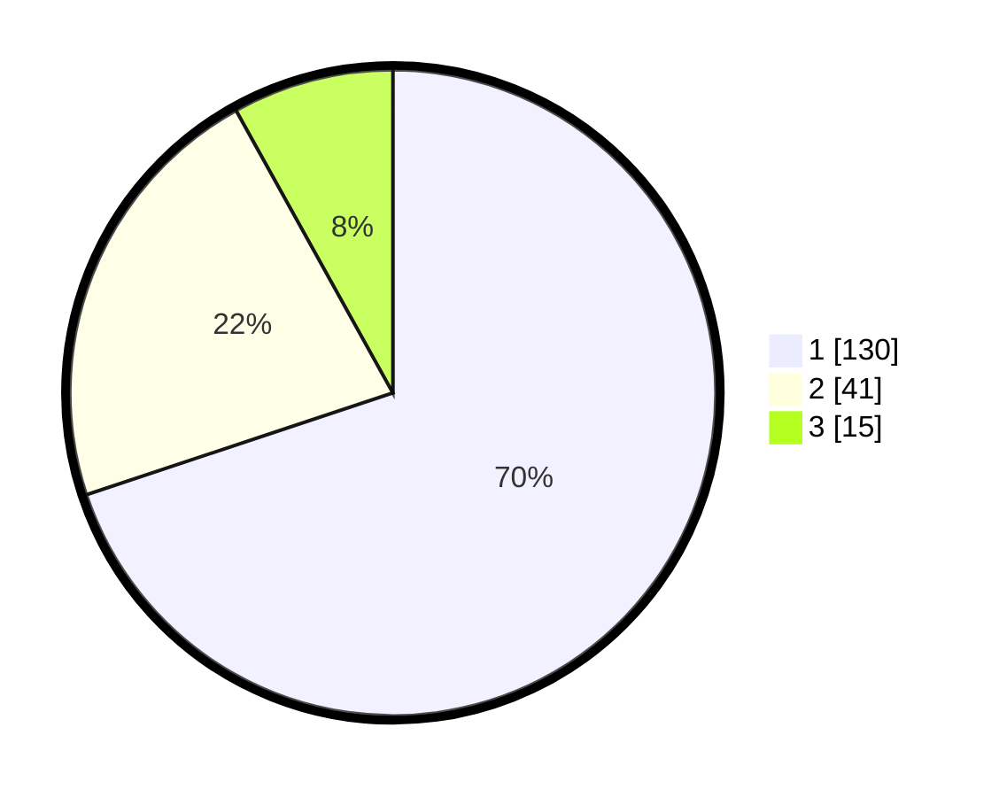

# Hasil

## Grafik

## Tabel

| No. | Nama Paslon    | Suara | Suara (raw) | Persentase |
|:--- |:-------------- | -----:| -----------:| ----------:|
| 1   | ANIES MUHAIMIN | 130   | [130][p-1]  | 69,89      |
| 2   | PRABOWO GIBRAN | 41    | [41][p-2]   | 22,04      |
| 3   | GANJAR MAHFUD  | 15    | [15][p-3]   | 8,06       |

[p-1]: https://github.com/gigit-pemilu/pemilu-2024/blob/main/pilpres/hitung-suara/sub/32-jawa-barat/sub/07-ciamis/sub/34-lumbung/sub/2007-rawa/sub/009-tps/sub/paslon-1.txt
[p-2]: https://github.com/gigit-pemilu/pemilu-2024/blob/main/pilpres/hitung-suara/sub/32-jawa-barat/sub/07-ciamis/sub/34-lumbung/sub/2007-rawa/sub/009-tps/sub/paslon-2.txt
[p-3]: https://github.com/gigit-pemilu/pemilu-2024/blob/main/pilpres/hitung-suara/sub/32-jawa-barat/sub/07-ciamis/sub/34-lumbung/sub/2007-rawa/sub/009-tps/sub/paslon-3.txt

## Foto C Plano

https://sirekap-obj-formc.kpu.go.id/633f/pemilu/ppwp/32/07/34/20/07/3207342007009-20240221-122740--bab9b73a-c0c2-4a7e-bb3a-cc74ec0bfc8a.jpg

https://sirekap-obj-formc.kpu.go.id/633f/pemilu/ppwp/32/07/34/20/07/3207342007009-20240214-141419--c783fb05-80ac-4a3a-8bba-5df4347966fb.jpg

https://sirekap-obj-formc.kpu.go.id/633f/pemilu/ppwp/32/07/34/20/07/3207342007009-20240214-141422--513b7c35-ebe2-430f-97c8-93185817447f.jpg

## Metadata

| Key        | Value               |
| ---------- | ------------------- |
| Time Stamp | 2024-02-21 13:00:00 |

