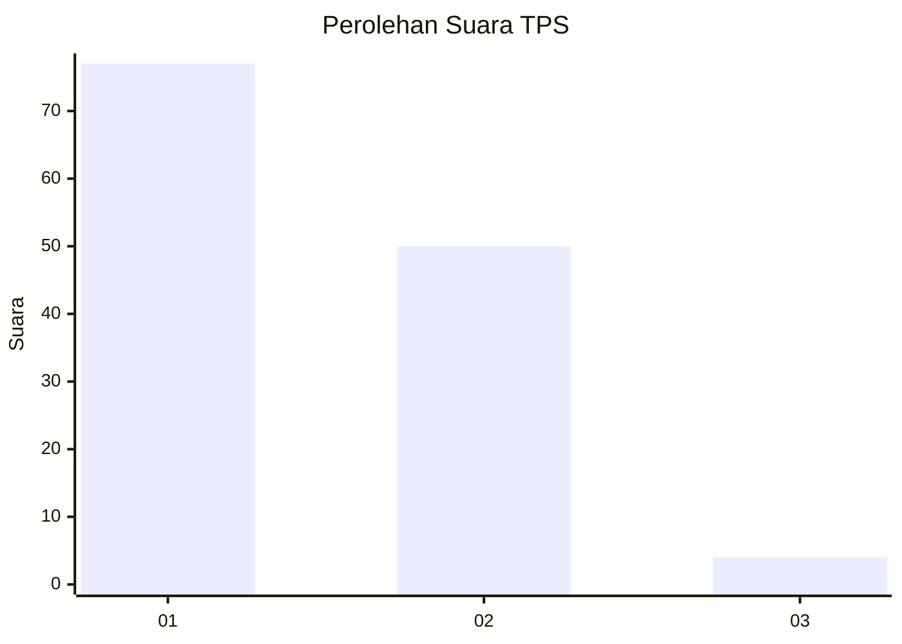
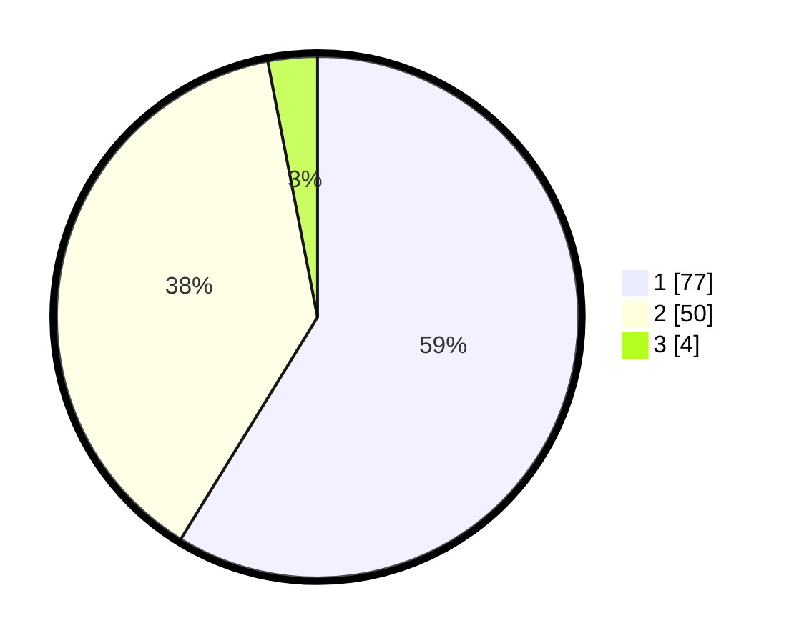

# Hasil

## Grafik

## Tabel

| No. | Nama Paslon    | Suara | Suara (raw) | Persentase |
|:--- |:-------------- | -----:| -----------:| ----------:|
| 1   | ANIES MUHAIMIN | 77    | [77][p-1]   | 58,78      |
| 2   | PRABOWO GIBRAN | 50    | [50][p-2]   | 38,17      |
| 3   | GANJAR MAHFUD  | 4     | [4][p-3]    | 3,05       |

[p-1]: https://github.com/gigit-pemilu/pemilu-2024-32-jawa-barat/blob/main/pilpres/hitung-suara/sub/32-jawa-barat/sub/07-ciamis/sub/35-purwadadi/sub/2001-bantardawa/sub/007-tps/sub/paslon-1.txt
[p-2]: https://github.com/gigit-pemilu/pemilu-2024-32-jawa-barat/blob/main/pilpres/hitung-suara/sub/32-jawa-barat/sub/07-ciamis/sub/35-purwadadi/sub/2001-bantardawa/sub/007-tps/sub/paslon-2.txt
[p-3]: https://github.com/gigit-pemilu/pemilu-2024-32-jawa-barat/blob/main/pilpres/hitung-suara/sub/32-jawa-barat/sub/07-ciamis/sub/35-purwadadi/sub/2001-bantardawa/sub/007-tps/sub/paslon-3.txt

## Foto C Plano

https://sirekap-obj-formc.kpu.go.id/d2a8/pemilu/ppwp/32/07/35/20/01/3207352001007-20240216-171046--b7b1951f-e946-4256-a8b0-295d602a7573.jpg

https://sirekap-obj-formc.kpu.go.id/d2a8/pemilu/ppwp/32/07/35/20/01/3207352001007-20240216-170905--6997d76f-8989-46ce-b23f-09c1cb4d24fc.jpg

https://sirekap-obj-formc.kpu.go.id/d2a8/pemilu/ppwp/32/07/35/20/01/3207352001007-20240214-210425--3b2114df-37ac-4407-9b49-8d2650e638d8.jpg

## Metadata

| Key        | Value               |
| ---------- | ------------------- |
| Time Stamp | 2024-02-17 16:36:25 |

