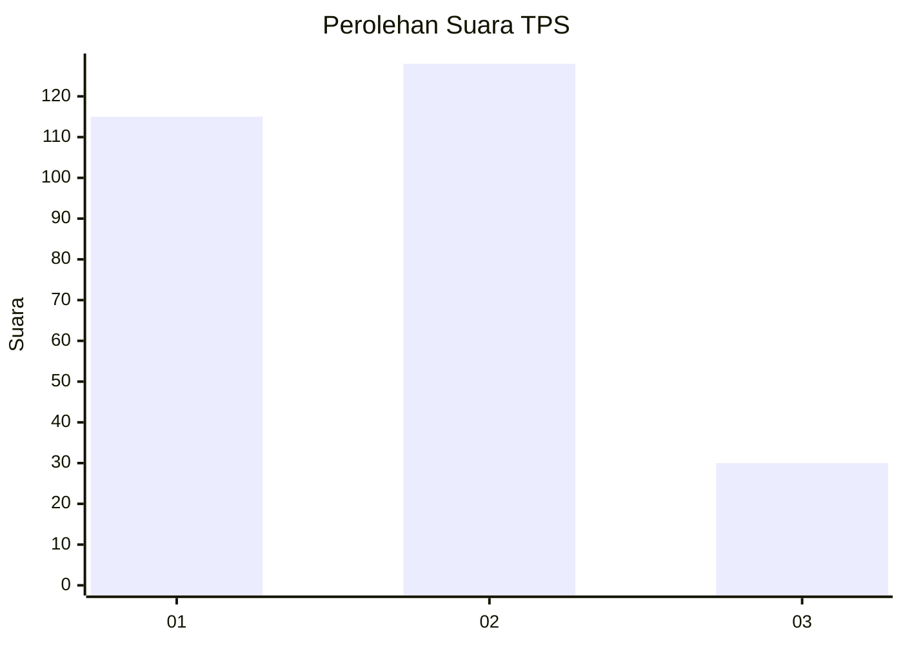
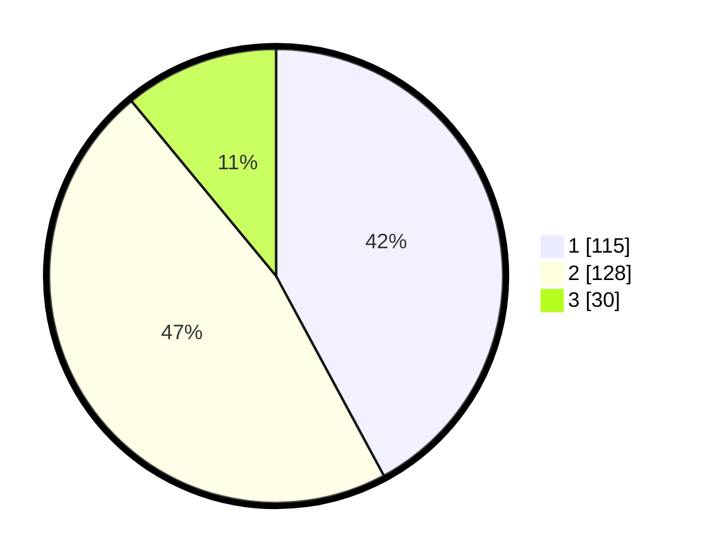

# Hasil

## Grafik

## Tabel

| No. | Nama Paslon    | Suara | Suara (raw) | Persentase |
|:--- |:-------------- | -----:| -----------:| ----------:|
| 1   | ANIES MUHAIMIN | 115   | [115][p-1]  | 42,12      |
| 2   | PRABOWO GIBRAN | 128   | [128][p-2]  | 46,89      |
| 3   | GANJAR MAHFUD  | 30    | [30][p-3]   | 10,99      |

[p-1]: https://github.com/gigit-pemilu/pemilu-2024-32-jawa-barat/blob/main/pilpres/hitung-suara/sub/32-jawa-barat/sub/07-ciamis/sub/35-purwadadi/sub/2003-purwajaya/sub/009-tps/sub/paslon-1.txt
[p-2]: https://github.com/gigit-pemilu/pemilu-2024-32-jawa-barat/blob/main/pilpres/hitung-suara/sub/32-jawa-barat/sub/07-ciamis/sub/35-purwadadi/sub/2003-purwajaya/sub/009-tps/sub/paslon-2.txt
[p-3]: https://github.com/gigit-pemilu/pemilu-2024-32-jawa-barat/blob/main/pilpres/hitung-suara/sub/32-jawa-barat/sub/07-ciamis/sub/35-purwadadi/sub/2003-purwajaya/sub/009-tps/sub/paslon-3.txt

## Foto C Plano

https://sirekap-obj-formc.kpu.go.id/136b/pemilu/ppwp/32/07/35/20/03/3207352003009-20240216-142011--688749dc-a2cc-4e43-984a-0465dc307fab.jpg

https://sirekap-obj-formc.kpu.go.id/136b/pemilu/ppwp/32/07/35/20/03/3207352003009-20240216-163441--900fca8b-73a8-4345-9c26-3271533643d5.jpg

https://sirekap-obj-formc.kpu.go.id/136b/pemilu/ppwp/32/07/35/20/03/3207352003009-20240216-211111--71b1ec7c-c73d-44f4-9784-d2db30696575.jpg

## Metadata

| Key        | Value               |
| ---------- | ------------------- |
| Time Stamp | 2024-02-17 16:36:25 |

