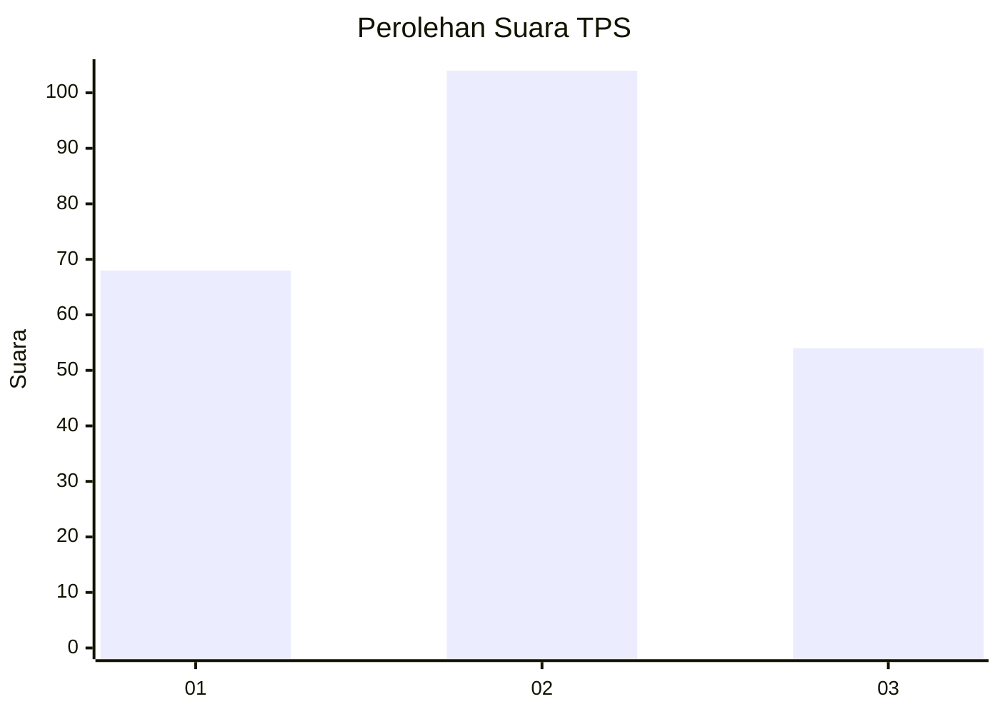
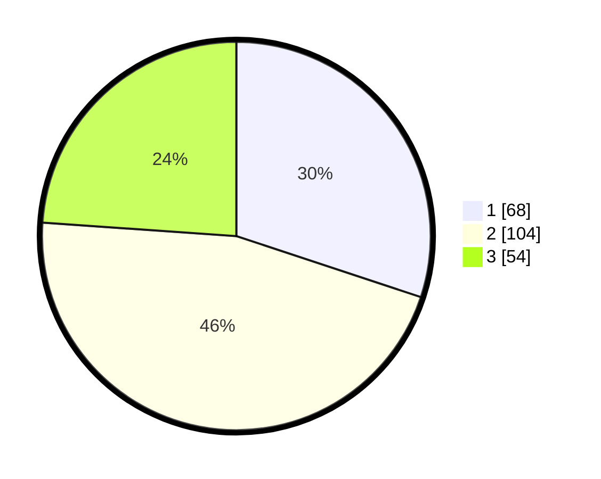

# Hasil

## Grafik

## Tabel

| No. | Nama Paslon    | Suara | Suara (raw) | Persentase |
|:--- |:-------------- | -----:| -----------:| ----------:|
| 1   | ANIES MUHAIMIN | 68    | [68][p-1]   | 30,09      |
| 2   | PRABOWO GIBRAN | 104   | [104][p-2]  | 46,02      |
| 3   | GANJAR MAHFUD  | 54    | [54][p-3]   | 23,89      |

[p-1]: https://github.com/gigit-pemilu/pemilu-2024-32-jawa-barat/blob/main/pilpres/hitung-suara/sub/32-jawa-barat/sub/07-ciamis/sub/37-banjaranyar/sub/2001-pasawahan/sub/001-tps/sub/paslon-1.txt
[p-2]: https://github.com/gigit-pemilu/pemilu-2024-32-jawa-barat/blob/main/pilpres/hitung-suara/sub/32-jawa-barat/sub/07-ciamis/sub/37-banjaranyar/sub/2001-pasawahan/sub/001-tps/sub/paslon-2.txt
[p-3]: https://github.com/gigit-pemilu/pemilu-2024-32-jawa-barat/blob/main/pilpres/hitung-suara/sub/32-jawa-barat/sub/07-ciamis/sub/37-banjaranyar/sub/2001-pasawahan/sub/001-tps/sub/paslon-3.txt

## Foto C Plano

https://sirekap-obj-formc.kpu.go.id/1f0e/pemilu/ppwp/32/07/37/20/01/3207372001001-20240215-044355--cc05db3d-fb66-4ed0-b36b-a65b0069d40f.jpg

https://sirekap-obj-formc.kpu.go.id/1f0e/pemilu/ppwp/32/07/37/20/01/3207372001001-20240215-044434--50708b40-98df-4a3f-851b-d5d09482c7a1.jpg

https://sirekap-obj-formc.kpu.go.id/1f0e/pemilu/ppwp/32/07/37/20/01/3207372001001-20240215-044625--9c874380-9edf-4e10-9cdf-e23f6d027634.jpg

## Metadata

| Key        | Value               |
| ---------- | ------------------- |
| Time Stamp | 2024-02-15 22:00:27 |

