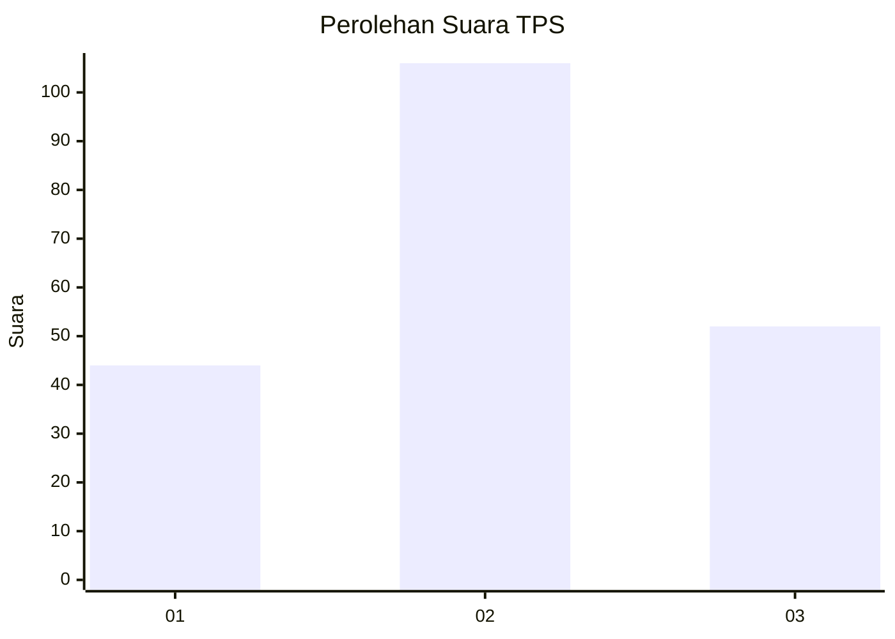
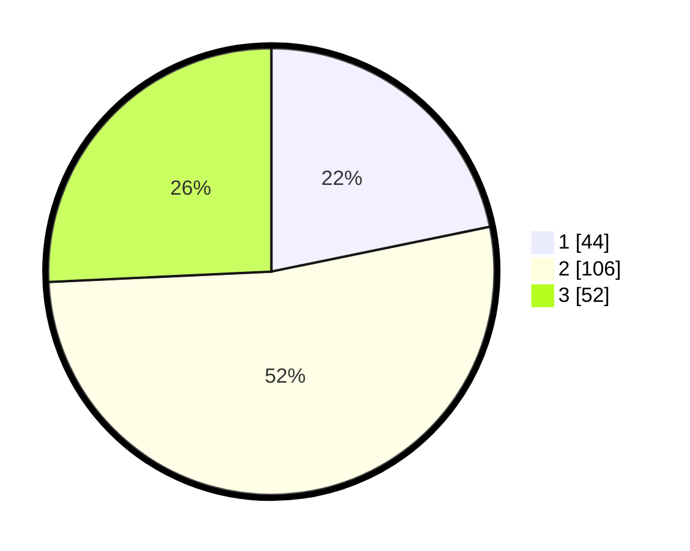

# Hasil

## Grafik

## Tabel

| No. | Nama Paslon    | Suara | Suara (raw) | Persentase |
|:--- |:-------------- | -----:| -----------:| ----------:|
| 1   | ANIES MUHAIMIN | 44    | [44][p-1]   | 21,78      |
| 2   | PRABOWO GIBRAN | 106   | [106][p-2]  | 52,48      |
| 3   | GANJAR MAHFUD  | 52    | [52][p-3]   | 25,74      |

[p-1]: https://github.com/gigit-pemilu/pemilu-2024/blob/main/pilpres/hitung-suara/sub/32-jawa-barat/sub/07-ciamis/sub/37-banjaranyar/sub/2001-pasawahan/sub/002-tps/sub/paslon-1.txt
[p-2]: https://github.com/gigit-pemilu/pemilu-2024/blob/main/pilpres/hitung-suara/sub/32-jawa-barat/sub/07-ciamis/sub/37-banjaranyar/sub/2001-pasawahan/sub/002-tps/sub/paslon-2.txt
[p-3]: https://github.com/gigit-pemilu/pemilu-2024/blob/main/pilpres/hitung-suara/sub/32-jawa-barat/sub/07-ciamis/sub/37-banjaranyar/sub/2001-pasawahan/sub/002-tps/sub/paslon-3.txt

## Foto C Plano

https://sirekap-obj-formc.kpu.go.id/9368/pemilu/ppwp/32/07/37/20/01/3207372001002-20240214-220452--71c52004-848c-4e1b-9537-ed520ccb3883.jpg

https://sirekap-obj-formc.kpu.go.id/9368/pemilu/ppwp/32/07/37/20/01/3207372001002-20240214-220559--31e8c911-b184-4ee9-bac6-4c73ef3863d2.jpg

https://sirekap-obj-formc.kpu.go.id/9368/pemilu/ppwp/32/07/37/20/01/3207372001002-20240214-220649--5d58c5e3-4dec-45f0-887d-24ce461f4f33.jpg

## Metadata

| Key        | Value               |
| ---------- | ------------------- |
| Time Stamp | 2024-02-15 22:00:27 |

