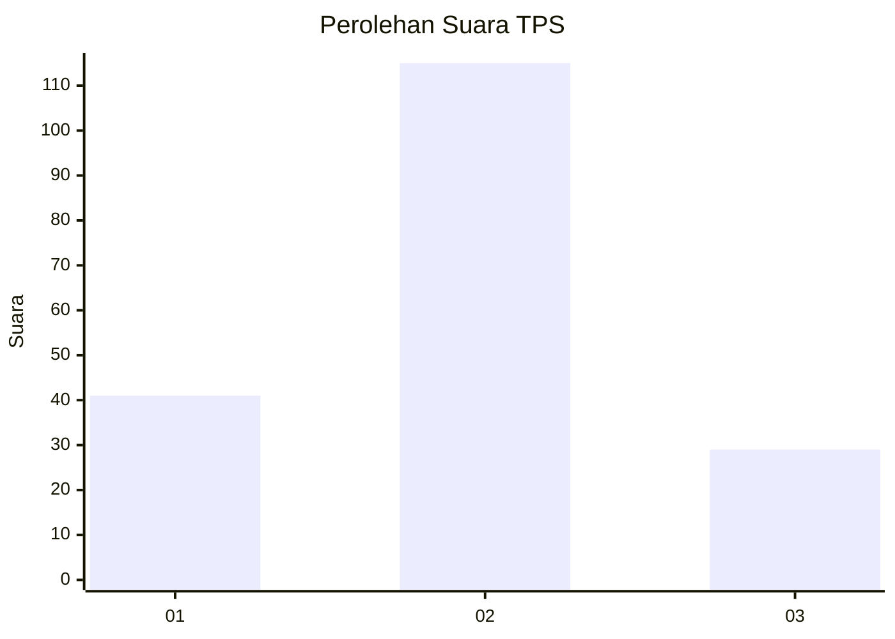
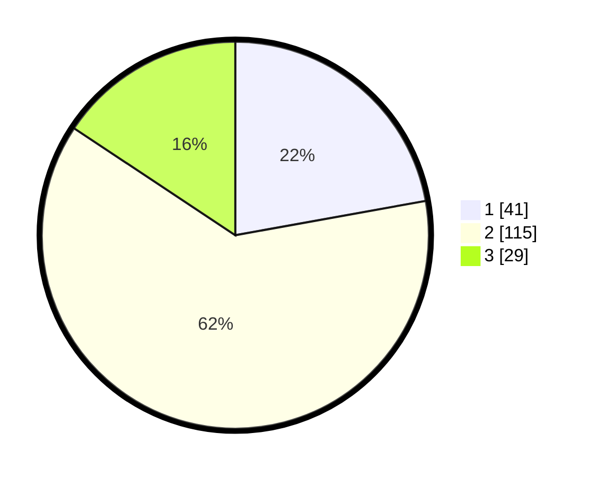

# Hasil

## Grafik

## Tabel

| No. | Nama Paslon    | Suara | Suara (raw) | Persentase |
|:--- |:-------------- | -----:| -----------:| ----------:|
| 1   | ANIES MUHAIMIN | 41    | [41][p-1]   | 22,16      |
| 2   | PRABOWO GIBRAN | 115   | [115][p-2]  | 62,16      |
| 3   | GANJAR MAHFUD  | 29    | [29][p-3]   | 15,68      |

[p-1]: https://github.com/gigit-pemilu/pemilu-2024/blob/main/pilpres/hitung-suara/sub/32-jawa-barat/sub/07-ciamis/sub/37-banjaranyar/sub/2001-pasawahan/sub/003-tps/sub/paslon-1.txt
[p-2]: https://github.com/gigit-pemilu/pemilu-2024/blob/main/pilpres/hitung-suara/sub/32-jawa-barat/sub/07-ciamis/sub/37-banjaranyar/sub/2001-pasawahan/sub/003-tps/sub/paslon-2.txt
[p-3]: https://github.com/gigit-pemilu/pemilu-2024/blob/main/pilpres/hitung-suara/sub/32-jawa-barat/sub/07-ciamis/sub/37-banjaranyar/sub/2001-pasawahan/sub/003-tps/sub/paslon-3.txt

## Foto C Plano

https://sirekap-obj-formc.kpu.go.id/98b4/pemilu/ppwp/32/07/37/20/01/3207372001003-20240215-054144--8b65aecc-b2c9-45f4-9462-4e9cf2fbf8f8.jpg

https://sirekap-obj-formc.kpu.go.id/98b4/pemilu/ppwp/32/07/37/20/01/3207372001003-20240215-054913--271e2d34-cefa-4ccf-9db1-f4cf3305faf6.jpg

https://sirekap-obj-formc.kpu.go.id/98b4/pemilu/ppwp/32/07/37/20/01/3207372001003-20240215-054331--e3975468-5bd0-4c96-a65e-22556fdddb5f.jpg

## Metadata

| Key        | Value               |
| ---------- | ------------------- |
| Time Stamp | 2024-02-15 22:00:27 |

