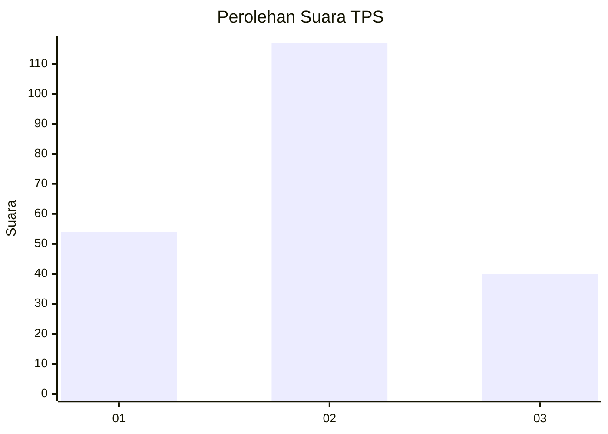
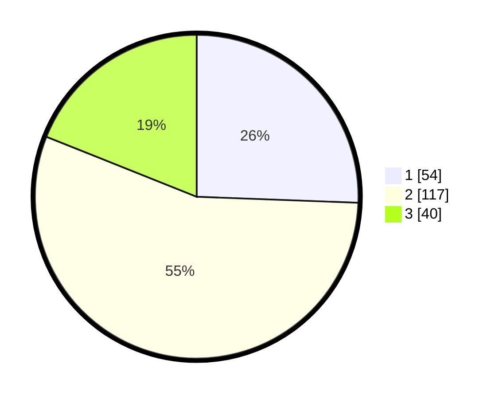

# Hasil

## Grafik

## Tabel

| No. | Nama Paslon    | Suara | Suara (raw) | Persentase |
|:--- |:-------------- | -----:| -----------:| ----------:|
| 1   | ANIES MUHAIMIN | 54    | [54][p-1]   | 25,59      |
| 2   | PRABOWO GIBRAN | 117   | [117][p-2]  | 55,45      |
| 3   | GANJAR MAHFUD  | 40    | [40][p-3]   | 18,96      |

[p-1]: https://github.com/gigit-pemilu/pemilu-2024/blob/main/pilpres/hitung-suara/sub/32-jawa-barat/sub/07-ciamis/sub/37-banjaranyar/sub/2001-pasawahan/sub/005-tps/sub/paslon-1.txt
[p-2]: https://github.com/gigit-pemilu/pemilu-2024/blob/main/pilpres/hitung-suara/sub/32-jawa-barat/sub/07-ciamis/sub/37-banjaranyar/sub/2001-pasawahan/sub/005-tps/sub/paslon-2.txt
[p-3]: https://github.com/gigit-pemilu/pemilu-2024/blob/main/pilpres/hitung-suara/sub/32-jawa-barat/sub/07-ciamis/sub/37-banjaranyar/sub/2001-pasawahan/sub/005-tps/sub/paslon-3.txt

## Foto C Plano

https://sirekap-obj-formc.kpu.go.id/b04f/pemilu/ppwp/32/07/37/20/01/3207372001005-20240215-002053--093a5e93-927c-44c9-adb4-61973ff29a85.jpg

https://sirekap-obj-formc.kpu.go.id/b04f/pemilu/ppwp/32/07/37/20/01/3207372001005-20240215-002216--fcf7aac3-bdd7-4642-b0b0-9d786e5d5ecd.jpg

https://sirekap-obj-formc.kpu.go.id/b04f/pemilu/ppwp/32/07/37/20/01/3207372001005-20240215-002448--a82850f7-f4aa-4928-887a-87884d6b2705.jpg

## Metadata

| Key        | Value               |
| ---------- | ------------------- |
| Time Stamp | 2024-02-15 15:00:29 |

