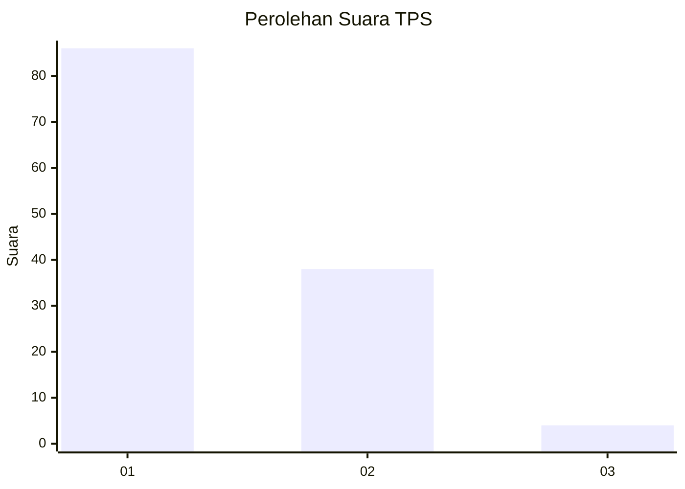
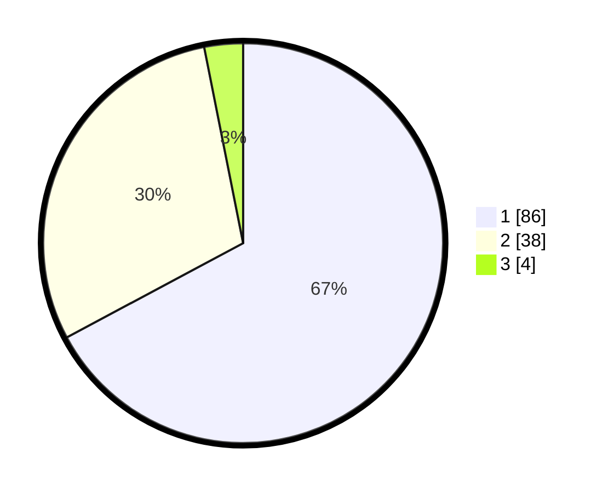

# Hasil

## Grafik

## Tabel

| No. | Nama Paslon    | Suara | Suara (raw) | Persentase |
|:--- |:-------------- | -----:| -----------:| ----------:|
| 1   | ANIES MUHAIMIN | 86    | [86][p-1]   | 67,19      |
| 2   | PRABOWO GIBRAN | 38    | [38][p-2]   | 29,69      |
| 3   | GANJAR MAHFUD  | 4     | [4][p-3]    | 3,13       |

[p-1]: https://github.com/gigit-pemilu/pemilu-2024/blob/main/pilpres/hitung-suara/sub/32-jawa-barat/sub/07-ciamis/sub/37-banjaranyar/sub/2010-tanjungsari/sub/004-tps/sub/paslon-1.txt
[p-2]: https://github.com/gigit-pemilu/pemilu-2024/blob/main/pilpres/hitung-suara/sub/32-jawa-barat/sub/07-ciamis/sub/37-banjaranyar/sub/2010-tanjungsari/sub/004-tps/sub/paslon-2.txt
[p-3]: https://github.com/gigit-pemilu/pemilu-2024/blob/main/pilpres/hitung-suara/sub/32-jawa-barat/sub/07-ciamis/sub/37-banjaranyar/sub/2010-tanjungsari/sub/004-tps/sub/paslon-3.txt

## Foto C Plano

https://sirekap-obj-formc.kpu.go.id/bd4e/pemilu/ppwp/32/07/37/20/10/3207372010004-20240215-022356--33cdbb53-af4c-48cf-8f42-1356fa1b75c9.jpg

https://sirekap-obj-formc.kpu.go.id/bd4e/pemilu/ppwp/32/07/37/20/10/3207372010004-20240215-022549--8f80772a-35f2-4d26-a0fb-691449547900.jpg

https://sirekap-obj-formc.kpu.go.id/bd4e/pemilu/ppwp/32/07/37/20/10/3207372010004-20240215-022731--78d313a0-8f02-4a57-b0ec-c3d2686f0066.jpg

## Metadata

| Key        | Value               |
| ---------- | ------------------- |
| Time Stamp | 2024-02-15 21:30:27 |

