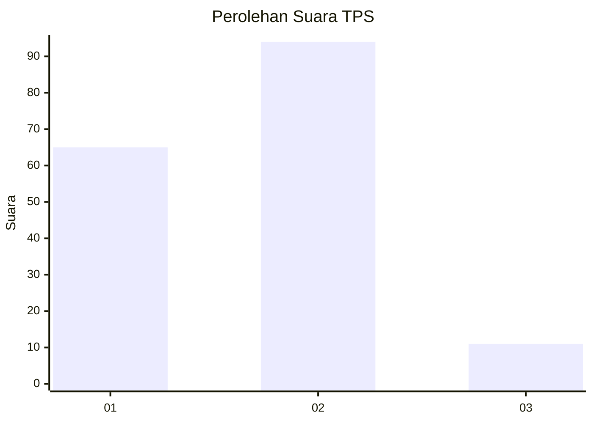
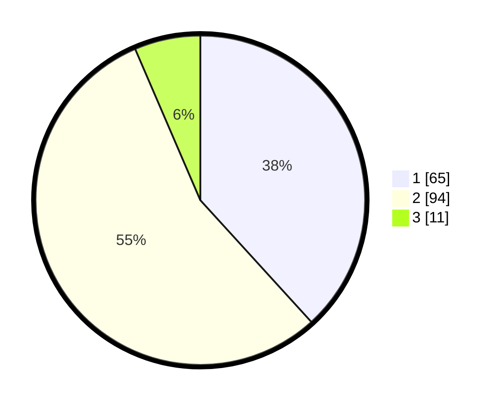

# Hasil

## Grafik

## Tabel

| No. | Nama Paslon    | Suara | Suara (raw) | Persentase |
|:--- |:-------------- | -----:| -----------:| ----------:|
| 1   | ANIES MUHAIMIN | 65    | [65][p-1]   | 38,24      |
| 2   | PRABOWO GIBRAN | 94    | [94][p-2]   | 55,29      |
| 3   | GANJAR MAHFUD  | 11    | [11][p-3]   | 6,47       |

[p-1]: https://github.com/gigit-pemilu/pemilu-2024-32-jawa-barat/blob/main/pilpres/hitung-suara/sub/32-jawa-barat/sub/08-kuningan/sub/01-kadugede/sub/2001-sindangjawa/sub/002-tps/sub/paslon-1.txt
[p-2]: https://github.com/gigit-pemilu/pemilu-2024-32-jawa-barat/blob/main/pilpres/hitung-suara/sub/32-jawa-barat/sub/08-kuningan/sub/01-kadugede/sub/2001-sindangjawa/sub/002-tps/sub/paslon-2.txt
[p-3]: https://github.com/gigit-pemilu/pemilu-2024-32-jawa-barat/blob/main/pilpres/hitung-suara/sub/32-jawa-barat/sub/08-kuningan/sub/01-kadugede/sub/2001-sindangjawa/sub/002-tps/sub/paslon-3.txt

## Foto C Plano

https://sirekap-obj-formc.kpu.go.id/d9e7/pemilu/ppwp/32/08/01/20/01/3208012001002-20240214-215413--92cd6310-f56a-4c6f-9348-dd90bb29c258.jpg

https://sirekap-obj-formc.kpu.go.id/d9e7/pemilu/ppwp/32/08/01/20/01/3208012001002-20240217-193922--e091870e-570e-44fd-9188-01e8171e4660.jpg

https://sirekap-obj-formc.kpu.go.id/d9e7/pemilu/ppwp/32/08/01/20/01/3208012001002-20240217-194541--691359c0-7b81-4c01-b31b-886b1de78908.jpg

## Metadata

| Key        | Value               |
| ---------- | ------------------- |
| Time Stamp | 2024-02-19 06:16:00 |

