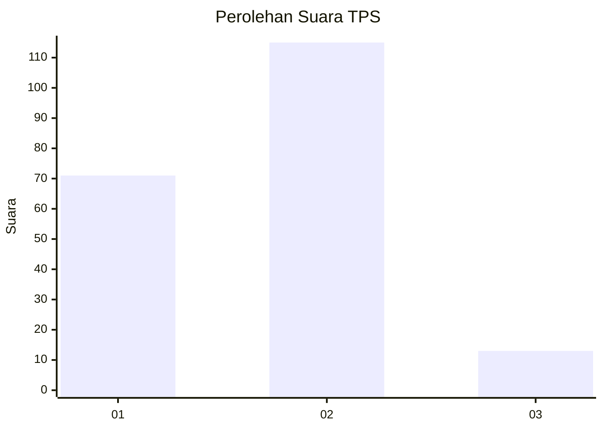
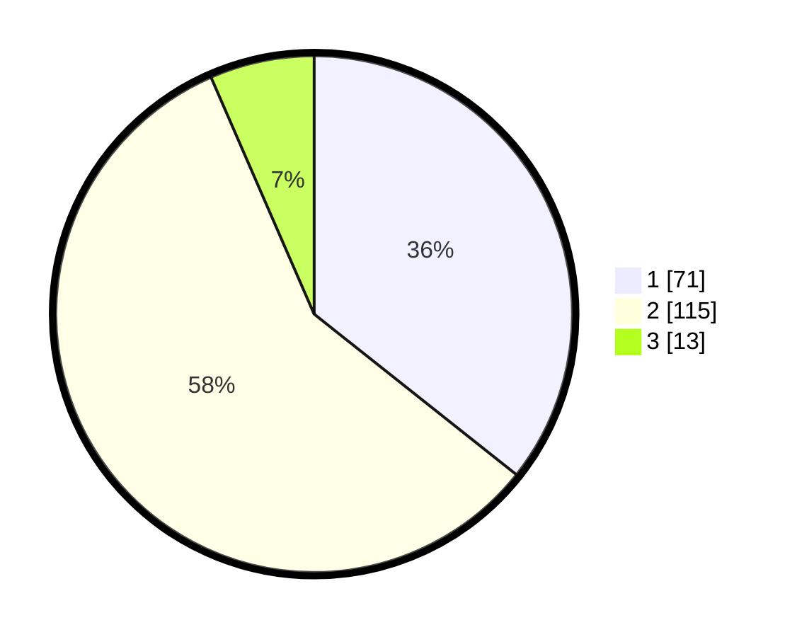

# Hasil

## Grafik

## Tabel

| No. | Nama Paslon    | Suara | Suara (raw) | Persentase |
|:--- |:-------------- | -----:| -----------:| ----------:|
| 1   | ANIES MUHAIMIN | 71    | [71][p-1]   | 35,68      |
| 2   | PRABOWO GIBRAN | 115   | [115][p-2]  | 57,79      |
| 3   | GANJAR MAHFUD  | 13    | [13][p-3]   | 6,53       |

[p-1]: https://github.com/gigit-pemilu/pemilu-2024/blob/main/pilpres/hitung-suara/sub/32-jawa-barat/sub/08-kuningan/sub/01-kadugede/sub/2001-sindangjawa/sub/005-tps/sub/paslon-1.txt
[p-2]: https://github.com/gigit-pemilu/pemilu-2024/blob/main/pilpres/hitung-suara/sub/32-jawa-barat/sub/08-kuningan/sub/01-kadugede/sub/2001-sindangjawa/sub/005-tps/sub/paslon-2.txt
[p-3]: https://github.com/gigit-pemilu/pemilu-2024/blob/main/pilpres/hitung-suara/sub/32-jawa-barat/sub/08-kuningan/sub/01-kadugede/sub/2001-sindangjawa/sub/005-tps/sub/paslon-3.txt

## Foto C Plano

https://sirekap-obj-formc.kpu.go.id/8302/pemilu/ppwp/32/08/01/20/01/3208012001005-20240214-213830--aec921be-5ee7-4c96-9eaf-574ae0fe90d2.jpg

https://sirekap-obj-formc.kpu.go.id/8302/pemilu/ppwp/32/08/01/20/01/3208012001005-20240217-195631--b5caa5fc-cfeb-4c9d-9496-42dfb6caaade.jpg

https://sirekap-obj-formc.kpu.go.id/8302/pemilu/ppwp/32/08/01/20/01/3208012001005-20240217-195650--4c0cec05-df68-4417-8af4-747a8c68047e.jpg

## Metadata

| Key        | Value               |
| ---------- | ------------------- |
| Time Stamp | 2024-02-19 06:16:00 |

