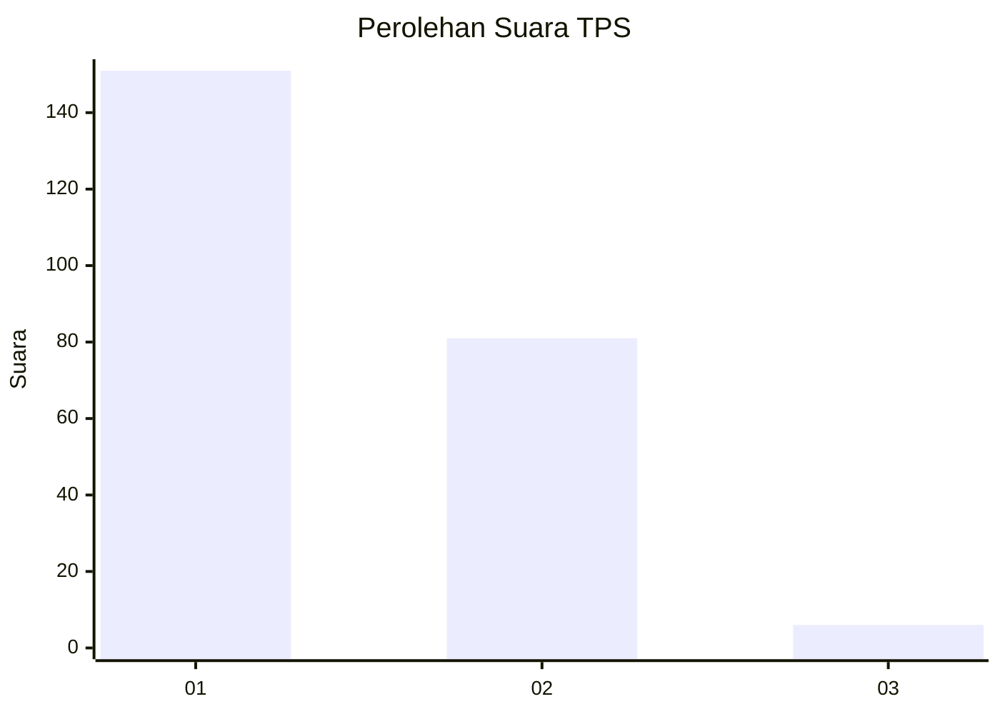
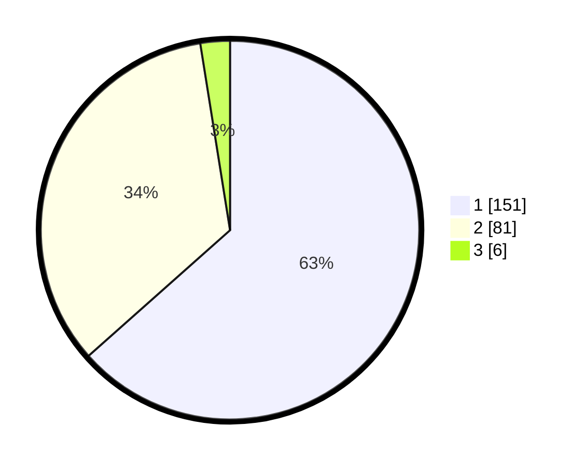

# Hasil

## Grafik

## Tabel

| No. | Nama Paslon    | Suara | Suara (raw) | Persentase |
|:--- |:-------------- | -----:| -----------:| ----------:|
| 1   | ANIES MUHAIMIN | 151   | [151][p-1]  | 63,45      |
| 2   | PRABOWO GIBRAN | 81    | [81][p-2]   | 34,03      |
| 3   | GANJAR MAHFUD  | 6     | [6][p-3]    | 2,52       |

[p-1]: https://github.com/gigit-pemilu/pemilu-2024-32-jawa-barat/blob/main/pilpres/hitung-suara/sub/32-jawa-barat/sub/08-kuningan/sub/01-kadugede/sub/2004-windujanten/sub/001-tps/sub/paslon-1.txt
[p-2]: https://github.com/gigit-pemilu/pemilu-2024-32-jawa-barat/blob/main/pilpres/hitung-suara/sub/32-jawa-barat/sub/08-kuningan/sub/01-kadugede/sub/2004-windujanten/sub/001-tps/sub/paslon-2.txt
[p-3]: https://github.com/gigit-pemilu/pemilu-2024-32-jawa-barat/blob/main/pilpres/hitung-suara/sub/32-jawa-barat/sub/08-kuningan/sub/01-kadugede/sub/2004-windujanten/sub/001-tps/sub/paslon-3.txt

## Foto C Plano

https://sirekap-obj-formc.kpu.go.id/8c5e/pemilu/ppwp/32/08/01/20/04/3208012004001-20240215-172920--aa369ac4-26dc-4d76-8017-ac8fcecb1b52.jpg

https://sirekap-obj-formc.kpu.go.id/8c5e/pemilu/ppwp/32/08/01/20/04/3208012004001-20240214-230058--4b4e6e61-6780-4af4-94f8-83beea4e3c93.jpg

https://sirekap-obj-formc.kpu.go.id/8c5e/pemilu/ppwp/32/08/01/20/04/3208012004001-20240215-015449--9fa56fd6-92c4-44ff-aef0-8ea6b92bddfc.jpg

## Metadata

| Key        | Value               |
| ---------- | ------------------- |
| Time Stamp | 2024-02-17 16:00:02 |

