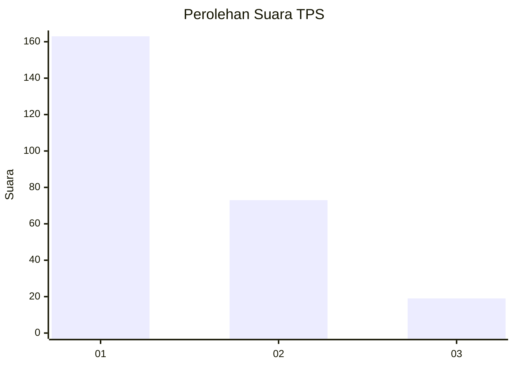
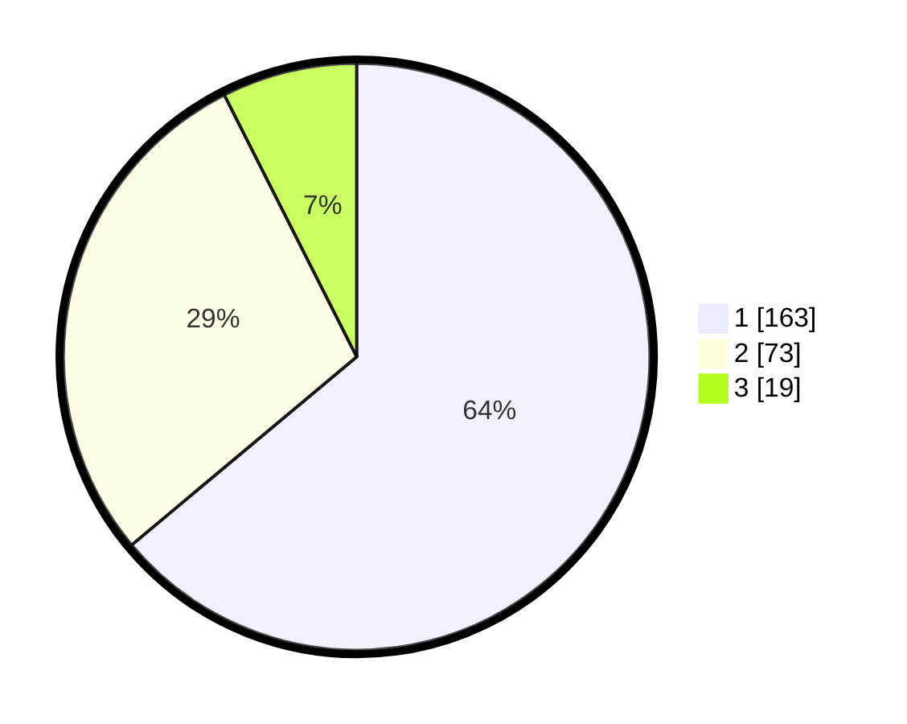

# Hasil

## Grafik

## Tabel

| No. | Nama Paslon    | Suara | Suara (raw) | Persentase |
|:--- |:-------------- | -----:| -----------:| ----------:|
| 1   | ANIES MUHAIMIN | 163   | [163][p-1]  | 63,92      |
| 2   | PRABOWO GIBRAN | 73    | [73][p-2]   | 28,63      |
| 3   | GANJAR MAHFUD  | 19    | [19][p-3]   | 7,45       |

[p-1]: https://github.com/gigit-pemilu/pemilu-2024/blob/main/pilpres/hitung-suara/sub/32-jawa-barat/sub/08-kuningan/sub/01-kadugede/sub/2004-windujanten/sub/003-tps/sub/paslon-1.txt
[p-2]: https://github.com/gigit-pemilu/pemilu-2024/blob/main/pilpres/hitung-suara/sub/32-jawa-barat/sub/08-kuningan/sub/01-kadugede/sub/2004-windujanten/sub/003-tps/sub/paslon-2.txt
[p-3]: https://github.com/gigit-pemilu/pemilu-2024/blob/main/pilpres/hitung-suara/sub/32-jawa-barat/sub/08-kuningan/sub/01-kadugede/sub/2004-windujanten/sub/003-tps/sub/paslon-3.txt

## Foto C Plano

https://sirekap-obj-formc.kpu.go.id/ef59/pemilu/ppwp/32/08/01/20/04/3208012004003-20240215-025948--a1a7bd87-29c0-46e2-ba20-26e7ffad9f93.jpg

https://sirekap-obj-formc.kpu.go.id/ef59/pemilu/ppwp/32/08/01/20/04/3208012004003-20240215-030018--7d6f1e43-591f-4be6-a696-3e3ee9bcc2e0.jpg

https://sirekap-obj-formc.kpu.go.id/ef59/pemilu/ppwp/32/08/01/20/04/3208012004003-20240215-030044--c34f45b2-6d4e-4143-aebd-5f1b0ad6f3db.jpg

## Metadata

| Key        | Value               |
| ---------- | ------------------- |
| Time Stamp | 2024-02-17 07:00:02 |

