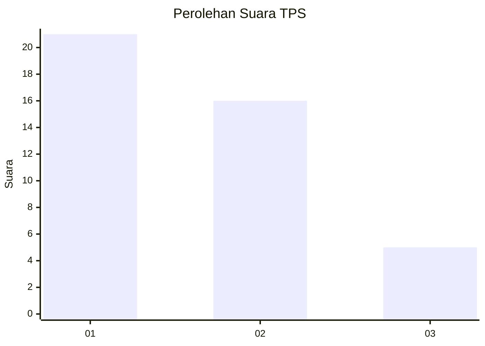
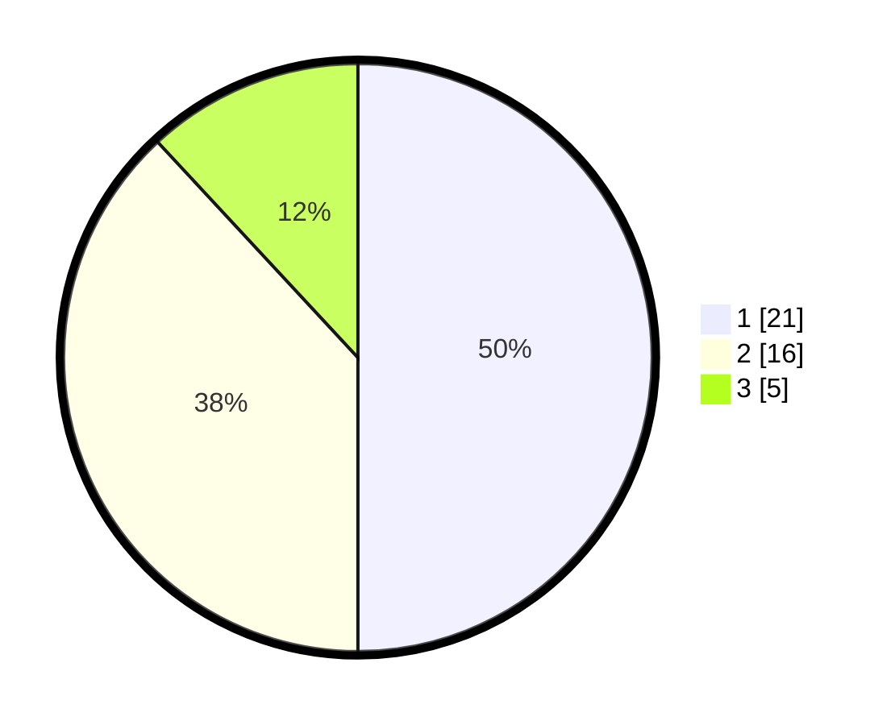

# Hasil

## Grafik

## Tabel

| No. | Nama Paslon    | Suara | Suara (raw) | Persentase |
|:--- |:-------------- | -----:| -----------:| ----------:|
| 1   | ANIES MUHAIMIN | 21    | [21][p-1]   | 50,00      |
| 2   | PRABOWO GIBRAN | 16    | [16][p-2]   | 38,10      |
| 3   | GANJAR MAHFUD  | 5     | [5][p-3]    | 11,90      |

[p-1]: https://github.com/gigit-pemilu/pemilu-2024/blob/main/pilpres/hitung-suara/sub/32-jawa-barat/sub/08-kuningan/sub/02-ciniru/sub/2001-pinara/sub/006-tps/sub/paslon-1.txt
[p-2]: https://github.com/gigit-pemilu/pemilu-2024/blob/main/pilpres/hitung-suara/sub/32-jawa-barat/sub/08-kuningan/sub/02-ciniru/sub/2001-pinara/sub/006-tps/sub/paslon-2.txt
[p-3]: https://github.com/gigit-pemilu/pemilu-2024/blob/main/pilpres/hitung-suara/sub/32-jawa-barat/sub/08-kuningan/sub/02-ciniru/sub/2001-pinara/sub/006-tps/sub/paslon-3.txt

## Foto C Plano

https://sirekap-obj-formc.kpu.go.id/fc6c/pemilu/ppwp/32/08/02/20/01/3208022001006-20240216-204203--bd003f08-dc3e-4444-9fc3-513cab59eb63.jpg

https://sirekap-obj-formc.kpu.go.id/fc6c/pemilu/ppwp/32/08/02/20/01/3208022001006-20240216-204208--90526e95-a26d-45f4-bbff-f67b8f64a87e.jpg

https://sirekap-obj-formc.kpu.go.id/fc6c/pemilu/ppwp/32/08/02/20/01/3208022001006-20240216-204214--d7cd917a-1fd2-4dfd-8884-b056ea93126a.jpg

## Metadata

| Key        | Value               |
| ---------- | ------------------- |
| Time Stamp | 2024-02-19 06:16:00 |

