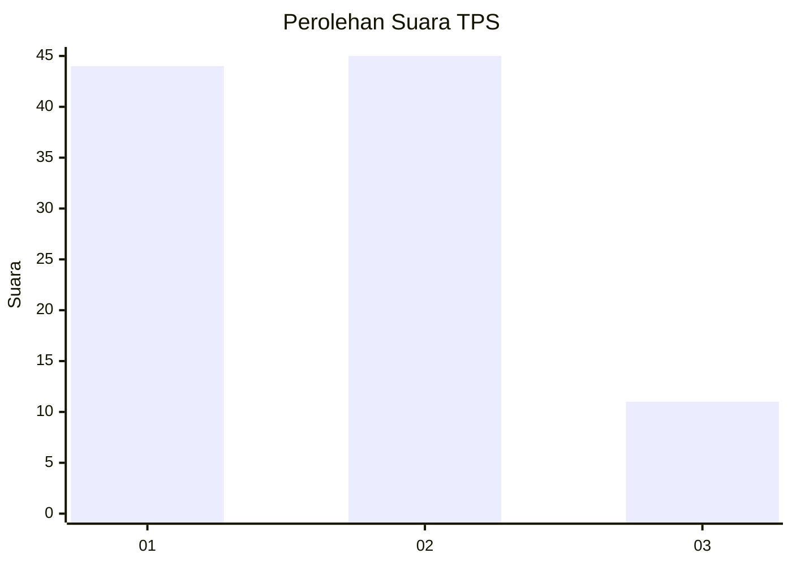
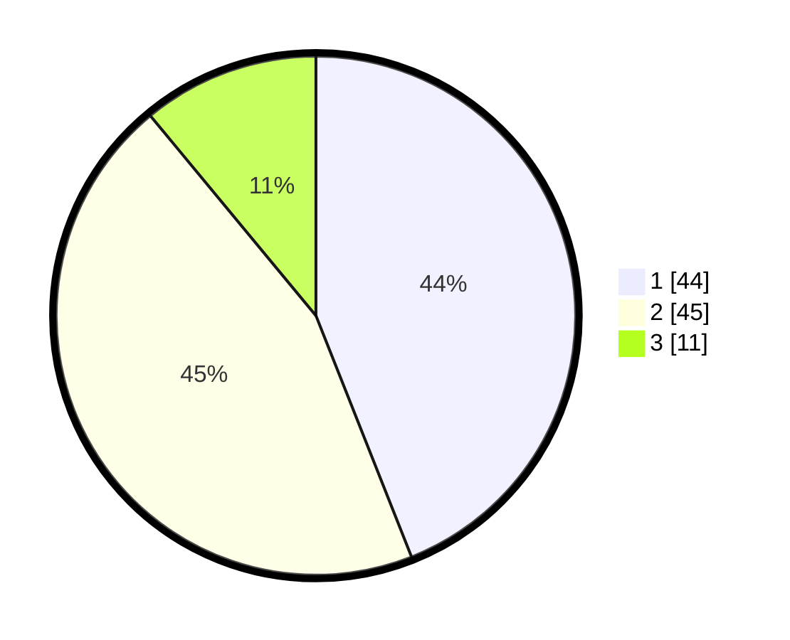

# Hasil

## Grafik

## Tabel

| No. | Nama Paslon    | Suara | Suara (raw) | Persentase |
|:--- |:-------------- | -----:| -----------:| ----------:|
| 1   | ANIES MUHAIMIN | 44    | [44][p-1]   | 44,00      |
| 2   | PRABOWO GIBRAN | 45    | [45][p-2]   | 45,00      |
| 3   | GANJAR MAHFUD  | 11    | [11][p-3]   | 11,00      |

[p-1]: https://github.com/gigit-pemilu/pemilu-2024/blob/main/pilpres/hitung-suara/sub/32-jawa-barat/sub/08-kuningan/sub/02-ciniru/sub/2002-cijemit/sub/006-tps/sub/paslon-1.txt
[p-2]: https://github.com/gigit-pemilu/pemilu-2024/blob/main/pilpres/hitung-suara/sub/32-jawa-barat/sub/08-kuningan/sub/02-ciniru/sub/2002-cijemit/sub/006-tps/sub/paslon-2.txt
[p-3]: https://github.com/gigit-pemilu/pemilu-2024/blob/main/pilpres/hitung-suara/sub/32-jawa-barat/sub/08-kuningan/sub/02-ciniru/sub/2002-cijemit/sub/006-tps/sub/paslon-3.txt

## Foto C Plano

https://sirekap-obj-formc.kpu.go.id/f4d1/pemilu/ppwp/32/08/02/20/02/3208022002006-20240214-191350--e89b1f68-ce75-4f2a-820e-6880c29a3163.jpg

https://sirekap-obj-formc.kpu.go.id/f4d1/pemilu/ppwp/32/08/02/20/02/3208022002006-20240214-191151--336c73c3-f322-4baf-8f4a-147fabc81f27.jpg

https://sirekap-obj-formc.kpu.go.id/f4d1/pemilu/ppwp/32/08/02/20/02/3208022002006-20240214-191232--6bc736ae-d911-41c2-b4f8-293b189b6f24.jpg

## Metadata

| Key        | Value               |
| ---------- | ------------------- |
| Time Stamp | 2024-02-16 00:00:26 |

