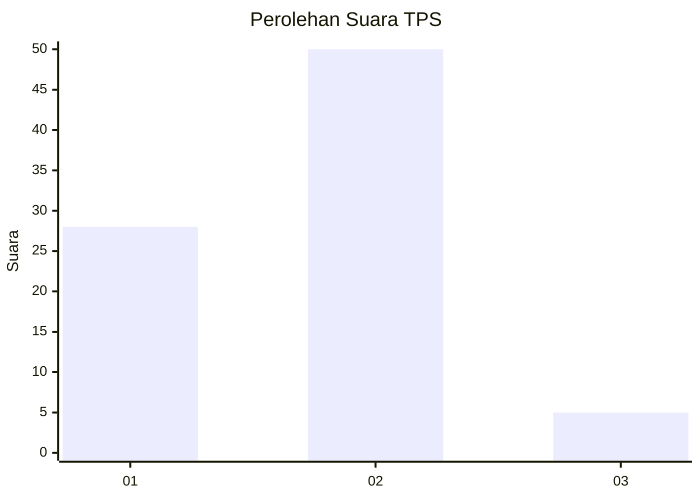
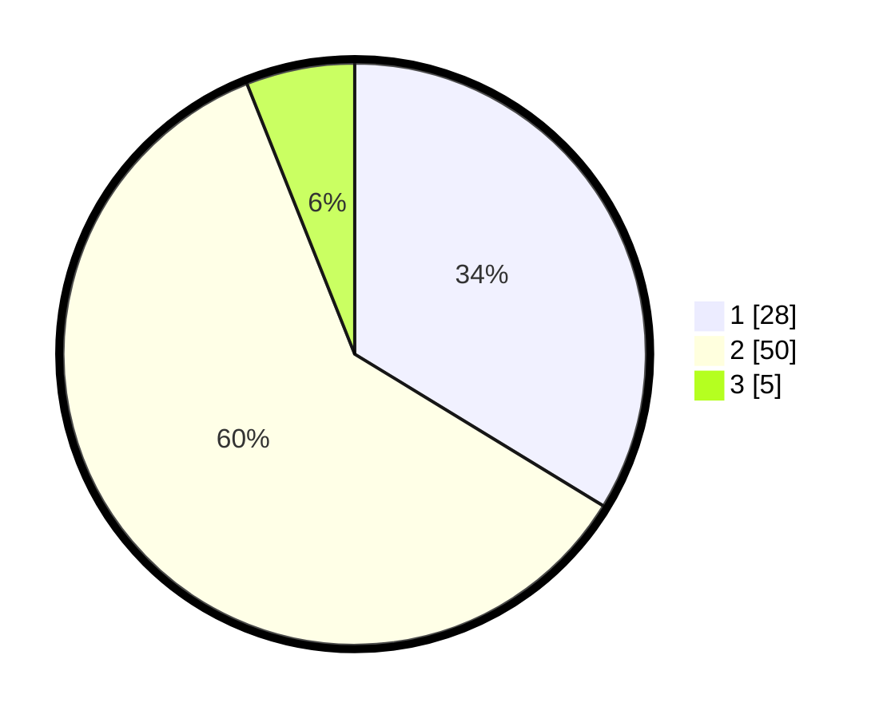

# Hasil

## Grafik

## Tabel

| No. | Nama Paslon    | Suara | Suara (raw) | Persentase |
|:--- |:-------------- | -----:| -----------:| ----------:|
| 1   | ANIES MUHAIMIN | 28    | [28][p-1]   | 33,73      |
| 2   | PRABOWO GIBRAN | 50    | [50][p-2]   | 60,24      |
| 3   | GANJAR MAHFUD  | 5     | [5][p-3]    | 6,02       |

[p-1]: https://github.com/gigit-pemilu/pemilu-2024-32-jawa-barat/blob/main/pilpres/hitung-suara/sub/32-jawa-barat/sub/08-kuningan/sub/02-ciniru/sub/2003-cipedes/sub/010-tps/sub/paslon-1.txt
[p-2]: https://github.com/gigit-pemilu/pemilu-2024-32-jawa-barat/blob/main/pilpres/hitung-suara/sub/32-jawa-barat/sub/08-kuningan/sub/02-ciniru/sub/2003-cipedes/sub/010-tps/sub/paslon-2.txt
[p-3]: https://github.com/gigit-pemilu/pemilu-2024-32-jawa-barat/blob/main/pilpres/hitung-suara/sub/32-jawa-barat/sub/08-kuningan/sub/02-ciniru/sub/2003-cipedes/sub/010-tps/sub/paslon-3.txt

## Foto C Plano

https://sirekap-obj-formc.kpu.go.id/2d14/pemilu/ppwp/32/08/02/20/03/3208022003010-20240214-192523--48be178c-9037-41f0-9123-f606a5d6fafa.jpg

https://sirekap-obj-formc.kpu.go.id/2d14/pemilu/ppwp/32/08/02/20/03/3208022003010-20240219-111833--e208bcdf-e917-4240-bb8a-07edb79383dd.jpg

https://sirekap-obj-formc.kpu.go.id/2d14/pemilu/ppwp/32/08/02/20/03/3208022003010-20240219-111840--41871807-7894-4897-8f67-637e1157e772.jpg

## Metadata

| Key        | Value               |
| ---------- | ------------------- |
| Time Stamp | 2024-02-19 12:00:00 |

