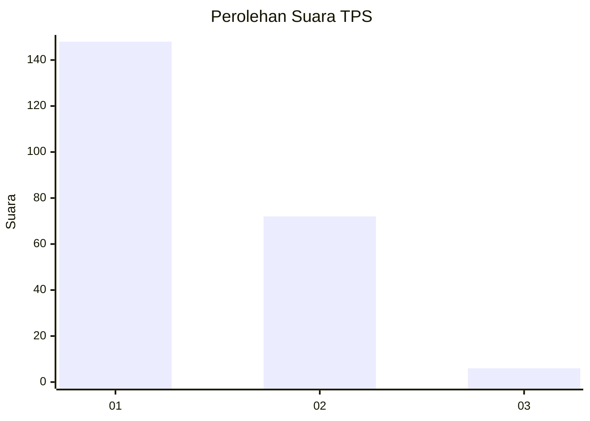
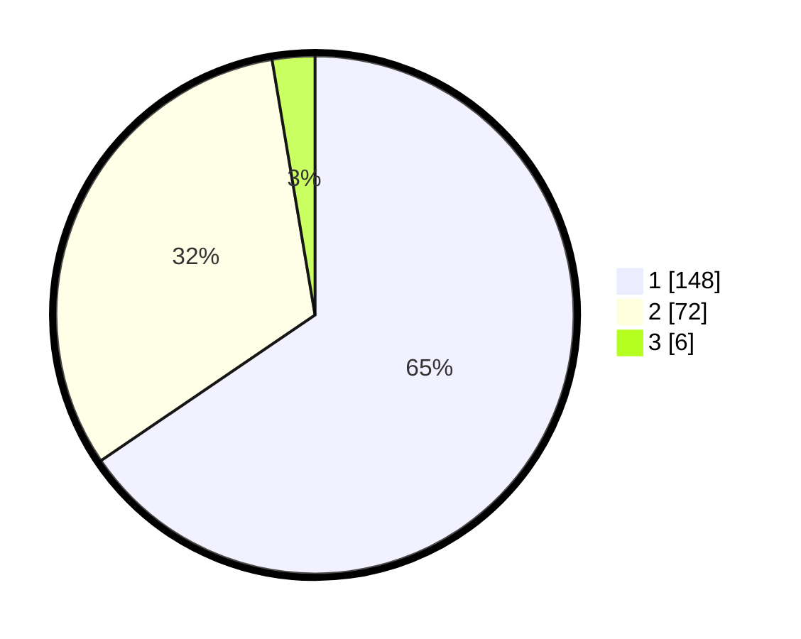

# Hasil

## Grafik

## Tabel

| No. | Nama Paslon    | Suara | Suara (raw) | Persentase |
|:--- |:-------------- | -----:| -----------:| ----------:|
| 1   | ANIES MUHAIMIN | 148   | [148][p-1]  | 65,49      |
| 2   | PRABOWO GIBRAN | 72    | [72][p-2]   | 31,86      |
| 3   | GANJAR MAHFUD  | 6     | [6][p-3]    | 2,65       |

[p-1]: https://github.com/gigit-pemilu/pemilu-2024/blob/main/pilpres/hitung-suara/sub/32-jawa-barat/sub/08-kuningan/sub/03-subang/sub/2003-subang/sub/004-tps/sub/paslon-1.txt
[p-2]: https://github.com/gigit-pemilu/pemilu-2024/blob/main/pilpres/hitung-suara/sub/32-jawa-barat/sub/08-kuningan/sub/03-subang/sub/2003-subang/sub/004-tps/sub/paslon-2.txt
[p-3]: https://github.com/gigit-pemilu/pemilu-2024/blob/main/pilpres/hitung-suara/sub/32-jawa-barat/sub/08-kuningan/sub/03-subang/sub/2003-subang/sub/004-tps/sub/paslon-3.txt

## Foto C Plano

https://sirekap-obj-formc.kpu.go.id/05e2/pemilu/ppwp/32/08/03/20/03/3208032003004-20240214-194229--71aa1144-79a8-4ec4-99c0-5e329663c373.jpg

https://sirekap-obj-formc.kpu.go.id/05e2/pemilu/ppwp/32/08/03/20/03/3208032003004-20240214-193500--52befb39-663c-4bf6-b3fd-842a96776564.jpg

https://sirekap-obj-formc.kpu.go.id/05e2/pemilu/ppwp/32/08/03/20/03/3208032003004-20240214-193549--c5e7e468-d93a-44d0-b09e-ac970644790b.jpg

## Metadata

| Key        | Value               |
| ---------- | ------------------- |
| Time Stamp | 2024-02-15 15:30:25 |

