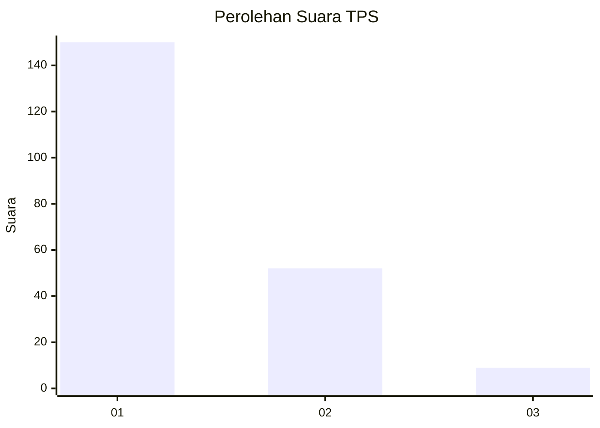
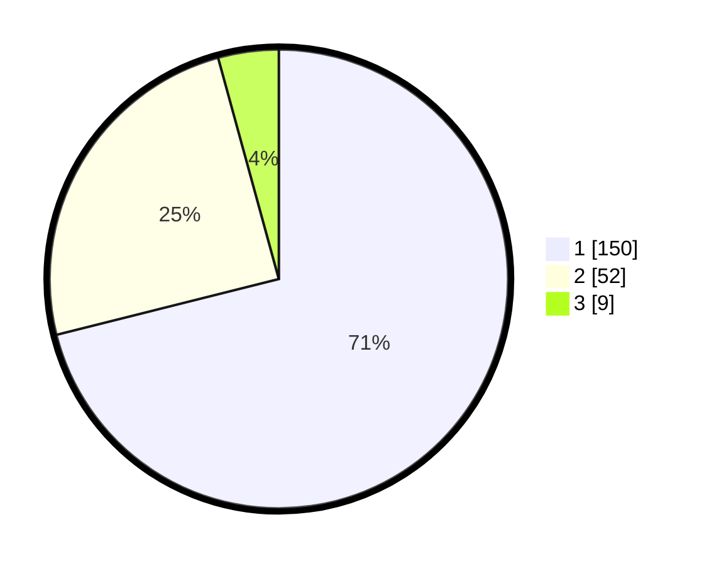

# Hasil

## Grafik

## Tabel

| No. | Nama Paslon    | Suara | Suara (raw) | Persentase |
|:--- |:-------------- | -----:| -----------:| ----------:|
| 1   | ANIES MUHAIMIN | 150   | [150][p-1]  | 71,09      |
| 2   | PRABOWO GIBRAN | 52    | [52][p-2]   | 24,64      |
| 3   | GANJAR MAHFUD  | 9     | [9][p-3]    | 4,27       |

[p-1]: https://github.com/gigit-pemilu/pemilu-2024/blob/main/pilpres/hitung-suara/sub/32-jawa-barat/sub/08-kuningan/sub/03-subang/sub/2005-situgede/sub/005-tps/sub/paslon-1.txt
[p-2]: https://github.com/gigit-pemilu/pemilu-2024/blob/main/pilpres/hitung-suara/sub/32-jawa-barat/sub/08-kuningan/sub/03-subang/sub/2005-situgede/sub/005-tps/sub/paslon-2.txt
[p-3]: https://github.com/gigit-pemilu/pemilu-2024/blob/main/pilpres/hitung-suara/sub/32-jawa-barat/sub/08-kuningan/sub/03-subang/sub/2005-situgede/sub/005-tps/sub/paslon-3.txt

## Foto C Plano

https://sirekap-obj-formc.kpu.go.id/4bb5/pemilu/ppwp/32/08/03/20/05/3208032005005-20240215-024653--3d2daf53-5170-493b-87fc-8a3260efb011.jpg

https://sirekap-obj-formc.kpu.go.id/4bb5/pemilu/ppwp/32/08/03/20/05/3208032005005-20240215-025011--896f6392-d78c-4abb-bd4f-90b207254809.jpg

https://sirekap-obj-formc.kpu.go.id/4bb5/pemilu/ppwp/32/08/03/20/05/3208032005005-20240215-025324--c07cd2a3-1e76-4398-90b2-3a6a16b21d6d.jpg

## Metadata

| Key        | Value               |
| ---------- | ------------------- |
| Time Stamp | 2024-02-15 19:30:26 |

