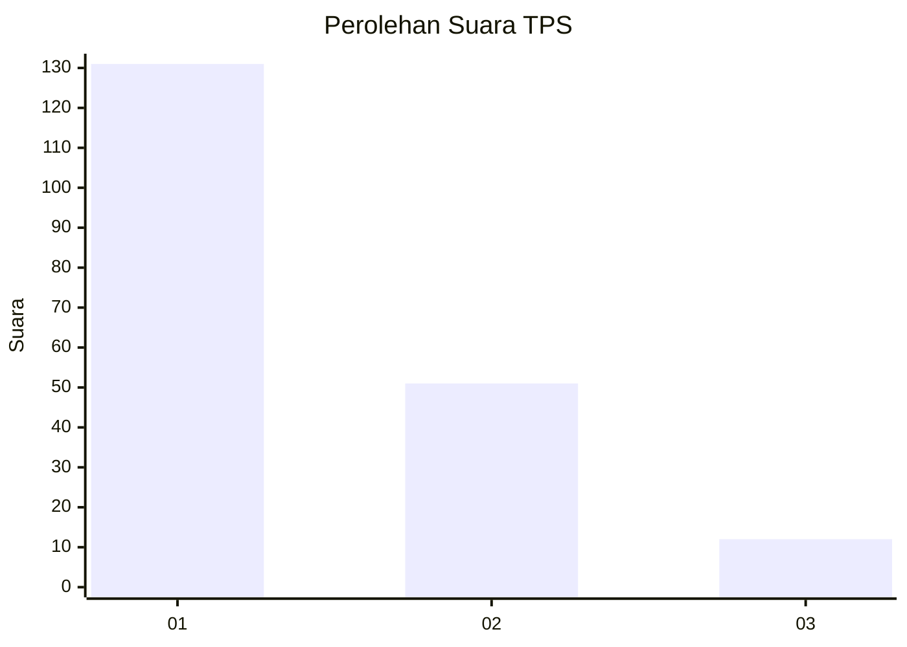
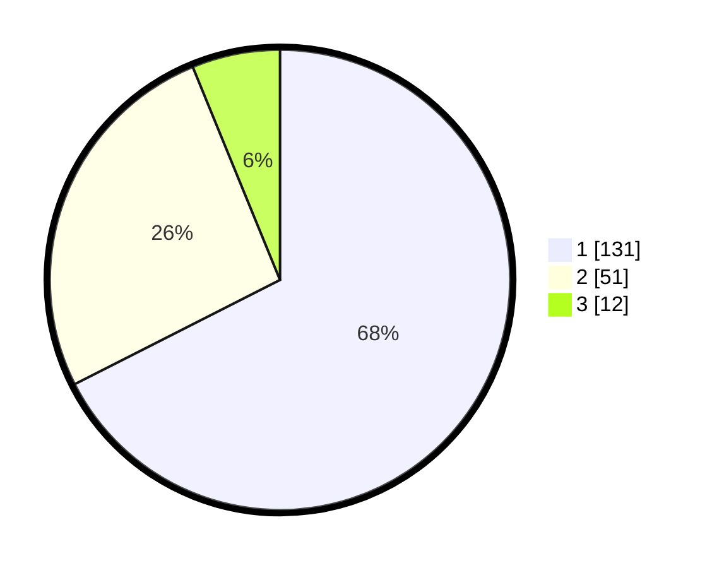

# Hasil

## Grafik

## Tabel

| No. | Nama Paslon    | Suara | Suara (raw) | Persentase |
|:--- |:-------------- | -----:| -----------:| ----------:|
| 1   | ANIES MUHAIMIN | 131   | [131][p-1]  | 67,53      |
| 2   | PRABOWO GIBRAN | 51    | [51][p-2]   | 26,29      |
| 3   | GANJAR MAHFUD  | 12    | [12][p-3]   | 6,19       |

[p-1]: https://github.com/gigit-pemilu/pemilu-2024-32-jawa-barat/blob/main/pilpres/hitung-suara/sub/32-jawa-barat/sub/08-kuningan/sub/04-ciwaru/sub/2003-ciwaru/sub/001-tps/sub/paslon-1.txt
[p-2]: https://github.com/gigit-pemilu/pemilu-2024-32-jawa-barat/blob/main/pilpres/hitung-suara/sub/32-jawa-barat/sub/08-kuningan/sub/04-ciwaru/sub/2003-ciwaru/sub/001-tps/sub/paslon-2.txt
[p-3]: https://github.com/gigit-pemilu/pemilu-2024-32-jawa-barat/blob/main/pilpres/hitung-suara/sub/32-jawa-barat/sub/08-kuningan/sub/04-ciwaru/sub/2003-ciwaru/sub/001-tps/sub/paslon-3.txt

## Foto C Plano

https://sirekap-obj-formc.kpu.go.id/94c0/pemilu/ppwp/32/08/04/20/03/3208042003001-20240214-223459--a8bcfa5b-250c-4a49-b516-13c4ef891433.jpg

https://sirekap-obj-formc.kpu.go.id/94c0/pemilu/ppwp/32/08/04/20/03/3208042003001-20240214-223601--2fc61f3c-fe7b-4fc4-87a2-0f4bc9d88812.jpg

https://sirekap-obj-formc.kpu.go.id/94c0/pemilu/ppwp/32/08/04/20/03/3208042003001-20240214-233318--133db71f-7595-40fa-895a-a83c706dd1e1.jpg

## Metadata

| Key        | Value               |
| ---------- | ------------------- |
| Time Stamp | 2024-02-17 16:00:02 |

