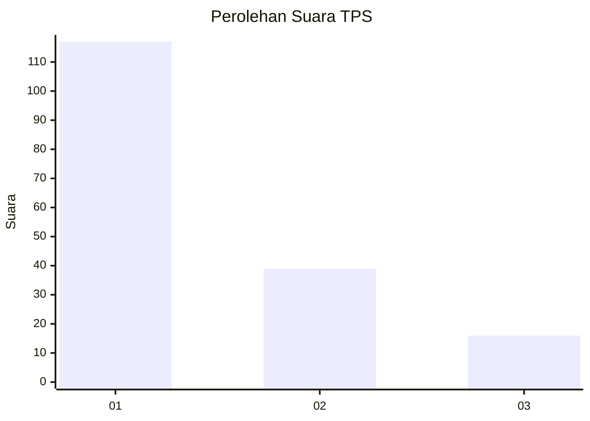
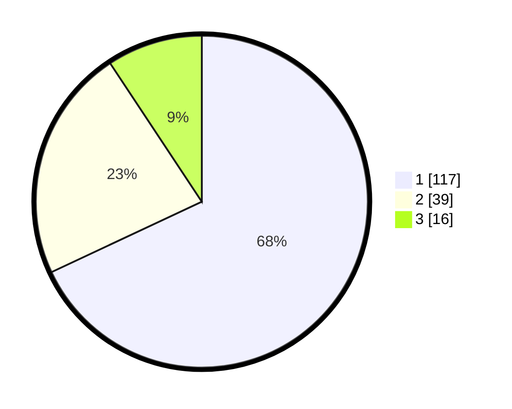

# Hasil

## Grafik

## Tabel

| No. | Nama Paslon    | Suara | Suara (raw) | Persentase |
|:--- |:-------------- | -----:| -----------:| ----------:|
| 1   | ANIES MUHAIMIN | 117   | [117][p-1]  | 68,02      |
| 2   | PRABOWO GIBRAN | 39    | [39][p-2]   | 22,67      |
| 3   | GANJAR MAHFUD  | 16    | [16][p-3]   | 9,30       |

[p-1]: https://github.com/gigit-pemilu/pemilu-2024/blob/main/pilpres/hitung-suara/sub/32-jawa-barat/sub/08-kuningan/sub/04-ciwaru/sub/2004-garajati/sub/002-tps/sub/paslon-1.txt
[p-2]: https://github.com/gigit-pemilu/pemilu-2024/blob/main/pilpres/hitung-suara/sub/32-jawa-barat/sub/08-kuningan/sub/04-ciwaru/sub/2004-garajati/sub/002-tps/sub/paslon-2.txt
[p-3]: https://github.com/gigit-pemilu/pemilu-2024/blob/main/pilpres/hitung-suara/sub/32-jawa-barat/sub/08-kuningan/sub/04-ciwaru/sub/2004-garajati/sub/002-tps/sub/paslon-3.txt

## Foto C Plano

https://sirekap-obj-formc.kpu.go.id/0ef9/pemilu/ppwp/32/08/04/20/04/3208042004002-20240214-232700--be6a8cd3-45f1-4dd4-ba96-79dbb4436d81.jpg

https://sirekap-obj-formc.kpu.go.id/0ef9/pemilu/ppwp/32/08/04/20/04/3208042004002-20240214-232720--429f071e-b9dd-4a4c-a4ec-7b477d582886.jpg

https://sirekap-obj-formc.kpu.go.id/0ef9/pemilu/ppwp/32/08/04/20/04/3208042004002-20240214-232737--5f446998-5b87-4d6c-8886-b859199cf4e2.jpg

## Metadata

| Key        | Value               |
| ---------- | ------------------- |
| Time Stamp | 2024-02-16 08:30:27 |

