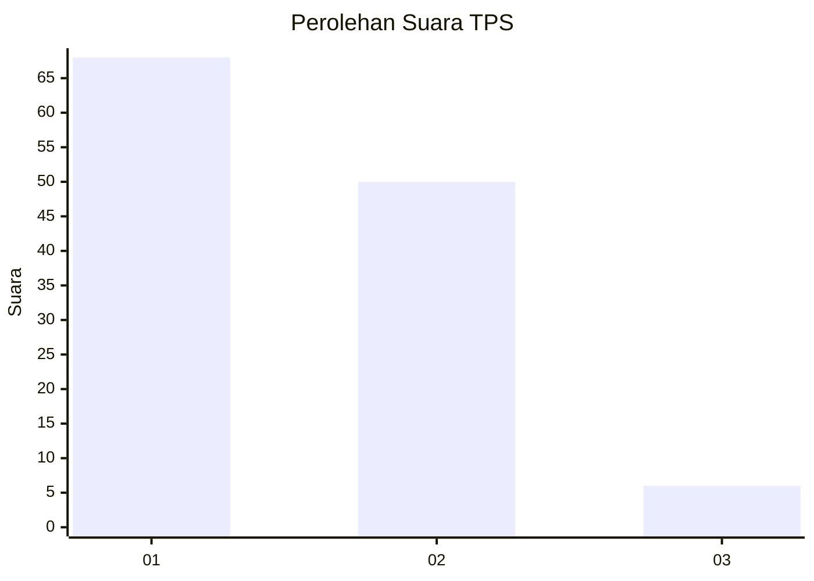
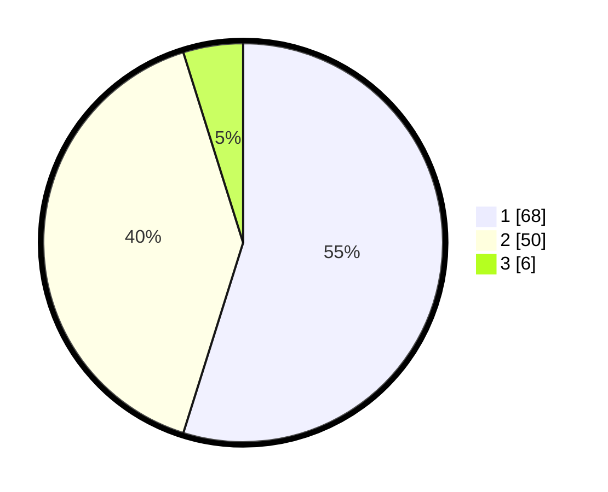

# Hasil

## Grafik

## Tabel

| No. | Nama Paslon    | Suara | Suara (raw) | Persentase |
|:--- |:-------------- | -----:| -----------:| ----------:|
| 1   | ANIES MUHAIMIN | 68    | [68][p-1]   | 54,84      |
| 2   | PRABOWO GIBRAN | 50    | [50][p-2]   | 40,32      |
| 3   | GANJAR MAHFUD  | 6     | [6][p-3]    | 4,84       |

[p-1]: https://github.com/gigit-pemilu/pemilu-2024-32-jawa-barat/blob/main/pilpres/hitung-suara/sub/32-jawa-barat/sub/08-kuningan/sub/04-ciwaru/sub/2005-baok/sub/005-tps/sub/paslon-1.txt
[p-2]: https://github.com/gigit-pemilu/pemilu-2024-32-jawa-barat/blob/main/pilpres/hitung-suara/sub/32-jawa-barat/sub/08-kuningan/sub/04-ciwaru/sub/2005-baok/sub/005-tps/sub/paslon-2.txt
[p-3]: https://github.com/gigit-pemilu/pemilu-2024-32-jawa-barat/blob/main/pilpres/hitung-suara/sub/32-jawa-barat/sub/08-kuningan/sub/04-ciwaru/sub/2005-baok/sub/005-tps/sub/paslon-3.txt

## Foto C Plano

https://sirekap-obj-formc.kpu.go.id/4c25/pemilu/ppwp/32/08/04/20/05/3208042005005-20240214-231634--f90d62ad-8539-4461-8957-0d5d003332d9.jpg

https://sirekap-obj-formc.kpu.go.id/4c25/pemilu/ppwp/32/08/04/20/05/3208042005005-20240214-231745--3ff50e48-c8ed-456e-814d-8c07365a774a.jpg

https://sirekap-obj-formc.kpu.go.id/4c25/pemilu/ppwp/32/08/04/20/05/3208042005005-20240214-232232--5b4a4b33-8d93-45ac-8d7f-4e7cd89216c3.jpg

## Metadata

| Key        | Value               |
| ---------- | ------------------- |
| Time Stamp | 2024-02-15 19:00:26 |

