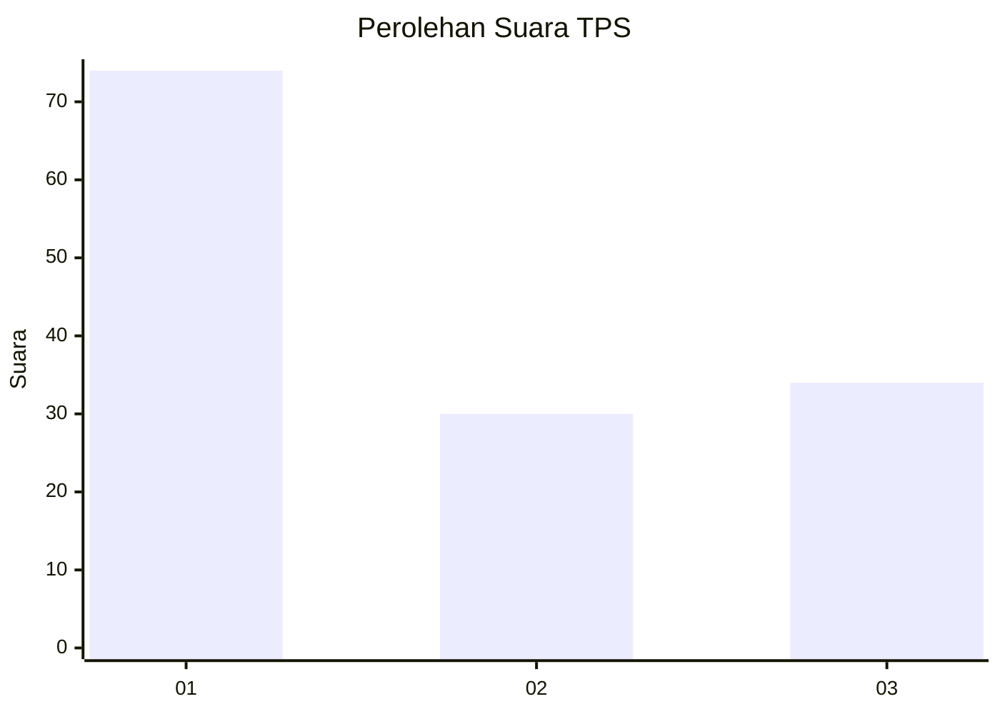
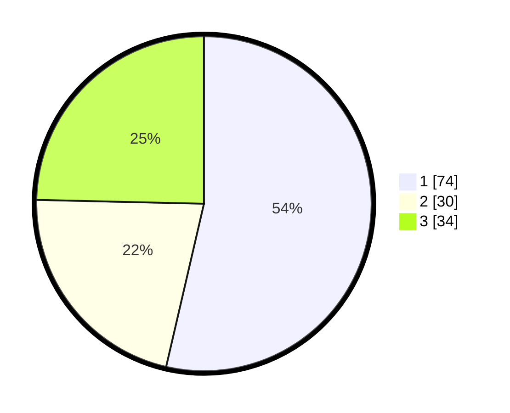

# Hasil

## Grafik

## Tabel

| No. | Nama Paslon    | Suara | Suara (raw) | Persentase |
|:--- |:-------------- | -----:| -----------:| ----------:|
| 1   | ANIES MUHAIMIN | 74    | [74][p-1]   | 53,62      |
| 2   | PRABOWO GIBRAN | 30    | [30][p-2]   | 21,74      |
| 3   | GANJAR MAHFUD  | 34    | [34][p-3]   | 24,64      |

[p-1]: https://github.com/gigit-pemilu/pemilu-2024-32-jawa-barat/blob/main/pilpres/hitung-suara/sub/32-jawa-barat/sub/08-kuningan/sub/04-ciwaru/sub/2009-lebakherang/sub/002-tps/sub/paslon-1.txt
[p-2]: https://github.com/gigit-pemilu/pemilu-2024-32-jawa-barat/blob/main/pilpres/hitung-suara/sub/32-jawa-barat/sub/08-kuningan/sub/04-ciwaru/sub/2009-lebakherang/sub/002-tps/sub/paslon-2.txt
[p-3]: https://github.com/gigit-pemilu/pemilu-2024-32-jawa-barat/blob/main/pilpres/hitung-suara/sub/32-jawa-barat/sub/08-kuningan/sub/04-ciwaru/sub/2009-lebakherang/sub/002-tps/sub/paslon-3.txt

## Foto C Plano

https://sirekap-obj-formc.kpu.go.id/4a99/pemilu/ppwp/32/08/04/20/09/3208042009002-20240214-202347--d4130bdc-d447-414e-af39-afc09f8519bb.jpg

https://sirekap-obj-formc.kpu.go.id/4a99/pemilu/ppwp/32/08/04/20/09/3208042009002-20240214-202901--65faf95b-7d00-4f6a-95e0-4a58190af69f.jpg

https://sirekap-obj-formc.kpu.go.id/4a99/pemilu/ppwp/32/08/04/20/09/3208042009002-20240214-203204--952a3099-bf93-48a9-a87d-ee019fb710a1.jpg

## Metadata

| Key        | Value               |
| ---------- | ------------------- |
| Time Stamp | 2024-02-15 19:30:26 |

