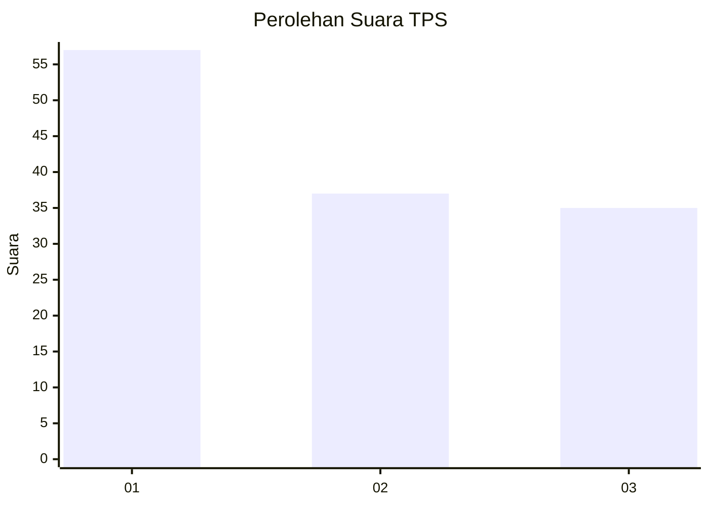
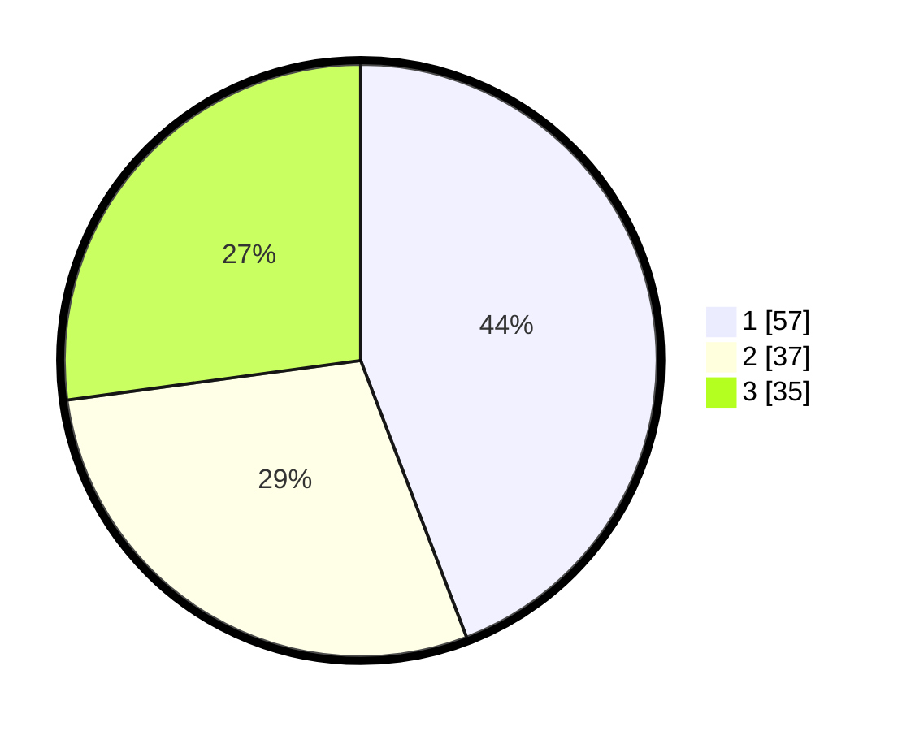

# Hasil

## Grafik

## Tabel

| No. | Nama Paslon    | Suara | Suara (raw) | Persentase |
|:--- |:-------------- | -----:| -----------:| ----------:|
| 1   | ANIES MUHAIMIN | 57    | [57][p-1]   | 44,19      |
| 2   | PRABOWO GIBRAN | 37    | [37][p-2]   | 28,68      |
| 3   | GANJAR MAHFUD  | 35    | [35][p-3]   | 27,13      |

[p-1]: https://github.com/gigit-pemilu/pemilu-2024-32-jawa-barat/blob/main/pilpres/hitung-suara/sub/32-jawa-barat/sub/08-kuningan/sub/04-ciwaru/sub/2011-linggajaya/sub/003-tps/sub/paslon-1.txt
[p-2]: https://github.com/gigit-pemilu/pemilu-2024-32-jawa-barat/blob/main/pilpres/hitung-suara/sub/32-jawa-barat/sub/08-kuningan/sub/04-ciwaru/sub/2011-linggajaya/sub/003-tps/sub/paslon-2.txt
[p-3]: https://github.com/gigit-pemilu/pemilu-2024-32-jawa-barat/blob/main/pilpres/hitung-suara/sub/32-jawa-barat/sub/08-kuningan/sub/04-ciwaru/sub/2011-linggajaya/sub/003-tps/sub/paslon-3.txt

## Foto C Plano

https://sirekap-obj-formc.kpu.go.id/2b63/pemilu/ppwp/32/08/04/20/11/3208042011003-20240215-010121--3dd2dae0-c6af-4ea5-b72b-6320419ec215.jpg

https://sirekap-obj-formc.kpu.go.id/2b63/pemilu/ppwp/32/08/04/20/11/3208042011003-20240215-010651--0876a7a7-fb54-4ee0-b8af-f59d4916c288.jpg

https://sirekap-obj-formc.kpu.go.id/2b63/pemilu/ppwp/32/08/04/20/11/3208042011003-20240215-010831--4c80abcd-2a5e-4b96-af92-fb7515a2331c.jpg

## Metadata

| Key        | Value               |
| ---------- | ------------------- |
| Time Stamp | 2024-02-15 20:00:44 |

