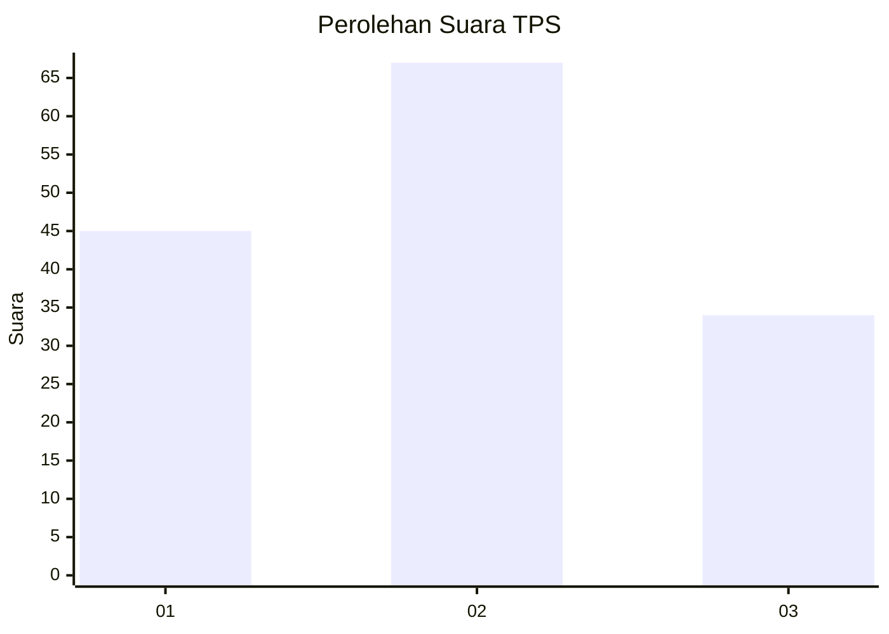
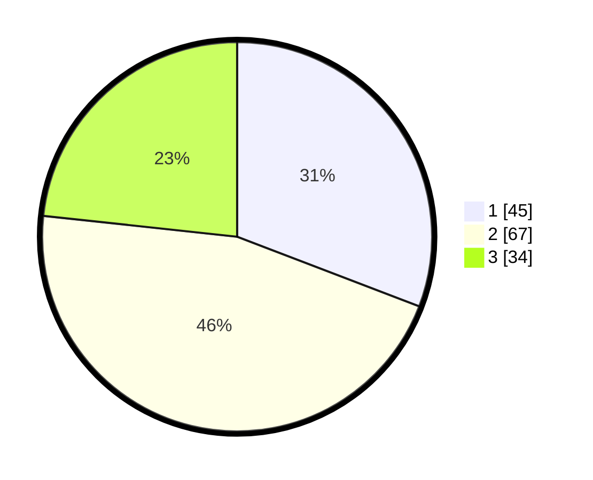

# Hasil

## Grafik

## Tabel

| No. | Nama Paslon    | Suara | Suara (raw) | Persentase |
|:--- |:-------------- | -----:| -----------:| ----------:|
| 1   | ANIES MUHAIMIN | 45    | [45][p-1]   | 30,82      |
| 2   | PRABOWO GIBRAN | 67    | [67][p-2]   | 45,89      |
| 3   | GANJAR MAHFUD  | 34    | [34][p-3]   | 23,29      |

[p-1]: https://github.com/gigit-pemilu/pemilu-2024/blob/main/pilpres/hitung-suara/sub/32-jawa-barat/sub/08-kuningan/sub/05-cibingbin/sub/2001-cipondok/sub/009-tps/sub/paslon-1.txt
[p-2]: https://github.com/gigit-pemilu/pemilu-2024/blob/main/pilpres/hitung-suara/sub/32-jawa-barat/sub/08-kuningan/sub/05-cibingbin/sub/2001-cipondok/sub/009-tps/sub/paslon-2.txt
[p-3]: https://github.com/gigit-pemilu/pemilu-2024/blob/main/pilpres/hitung-suara/sub/32-jawa-barat/sub/08-kuningan/sub/05-cibingbin/sub/2001-cipondok/sub/009-tps/sub/paslon-3.txt

## Foto C Plano

https://sirekap-obj-formc.kpu.go.id/e4f5/pemilu/ppwp/32/08/05/20/01/3208052001009-20240215-000150--41d2cc0a-d38b-4498-af8e-319e5181af65.jpg

https://sirekap-obj-formc.kpu.go.id/e4f5/pemilu/ppwp/32/08/05/20/01/3208052001009-20240215-001035--650aeff8-ee35-4849-8ac6-b177706271a5.jpg

https://sirekap-obj-formc.kpu.go.id/e4f5/pemilu/ppwp/32/08/05/20/01/3208052001009-20240215-001140--c3f74c9f-ccf0-4849-9c64-b17c4c36afbb.jpg

## Metadata

| Key        | Value               |
| ---------- | ------------------- |
| Time Stamp | 2024-02-15 20:00:44 |

