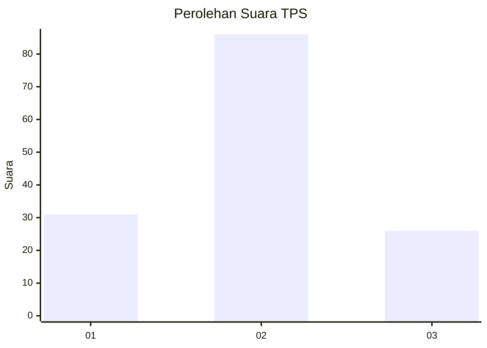
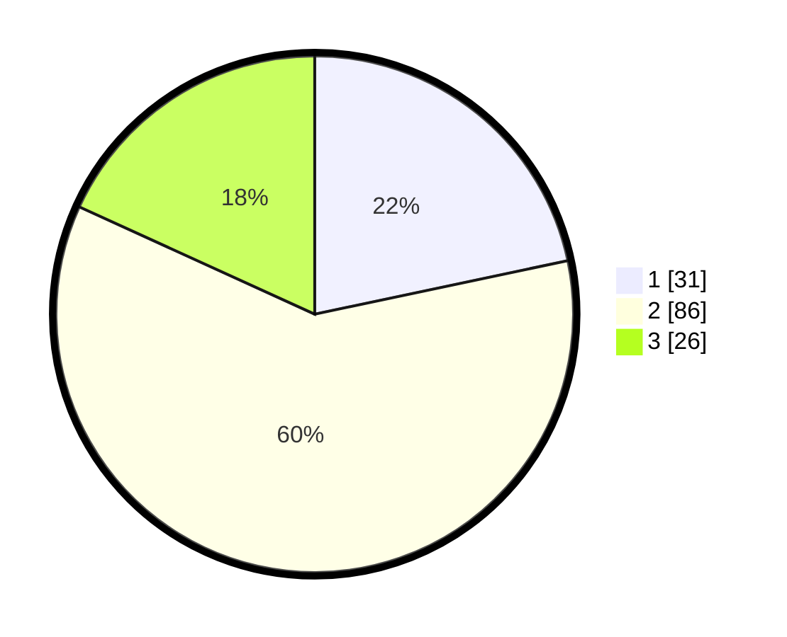

# Hasil

## Grafik

## Tabel

| No. | Nama Paslon    | Suara | Suara (raw) | Persentase |
|:--- |:-------------- | -----:| -----------:| ----------:|
| 1   | ANIES MUHAIMIN | 31    | [31][p-1]   | 21,68      |
| 2   | PRABOWO GIBRAN | 86    | [86][p-2]   | 60,14      |
| 3   | GANJAR MAHFUD  | 26    | [26][p-3]   | 18,18      |

[p-1]: https://github.com/gigit-pemilu/pemilu-2024-32-jawa-barat/blob/main/pilpres/hitung-suara/sub/32-jawa-barat/sub/08-kuningan/sub/05-cibingbin/sub/2001-cipondok/sub/010-tps/sub/paslon-1.txt
[p-2]: https://github.com/gigit-pemilu/pemilu-2024-32-jawa-barat/blob/main/pilpres/hitung-suara/sub/32-jawa-barat/sub/08-kuningan/sub/05-cibingbin/sub/2001-cipondok/sub/010-tps/sub/paslon-2.txt
[p-3]: https://github.com/gigit-pemilu/pemilu-2024-32-jawa-barat/blob/main/pilpres/hitung-suara/sub/32-jawa-barat/sub/08-kuningan/sub/05-cibingbin/sub/2001-cipondok/sub/010-tps/sub/paslon-3.txt

## Foto C Plano

https://sirekap-obj-formc.kpu.go.id/6f53/pemilu/ppwp/32/08/05/20/01/3208052001010-20240214-232925--fecf78d3-cf78-4774-973a-a50d3d880a4e.jpg

https://sirekap-obj-formc.kpu.go.id/6f53/pemilu/ppwp/32/08/05/20/01/3208052001010-20240214-233043--dd3abe0d-c16a-4e6c-a734-211e6c272f41.jpg

https://sirekap-obj-formc.kpu.go.id/6f53/pemilu/ppwp/32/08/05/20/01/3208052001010-20240214-233407--e88aba76-acb8-4471-81d3-62552802bde8.jpg

## Metadata

| Key        | Value               |
| ---------- | ------------------- |
| Time Stamp | 2024-02-15 20:00:44 |

