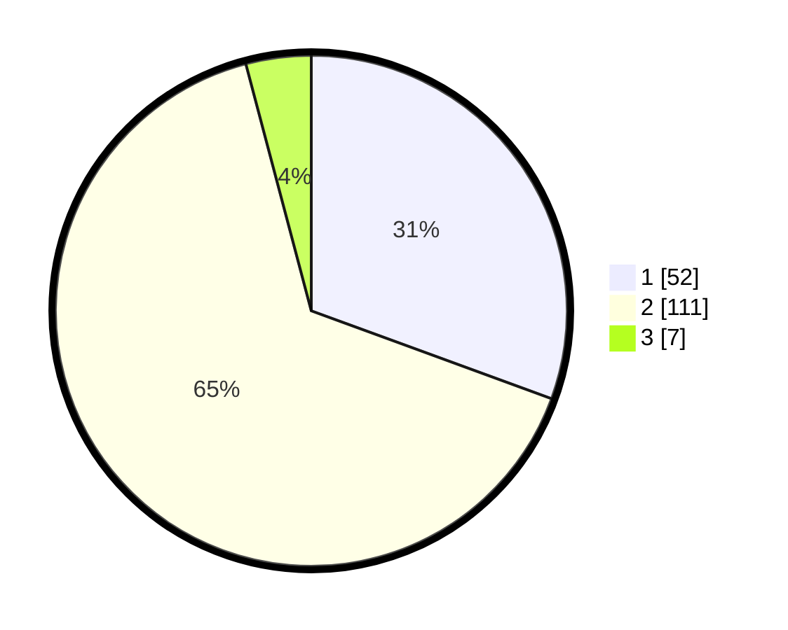

# Hasil

## Grafik

## Tabel

| No. | Nama Paslon    | Suara | Suara (raw) | Persentase |
|:--- |:-------------- | -----:| -----------:| ----------:|
| 1   | ANIES MUHAIMIN | 52    | [52][p-1]   | 30,59      |
| 2   | PRABOWO GIBRAN | 111   | [111][p-2]  | 65,29      |
| 3   | GANJAR MAHFUD  | 7     | [7][p-3]    | 4,12       |

[p-1]: https://github.com/gigit-pemilu/pemilu-2024/blob/main/pilpres/hitung-suara/sub/32-jawa-barat/sub/08-kuningan/sub/05-cibingbin/sub/2002-sindangjawa/sub/001-tps/sub/paslon-1.txt
[p-2]: https://github.com/gigit-pemilu/pemilu-2024/blob/main/pilpres/hitung-suara/sub/32-jawa-barat/sub/08-kuningan/sub/05-cibingbin/sub/2002-sindangjawa/sub/001-tps/sub/paslon-2.txt
[p-3]: https://github.com/gigit-pemilu/pemilu-2024/blob/main/pilpres/hitung-suara/sub/32-jawa-barat/sub/08-kuningan/sub/05-cibingbin/sub/2002-sindangjawa/sub/001-tps/sub/paslon-3.txt

## Foto C Plano

https://sirekap-obj-formc.kpu.go.id/4da3/pemilu/ppwp/32/08/05/20/02/3208052002001-20240214-194808--394bdf5a-a1b4-4b04-823b-3b13ae19e6e1.jpg

https://sirekap-obj-formc.kpu.go.id/4da3/pemilu/ppwp/32/08/05/20/02/3208052002001-20240214-194818--b5031266-0857-4f47-b359-574f1b96ceed.jpg

https://sirekap-obj-formc.kpu.go.id/4da3/pemilu/ppwp/32/08/05/20/02/3208052002001-20240214-194827--9aea5970-df80-4b5b-a161-0a7c36e312a4.jpg

## Metadata

| Key        | Value               |
| ---------- | ------------------- |
| Time Stamp | 2024-02-14 21:46:01 |

