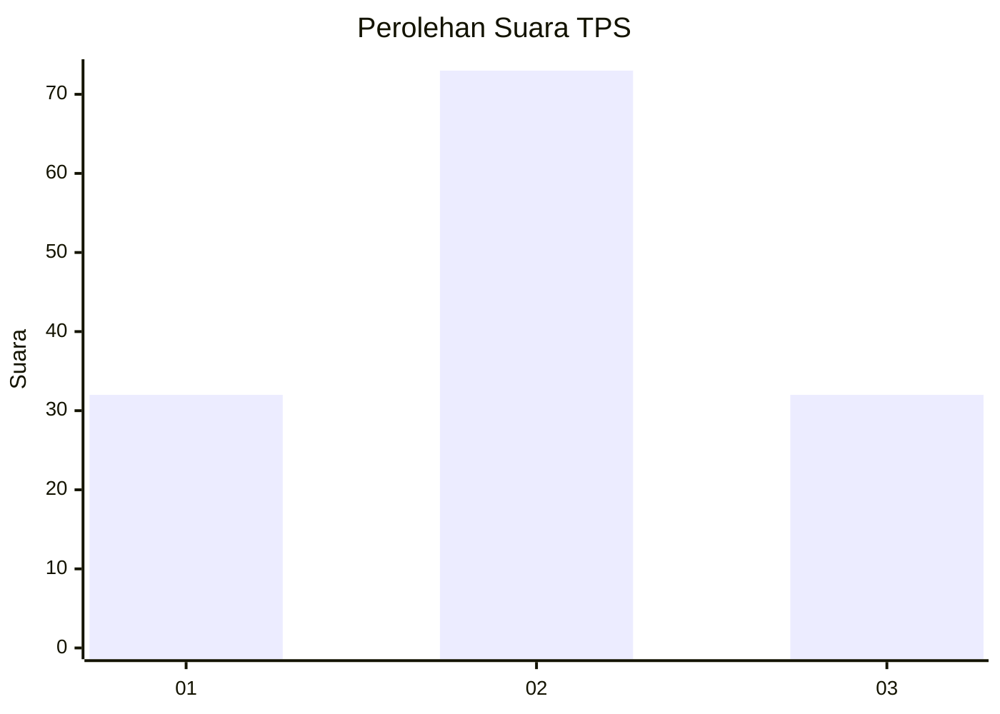
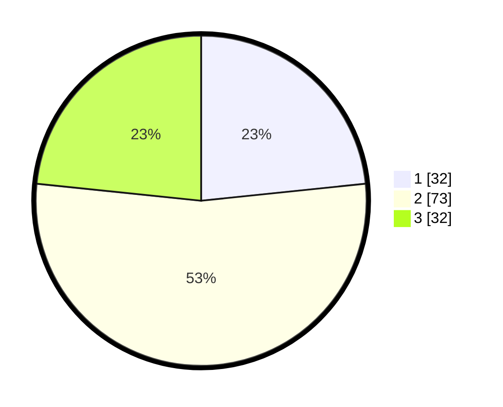

# Hasil

## Grafik

## Tabel

| No. | Nama Paslon    | Suara | Suara (raw) | Persentase |
|:--- |:-------------- | -----:| -----------:| ----------:|
| 1   | ANIES MUHAIMIN | 32    | [32][p-1]   | 23,36      |
| 2   | PRABOWO GIBRAN | 73    | [73][p-2]   | 53,28      |
| 3   | GANJAR MAHFUD  | 32    | [32][p-3]   | 23,36      |

[p-1]: https://github.com/gigit-pemilu/pemilu-2024-32-jawa-barat/blob/main/pilpres/hitung-suara/sub/32-jawa-barat/sub/08-kuningan/sub/06-luragung/sub/2002-walaharcageur/sub/006-tps/sub/paslon-1.txt
[p-2]: https://github.com/gigit-pemilu/pemilu-2024-32-jawa-barat/blob/main/pilpres/hitung-suara/sub/32-jawa-barat/sub/08-kuningan/sub/06-luragung/sub/2002-walaharcageur/sub/006-tps/sub/paslon-2.txt
[p-3]: https://github.com/gigit-pemilu/pemilu-2024-32-jawa-barat/blob/main/pilpres/hitung-suara/sub/32-jawa-barat/sub/08-kuningan/sub/06-luragung/sub/2002-walaharcageur/sub/006-tps/sub/paslon-3.txt

## Foto C Plano

https://sirekap-obj-formc.kpu.go.id/24c8/pemilu/ppwp/32/08/06/20/02/3208062002006-20240214-232216--ddc48e60-00f9-45c4-9d84-edabb9137bd9.jpg

https://sirekap-obj-formc.kpu.go.id/24c8/pemilu/ppwp/32/08/06/20/02/3208062002006-20240214-232418--da80c20e-96d8-4af0-8cda-afb7d96a58da.jpg

https://sirekap-obj-formc.kpu.go.id/24c8/pemilu/ppwp/32/08/06/20/02/3208062002006-20240214-232548--c6cb04b4-ac8b-498d-b93c-7e462ccb22f3.jpg

## Metadata

| Key        | Value               |
| ---------- | ------------------- |
| Time Stamp | 2024-02-24 22:31:28 |

