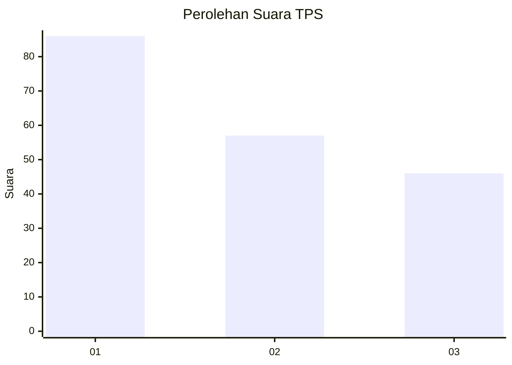
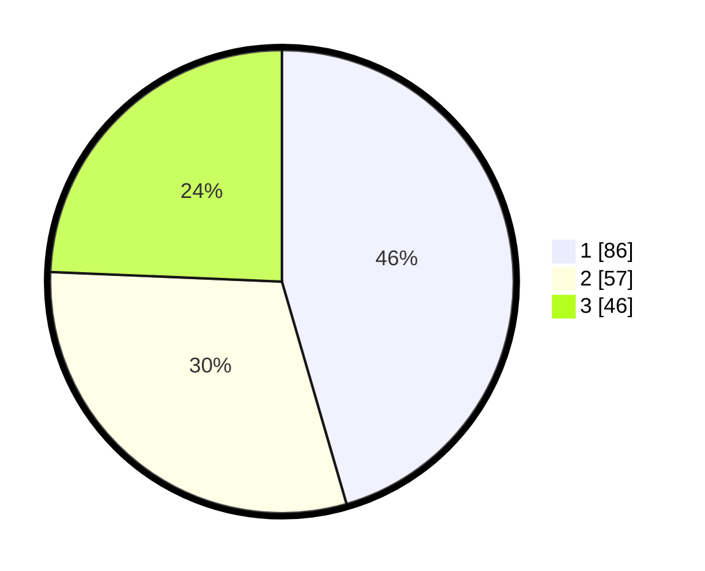

# Hasil

## Grafik

## Tabel

| No. | Nama Paslon    | Suara | Suara (raw) | Persentase |
|:--- |:-------------- | -----:| -----------:| ----------:|
| 1   | ANIES MUHAIMIN | 86    | [86][p-1]   | 45,50      |
| 2   | PRABOWO GIBRAN | 57    | [57][p-2]   | 30,16      |
| 3   | GANJAR MAHFUD  | 46    | [46][p-3]   | 24,34      |

[p-1]: https://github.com/gigit-pemilu/pemilu-2024-32-jawa-barat/blob/main/pilpres/hitung-suara/sub/32-jawa-barat/sub/08-kuningan/sub/07-lebakwangi/sub/2010-langseb/sub/002-tps/sub/paslon-1.txt
[p-2]: https://github.com/gigit-pemilu/pemilu-2024-32-jawa-barat/blob/main/pilpres/hitung-suara/sub/32-jawa-barat/sub/08-kuningan/sub/07-lebakwangi/sub/2010-langseb/sub/002-tps/sub/paslon-2.txt
[p-3]: https://github.com/gigit-pemilu/pemilu-2024-32-jawa-barat/blob/main/pilpres/hitung-suara/sub/32-jawa-barat/sub/08-kuningan/sub/07-lebakwangi/sub/2010-langseb/sub/002-tps/sub/paslon-3.txt

## Foto C Plano

https://sirekap-obj-formc.kpu.go.id/f52b/pemilu/ppwp/32/08/07/20/10/3208072010002-20240224-122727--b429ff69-dfe3-4310-ad47-310eb4de3807.jpg

https://sirekap-obj-formc.kpu.go.id/f52b/pemilu/ppwp/32/08/07/20/10/3208072010002-20240224-122734--af4bf435-9ab9-4b75-83b8-9571a243f002.jpg

https://sirekap-obj-formc.kpu.go.id/f52b/pemilu/ppwp/32/08/07/20/10/3208072010002-20240224-122740--7eb72908-0068-4136-a973-ec64116ecf15.jpg

## Metadata

| Key        | Value               |
| ---------- | ------------------- |
| Time Stamp | 2024-02-24 22:31:28 |

