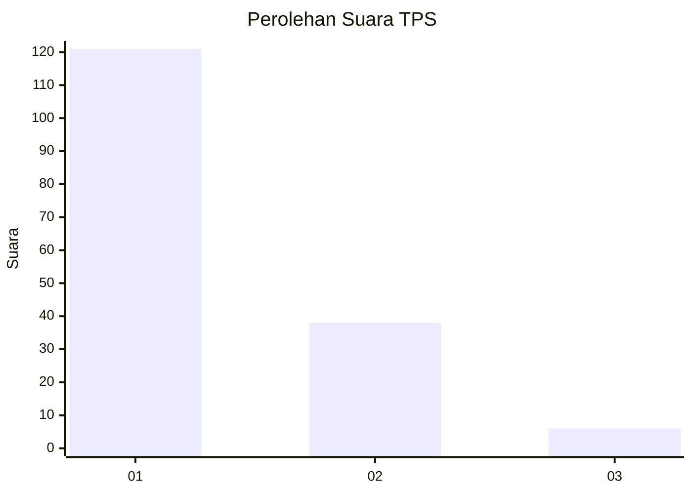
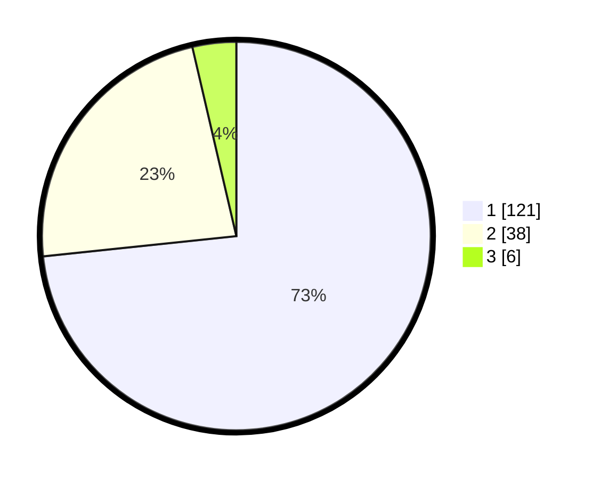

# Hasil

## Grafik

## Tabel

| No. | Nama Paslon    | Suara | Suara (raw) | Persentase |
|:--- |:-------------- | -----:| -----------:| ----------:|
| 1   | ANIES MUHAIMIN | 121   | [121][p-1]  | 73,33      |
| 2   | PRABOWO GIBRAN | 38    | [38][p-2]   | 23,03      |
| 3   | GANJAR MAHFUD  | 6     | [6][p-3]    | 3,64       |

[p-1]: https://github.com/gigit-pemilu/pemilu-2024-32-jawa-barat/blob/main/pilpres/hitung-suara/sub/32-jawa-barat/sub/08-kuningan/sub/07-lebakwangi/sub/2010-langseb/sub/003-tps/sub/paslon-1.txt
[p-2]: https://github.com/gigit-pemilu/pemilu-2024-32-jawa-barat/blob/main/pilpres/hitung-suara/sub/32-jawa-barat/sub/08-kuningan/sub/07-lebakwangi/sub/2010-langseb/sub/003-tps/sub/paslon-2.txt
[p-3]: https://github.com/gigit-pemilu/pemilu-2024-32-jawa-barat/blob/main/pilpres/hitung-suara/sub/32-jawa-barat/sub/08-kuningan/sub/07-lebakwangi/sub/2010-langseb/sub/003-tps/sub/paslon-3.txt

## Foto C Plano

https://sirekap-obj-formc.kpu.go.id/101b/pemilu/ppwp/32/08/07/20/10/3208072010003-20240224-122807--de2d32d2-0c76-4ac8-b5c6-f38257f29384.jpg

https://sirekap-obj-formc.kpu.go.id/101b/pemilu/ppwp/32/08/07/20/10/3208072010003-20240224-122833--24ff9b14-a1bb-445f-b630-4b2f6ac8cde3.jpg

https://sirekap-obj-formc.kpu.go.id/101b/pemilu/ppwp/32/08/07/20/10/3208072010003-20240224-122858--1187e4a9-dc21-44af-8e1e-5672a3677f87.jpg

## Metadata

| Key        | Value               |
| ---------- | ------------------- |
| Time Stamp | 2024-02-24 22:31:28 |

