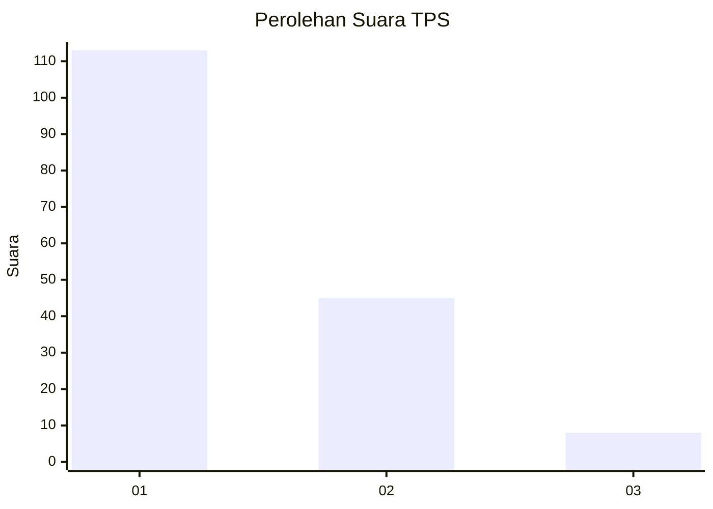
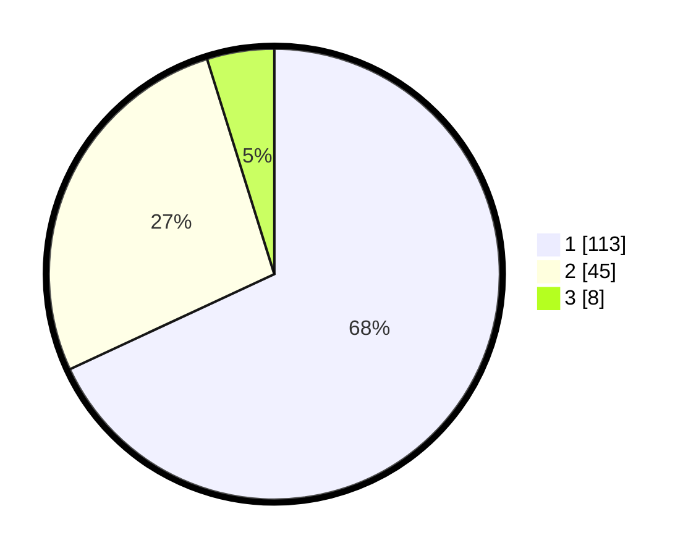

# Hasil

## Grafik

## Tabel

| No. | Nama Paslon    | Suara | Suara (raw) | Persentase |
|:--- |:-------------- | -----:| -----------:| ----------:|
| 1   | ANIES MUHAIMIN | 113   | [113][p-1]  | 68,07      |
| 2   | PRABOWO GIBRAN | 45    | [45][p-2]   | 27,11      |
| 3   | GANJAR MAHFUD  | 8     | [8][p-3]    | 4,82       |

[p-1]: https://github.com/gigit-pemilu/pemilu-2024-32-jawa-barat/blob/main/pilpres/hitung-suara/sub/32-jawa-barat/sub/08-kuningan/sub/07-lebakwangi/sub/2010-langseb/sub/004-tps/sub/paslon-1.txt
[p-2]: https://github.com/gigit-pemilu/pemilu-2024-32-jawa-barat/blob/main/pilpres/hitung-suara/sub/32-jawa-barat/sub/08-kuningan/sub/07-lebakwangi/sub/2010-langseb/sub/004-tps/sub/paslon-2.txt
[p-3]: https://github.com/gigit-pemilu/pemilu-2024-32-jawa-barat/blob/main/pilpres/hitung-suara/sub/32-jawa-barat/sub/08-kuningan/sub/07-lebakwangi/sub/2010-langseb/sub/004-tps/sub/paslon-3.txt

## Foto C Plano

https://sirekap-obj-formc.kpu.go.id/2093/pemilu/ppwp/32/08/07/20/10/3208072010004-20240224-122912--1b586ced-c443-4c6c-ac44-25bf088b0146.jpg

https://sirekap-obj-formc.kpu.go.id/2093/pemilu/ppwp/32/08/07/20/10/3208072010004-20240224-122918--a4cdf05e-19c8-43a8-b704-389d9c6be35e.jpg

https://sirekap-obj-formc.kpu.go.id/2093/pemilu/ppwp/32/08/07/20/10/3208072010004-20240224-122924--c72589d0-b889-4c94-a89d-8fffa5f94a06.jpg

## Metadata

| Key        | Value               |
| ---------- | ------------------- |
| Time Stamp | 2024-02-25 10:00:00 |

