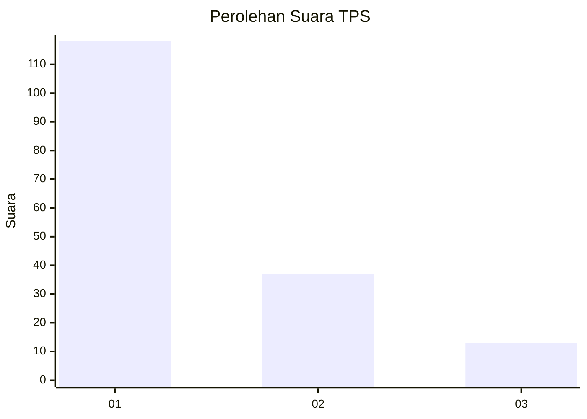
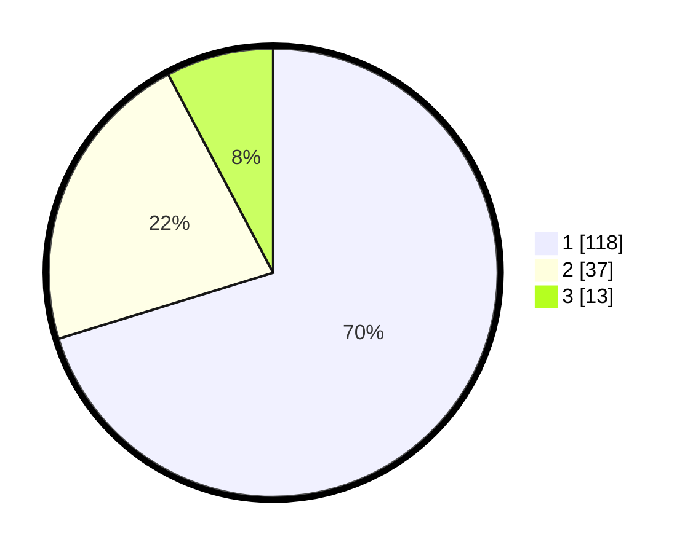

# Hasil

## Grafik

## Tabel

| No. | Nama Paslon    | Suara | Suara (raw) | Persentase |
|:--- |:-------------- | -----:| -----------:| ----------:|
| 1   | ANIES MUHAIMIN | 118   | [118][p-1]  | 70,24      |
| 2   | PRABOWO GIBRAN | 37    | [37][p-2]   | 22,02      |
| 3   | GANJAR MAHFUD  | 13    | [13][p-3]   | 7,74       |

[p-1]: https://github.com/gigit-pemilu/pemilu-2024-32-jawa-barat/blob/main/pilpres/hitung-suara/sub/32-jawa-barat/sub/08-kuningan/sub/07-lebakwangi/sub/2010-langseb/sub/005-tps/sub/paslon-1.txt
[p-2]: https://github.com/gigit-pemilu/pemilu-2024-32-jawa-barat/blob/main/pilpres/hitung-suara/sub/32-jawa-barat/sub/08-kuningan/sub/07-lebakwangi/sub/2010-langseb/sub/005-tps/sub/paslon-2.txt
[p-3]: https://github.com/gigit-pemilu/pemilu-2024-32-jawa-barat/blob/main/pilpres/hitung-suara/sub/32-jawa-barat/sub/08-kuningan/sub/07-lebakwangi/sub/2010-langseb/sub/005-tps/sub/paslon-3.txt

## Foto C Plano

https://sirekap-obj-formc.kpu.go.id/82f9/pemilu/ppwp/32/08/07/20/10/3208072010005-20240224-122949--26887385-cd59-4749-9c63-5ceec2be2be0.jpg

https://sirekap-obj-formc.kpu.go.id/82f9/pemilu/ppwp/32/08/07/20/10/3208072010005-20240216-064521--6b864404-31a8-4f9e-9375-d50a6a6d052a.jpg

https://sirekap-obj-formc.kpu.go.id/82f9/pemilu/ppwp/32/08/07/20/10/3208072010005-20240224-123010--93438809-5533-4d51-bdbe-59d4592e160c.jpg

## Metadata

| Key        | Value               |
| ---------- | ------------------- |
| Time Stamp | 2024-02-24 22:31:28 |

