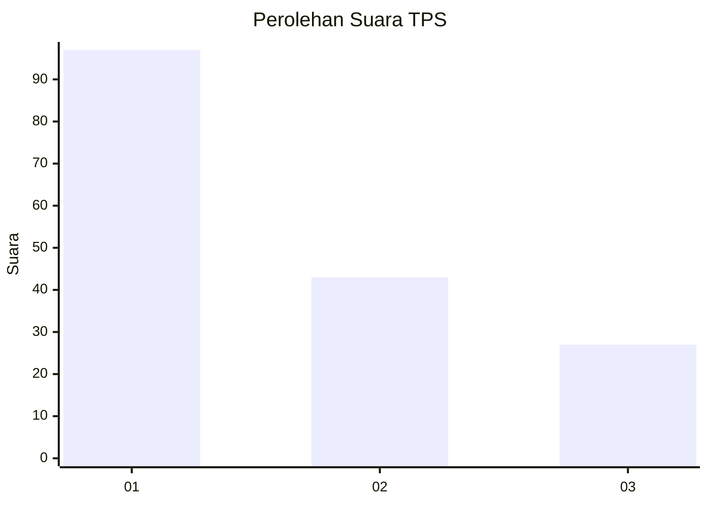
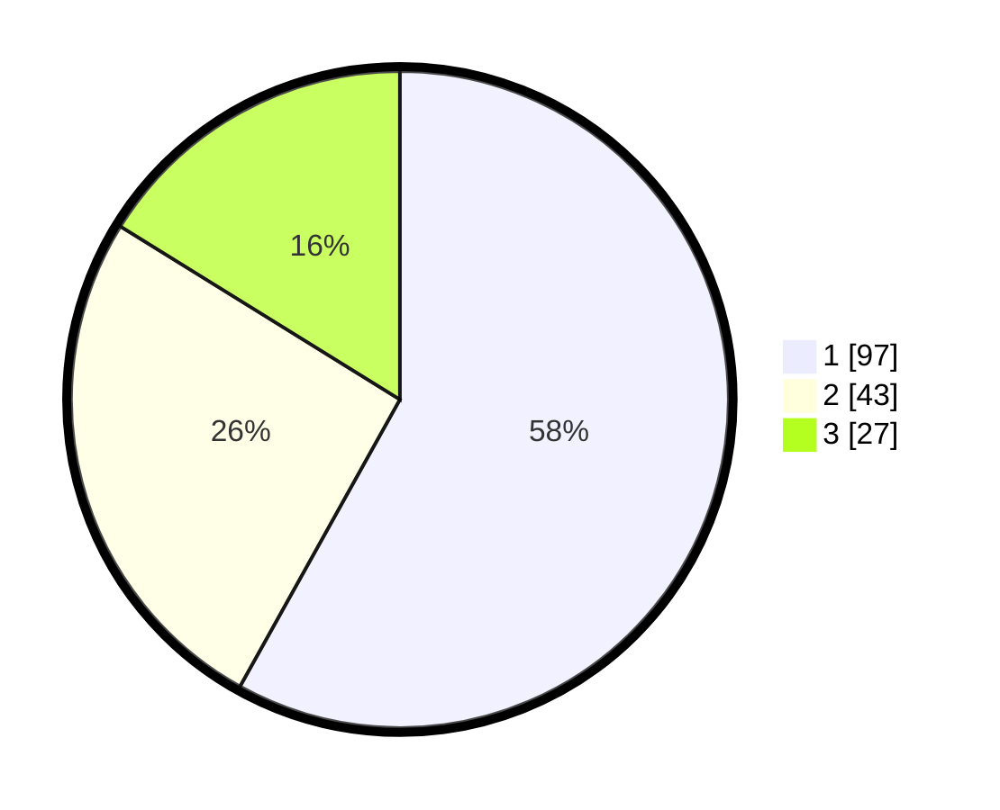

# Hasil

## Grafik

## Tabel

| No. | Nama Paslon    | Suara | Suara (raw) | Persentase |
|:--- |:-------------- | -----:| -----------:| ----------:|
| 1   | ANIES MUHAIMIN | 97    | [97][p-1]   | 58,08      |
| 2   | PRABOWO GIBRAN | 43    | [43][p-2]   | 25,75      |
| 3   | GANJAR MAHFUD  | 27    | [27][p-3]   | 16,17      |

[p-1]: https://github.com/gigit-pemilu/pemilu-2024-32-jawa-barat/blob/main/pilpres/hitung-suara/sub/32-jawa-barat/sub/08-kuningan/sub/07-lebakwangi/sub/2010-langseb/sub/006-tps/sub/paslon-1.txt
[p-2]: https://github.com/gigit-pemilu/pemilu-2024-32-jawa-barat/blob/main/pilpres/hitung-suara/sub/32-jawa-barat/sub/08-kuningan/sub/07-lebakwangi/sub/2010-langseb/sub/006-tps/sub/paslon-2.txt
[p-3]: https://github.com/gigit-pemilu/pemilu-2024-32-jawa-barat/blob/main/pilpres/hitung-suara/sub/32-jawa-barat/sub/08-kuningan/sub/07-lebakwangi/sub/2010-langseb/sub/006-tps/sub/paslon-3.txt

## Foto C Plano

https://sirekap-obj-formc.kpu.go.id/8582/pemilu/ppwp/32/08/07/20/10/3208072010006-20240224-123022--3ea39b2d-b4c6-4442-a434-f5c200441973.jpg

https://sirekap-obj-formc.kpu.go.id/8582/pemilu/ppwp/32/08/07/20/10/3208072010006-20240224-123043--c080a61b-51ea-43bd-ba3d-77be525d52a7.jpg

https://sirekap-obj-formc.kpu.go.id/8582/pemilu/ppwp/32/08/07/20/10/3208072010006-20240224-123102--a3a64fd6-0431-4922-a49a-3bba6ddc5408.jpg

## Metadata

| Key        | Value               |
| ---------- | ------------------- |
| Time Stamp | 2024-02-25 10:00:00 |

