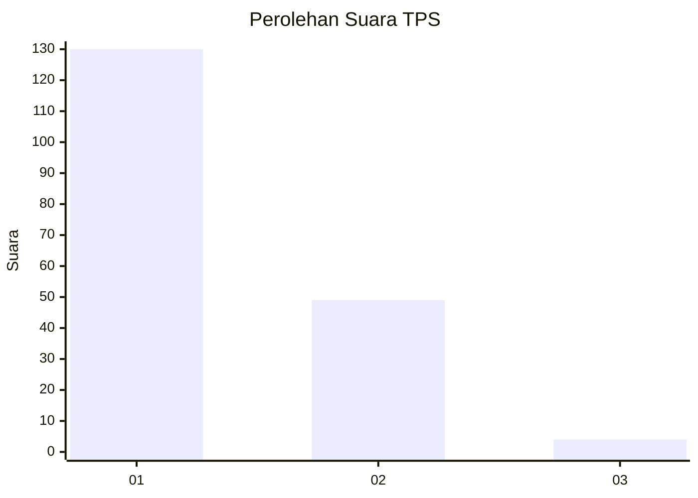
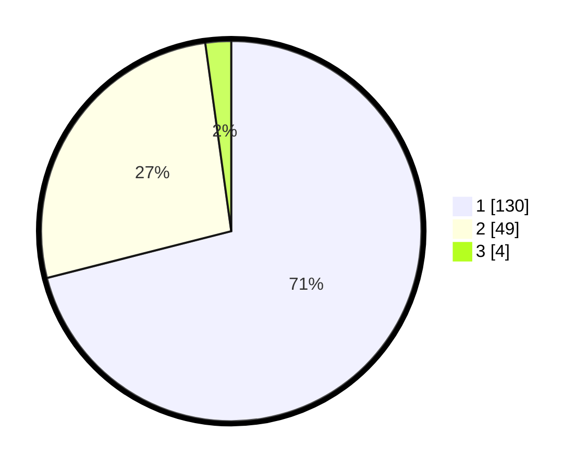

# Hasil

## Grafik

## Tabel

| No. | Nama Paslon    | Suara | Suara (raw) | Persentase |
|:--- |:-------------- | -----:| -----------:| ----------:|
| 1   | ANIES MUHAIMIN | 130   | [130][p-1]  | 71,04      |
| 2   | PRABOWO GIBRAN | 49    | [49][p-2]   | 26,78      |
| 3   | GANJAR MAHFUD  | 4     | [4][p-3]    | 2,19       |

[p-1]: https://github.com/gigit-pemilu/pemilu-2024/blob/main/pilpres/hitung-suara/sub/32-jawa-barat/sub/08-kuningan/sub/07-lebakwangi/sub/2017-sindang/sub/003-tps/sub/paslon-1.txt
[p-2]: https://github.com/gigit-pemilu/pemilu-2024/blob/main/pilpres/hitung-suara/sub/32-jawa-barat/sub/08-kuningan/sub/07-lebakwangi/sub/2017-sindang/sub/003-tps/sub/paslon-2.txt
[p-3]: https://github.com/gigit-pemilu/pemilu-2024/blob/main/pilpres/hitung-suara/sub/32-jawa-barat/sub/08-kuningan/sub/07-lebakwangi/sub/2017-sindang/sub/003-tps/sub/paslon-3.txt

## Foto C Plano

https://sirekap-obj-formc.kpu.go.id/7bc0/pemilu/ppwp/32/08/07/20/17/3208072017003-20240214-194405--90f6e369-88a5-4985-9223-5344eed8a790.jpg

https://sirekap-obj-formc.kpu.go.id/7bc0/pemilu/ppwp/32/08/07/20/17/3208072017003-20240214-194358--6c9e133b-8dbf-470b-91bb-27d8d85692f9.jpg

https://sirekap-obj-formc.kpu.go.id/7bc0/pemilu/ppwp/32/08/07/20/17/3208072017003-20240214-194351--72a743dc-13f2-4747-a124-8cceb761a7a3.jpg

## Metadata

| Key        | Value               |
| ---------- | ------------------- |
| Time Stamp | 2024-02-17 16:36:25 |

