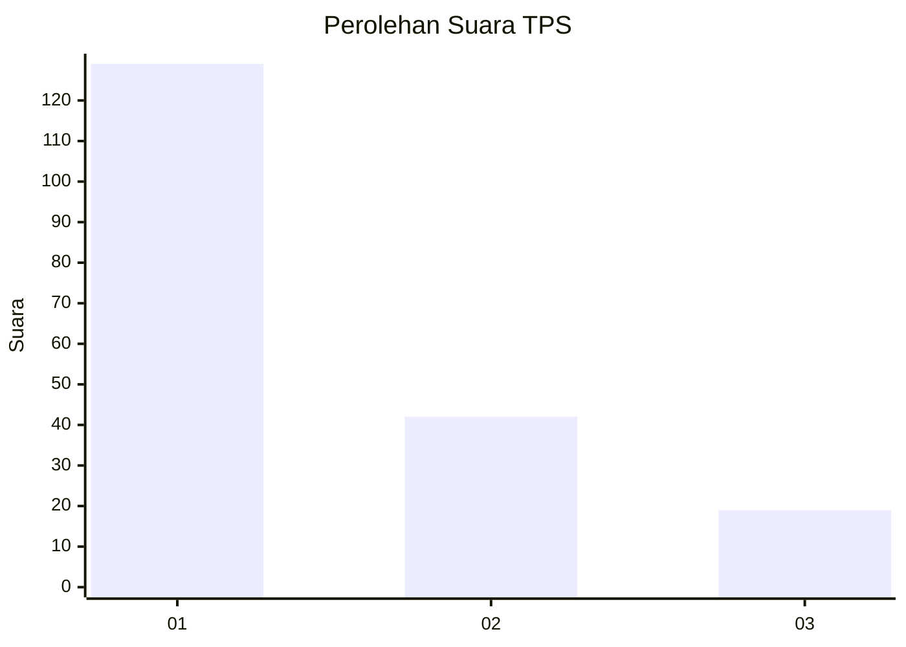
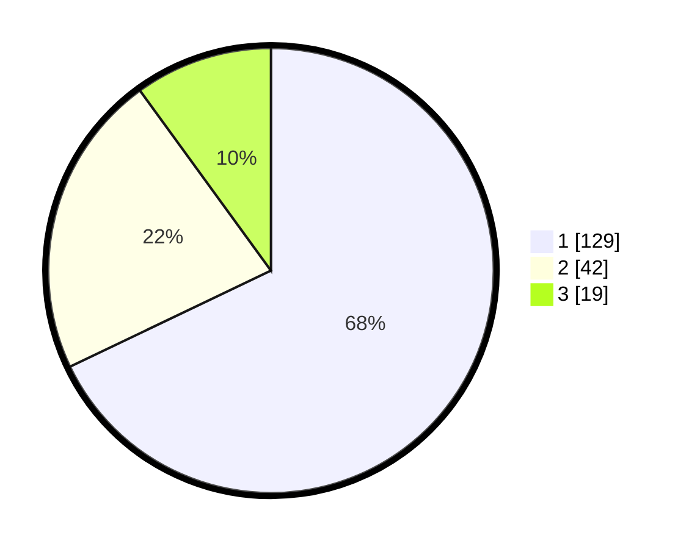

# Hasil

## Grafik

## Tabel

| No. | Nama Paslon    | Suara | Suara (raw) | Persentase |
|:--- |:-------------- | -----:| -----------:| ----------:|
| 1   | ANIES MUHAIMIN | 129   | [129][p-1]  | 67,89      |
| 2   | PRABOWO GIBRAN | 42    | [42][p-2]   | 22,11      |
| 3   | GANJAR MAHFUD  | 19    | [19][p-3]   | 10,00      |

[p-1]: https://github.com/gigit-pemilu/pemilu-2024-32-jawa-barat/blob/main/pilpres/hitung-suara/sub/32-jawa-barat/sub/08-kuningan/sub/08-garawangi/sub/2007-garawangi/sub/006-tps/sub/paslon-1.txt
[p-2]: https://github.com/gigit-pemilu/pemilu-2024-32-jawa-barat/blob/main/pilpres/hitung-suara/sub/32-jawa-barat/sub/08-kuningan/sub/08-garawangi/sub/2007-garawangi/sub/006-tps/sub/paslon-2.txt
[p-3]: https://github.com/gigit-pemilu/pemilu-2024-32-jawa-barat/blob/main/pilpres/hitung-suara/sub/32-jawa-barat/sub/08-kuningan/sub/08-garawangi/sub/2007-garawangi/sub/006-tps/sub/paslon-3.txt

## Foto C Plano

https://sirekap-obj-formc.kpu.go.id/e167/pemilu/ppwp/32/08/08/20/07/3208082007006-20240215-085923--67f15cd9-5318-4856-aa9a-0894ffa6722e.jpg

https://sirekap-obj-formc.kpu.go.id/e167/pemilu/ppwp/32/08/08/20/07/3208082007006-20240215-090414--df8c7472-37f5-4363-8d38-10620a21d2aa.jpg

https://sirekap-obj-formc.kpu.go.id/e167/pemilu/ppwp/32/08/08/20/07/3208082007006-20240215-090603--b9820411-e0c5-45bc-b8fd-7cf446b54c93.jpg

## Metadata

| Key        | Value               |
| ---------- | ------------------- |
| Time Stamp | 2024-02-17 16:36:25 |

