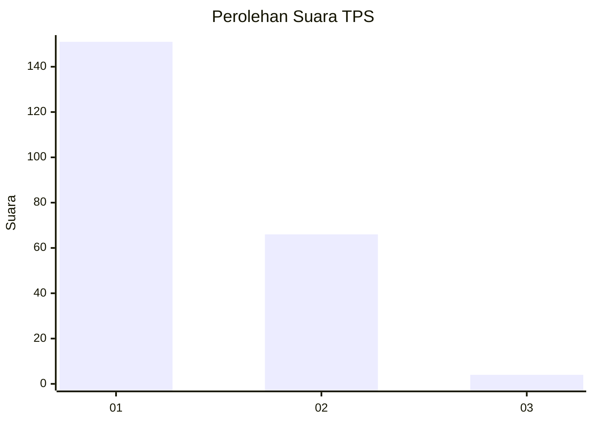
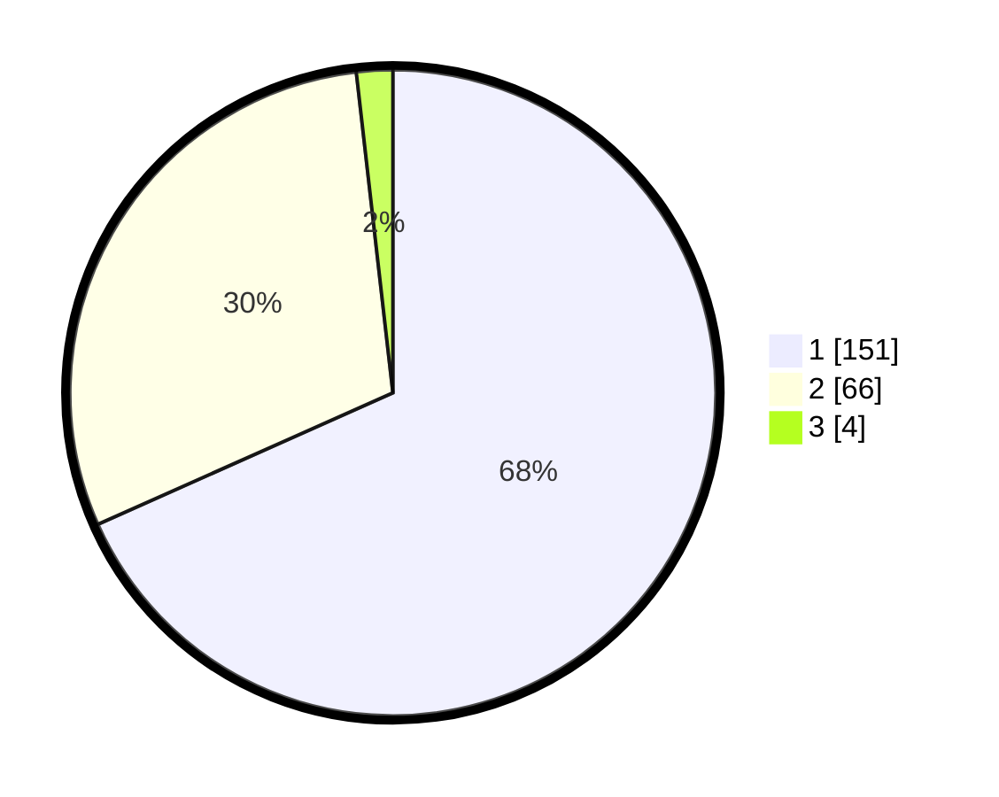

# Hasil

## Grafik

## Tabel

| No. | Nama Paslon    | Suara | Suara (raw) | Persentase |
|:--- |:-------------- | -----:| -----------:| ----------:|
| 1   | ANIES MUHAIMIN | 151   | [151][p-1]  | 68,33      |
| 2   | PRABOWO GIBRAN | 66    | [66][p-2]   | 29,86      |
| 3   | GANJAR MAHFUD  | 4     | [4][p-3]    | 1,81       |

[p-1]: https://github.com/gigit-pemilu/pemilu-2024-32-jawa-barat/blob/main/pilpres/hitung-suara/sub/32-jawa-barat/sub/08-kuningan/sub/08-garawangi/sub/2010-purwasari/sub/012-tps/sub/paslon-1.txt
[p-2]: https://github.com/gigit-pemilu/pemilu-2024-32-jawa-barat/blob/main/pilpres/hitung-suara/sub/32-jawa-barat/sub/08-kuningan/sub/08-garawangi/sub/2010-purwasari/sub/012-tps/sub/paslon-2.txt
[p-3]: https://github.com/gigit-pemilu/pemilu-2024-32-jawa-barat/blob/main/pilpres/hitung-suara/sub/32-jawa-barat/sub/08-kuningan/sub/08-garawangi/sub/2010-purwasari/sub/012-tps/sub/paslon-3.txt

## Foto C Plano

https://sirekap-obj-formc.kpu.go.id/64dc/pemilu/ppwp/32/08/08/20/10/3208082010012-20240214-215802--25862a25-d4b8-42f1-ae28-6947d40e1186.jpg

https://sirekap-obj-formc.kpu.go.id/64dc/pemilu/ppwp/32/08/08/20/10/3208082010012-20240215-025053--5e77abc2-01aa-4e53-af4d-a4f159a1e4bd.jpg

https://sirekap-obj-formc.kpu.go.id/64dc/pemilu/ppwp/32/08/08/20/10/3208082010012-20240215-025154--72d229b8-ebd0-4c83-b68c-616f64575365.jpg

## Metadata

| Key        | Value               |
| ---------- | ------------------- |
| Time Stamp | 2024-02-15 15:00:29 |

