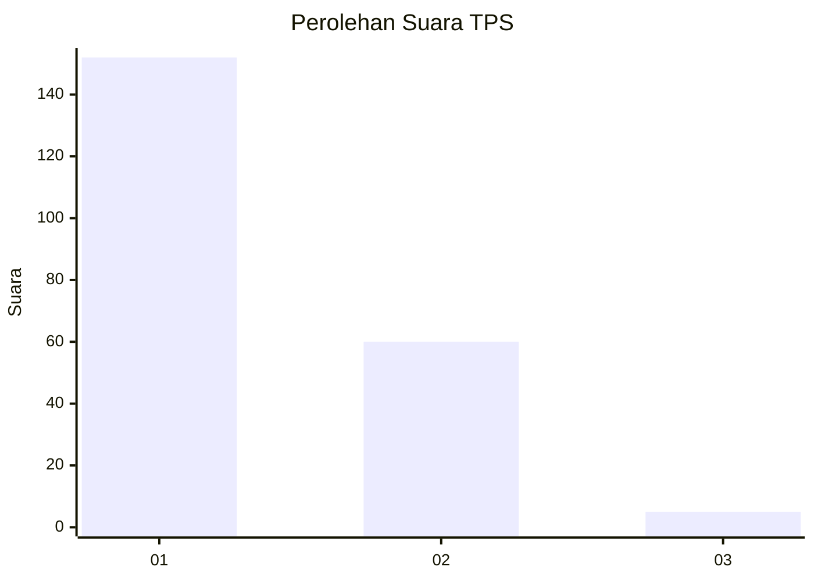
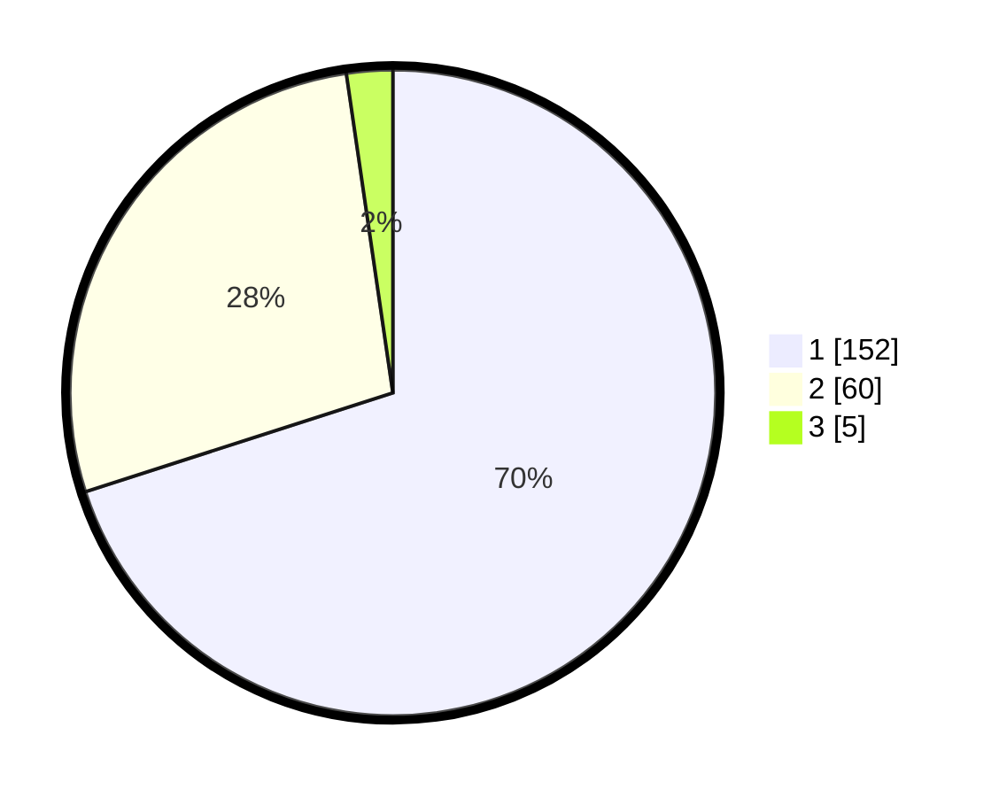

# Hasil

## Grafik

## Tabel

| No. | Nama Paslon    | Suara | Suara (raw) | Persentase |
|:--- |:-------------- | -----:| -----------:| ----------:|
| 1   | ANIES MUHAIMIN | 152   | [152][p-1]  | 70,05      |
| 2   | PRABOWO GIBRAN | 60    | [60][p-2]   | 27,65      |
| 3   | GANJAR MAHFUD  | 5     | [5][p-3]    | 2,30       |

[p-1]: https://github.com/gigit-pemilu/pemilu-2024-32-jawa-barat/blob/main/pilpres/hitung-suara/sub/32-jawa-barat/sub/08-kuningan/sub/09-kuningan/sub/1001-citangtu/sub/003-tps/sub/paslon-1.txt
[p-2]: https://github.com/gigit-pemilu/pemilu-2024-32-jawa-barat/blob/main/pilpres/hitung-suara/sub/32-jawa-barat/sub/08-kuningan/sub/09-kuningan/sub/1001-citangtu/sub/003-tps/sub/paslon-2.txt
[p-3]: https://github.com/gigit-pemilu/pemilu-2024-32-jawa-barat/blob/main/pilpres/hitung-suara/sub/32-jawa-barat/sub/08-kuningan/sub/09-kuningan/sub/1001-citangtu/sub/003-tps/sub/paslon-3.txt

## Foto C Plano

https://sirekap-obj-formc.kpu.go.id/9a08/pemilu/ppwp/32/08/09/10/01/3208091001003-20240214-155405--2b66ac81-ab35-441a-94a7-a7527ee2a071.jpg

https://sirekap-obj-formc.kpu.go.id/9a08/pemilu/ppwp/32/08/09/10/01/3208091001003-20240214-210816--1c14cfbf-abb6-44b9-9691-f944eaded43f.jpg

https://sirekap-obj-formc.kpu.go.id/9a08/pemilu/ppwp/32/08/09/10/01/3208091001003-20240214-210820--54ec6210-b4e0-49f6-8422-b91fbc4c72bc.jpg

## Metadata

| Key        | Value               |
| ---------- | ------------------- |
| Time Stamp | 2024-02-15 05:00:24 |

