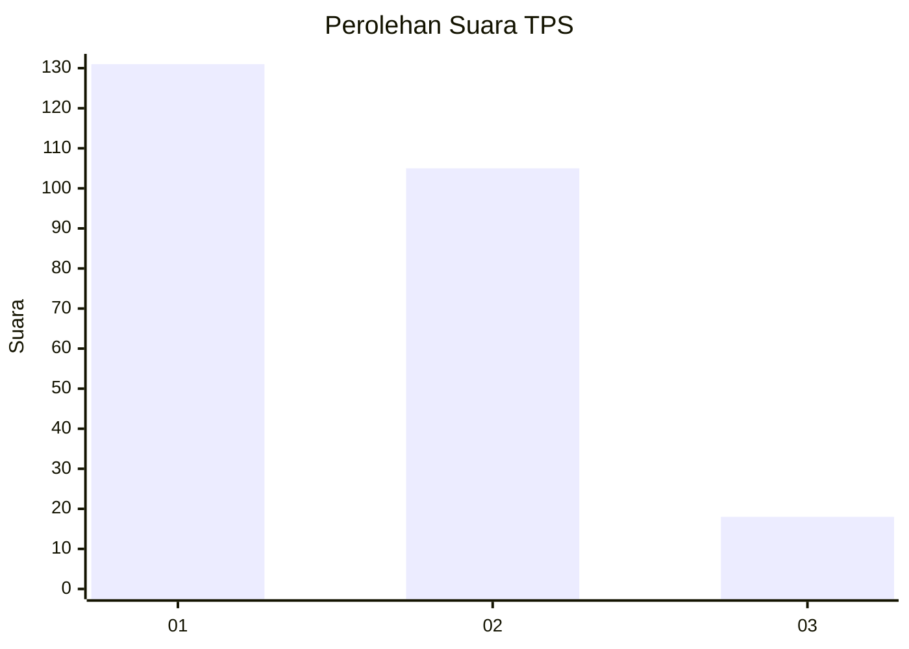
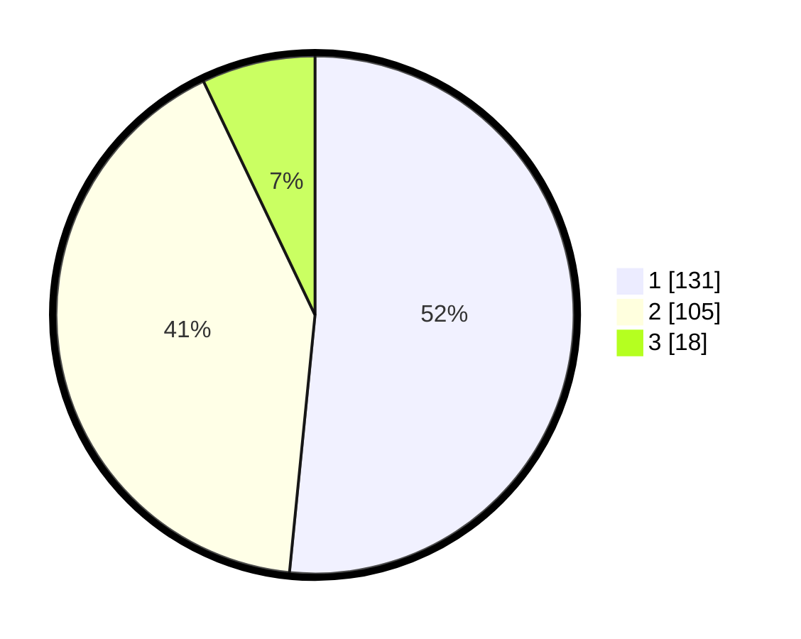

# Hasil

## Grafik

## Tabel

| No. | Nama Paslon    | Suara | Suara (raw) | Persentase |
|:--- |:-------------- | -----:| -----------:| ----------:|
| 1   | ANIES MUHAIMIN | 131   | [131][p-1]  | 51,57      |
| 2   | PRABOWO GIBRAN | 105   | [105][p-2]  | 41,34      |
| 3   | GANJAR MAHFUD  | 18    | [18][p-3]   | 7,09       |

[p-1]: https://github.com/gigit-pemilu/pemilu-2024/blob/main/pilpres/hitung-suara/sub/32-jawa-barat/sub/08-kuningan/sub/09-kuningan/sub/1002-kuningan/sub/020-tps/sub/paslon-1.txt
[p-2]: https://github.com/gigit-pemilu/pemilu-2024/blob/main/pilpres/hitung-suara/sub/32-jawa-barat/sub/08-kuningan/sub/09-kuningan/sub/1002-kuningan/sub/020-tps/sub/paslon-2.txt
[p-3]: https://github.com/gigit-pemilu/pemilu-2024/blob/main/pilpres/hitung-suara/sub/32-jawa-barat/sub/08-kuningan/sub/09-kuningan/sub/1002-kuningan/sub/020-tps/sub/paslon-3.txt

## Foto C Plano

https://sirekap-obj-formc.kpu.go.id/c39c/pemilu/ppwp/32/08/09/10/02/3208091002020-20240214-191436--c101b8ac-5ed6-4db3-87e7-65105faa7bfa.jpg

https://sirekap-obj-formc.kpu.go.id/c39c/pemilu/ppwp/32/08/09/10/02/3208091002020-20240214-191440--17bec787-3b00-4dc3-92ee-5a2ebcb9c814.jpg

https://sirekap-obj-formc.kpu.go.id/c39c/pemilu/ppwp/32/08/09/10/02/3208091002020-20240214-191444--3906b135-25bf-483c-86c0-01e37a921aee.jpg

## Metadata

| Key        | Value               |
| ---------- | ------------------- |
| Time Stamp | 2024-02-17 16:52:47 |

