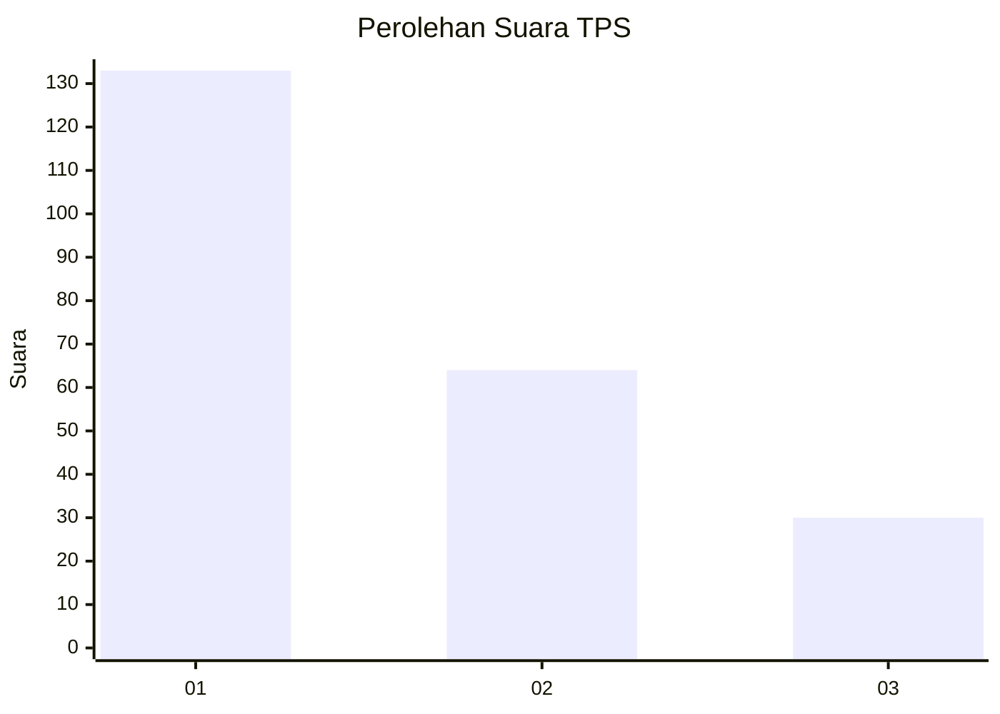
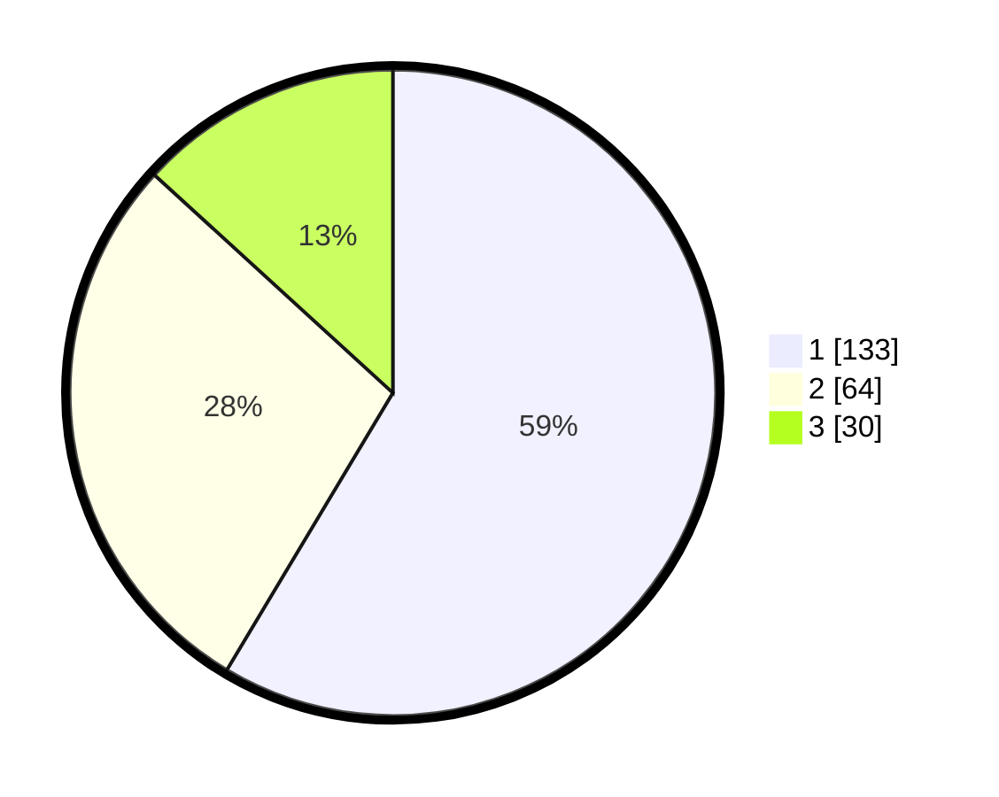

# Hasil

## Grafik

## Tabel

| No. | Nama Paslon    | Suara | Suara (raw) | Persentase |
|:--- |:-------------- | -----:| -----------:| ----------:|
| 1   | ANIES MUHAIMIN | 133   | [133][p-1]  | 58,59      |
| 2   | PRABOWO GIBRAN | 64    | [64][p-2]   | 28,19      |
| 3   | GANJAR MAHFUD  | 30    | [30][p-3]   | 13,22      |

[p-1]: https://github.com/gigit-pemilu/pemilu-2024-32-jawa-barat/blob/main/pilpres/hitung-suara/sub/32-jawa-barat/sub/08-kuningan/sub/09-kuningan/sub/1003-winduhaji/sub/002-tps/sub/paslon-1.txt
[p-2]: https://github.com/gigit-pemilu/pemilu-2024-32-jawa-barat/blob/main/pilpres/hitung-suara/sub/32-jawa-barat/sub/08-kuningan/sub/09-kuningan/sub/1003-winduhaji/sub/002-tps/sub/paslon-2.txt
[p-3]: https://github.com/gigit-pemilu/pemilu-2024-32-jawa-barat/blob/main/pilpres/hitung-suara/sub/32-jawa-barat/sub/08-kuningan/sub/09-kuningan/sub/1003-winduhaji/sub/002-tps/sub/paslon-3.txt

## Foto C Plano

https://sirekap-obj-formc.kpu.go.id/5062/pemilu/ppwp/32/08/09/10/03/3208091003002-20240214-211745--f2fa60d1-4a28-4df7-812c-b292dfe1f151.jpg

https://sirekap-obj-formc.kpu.go.id/5062/pemilu/ppwp/32/08/09/10/03/3208091003002-20240214-211939--fb8a2c2e-4d6b-46db-b35e-9f88d6213b77.jpg

https://sirekap-obj-formc.kpu.go.id/5062/pemilu/ppwp/32/08/09/10/03/3208091003002-20240214-212151--6c8d5d62-f802-4af0-9783-a7ceb1537629.jpg

## Metadata

| Key        | Value               |
| ---------- | ------------------- |
| Time Stamp | 2024-02-17 17:00:04 |

