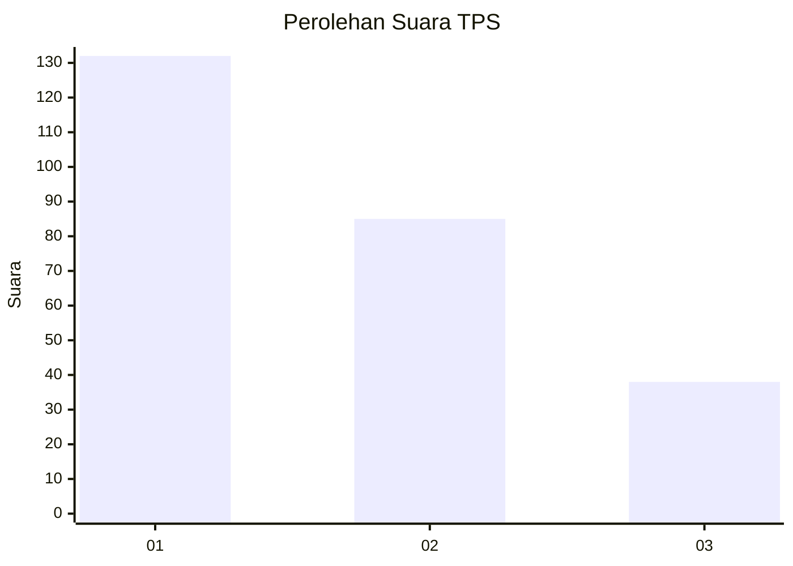
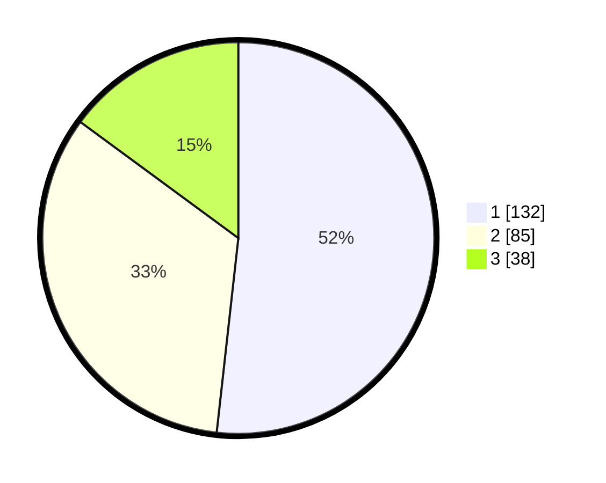

# Hasil

## Grafik

## Tabel

| No. | Nama Paslon    | Suara | Suara (raw) | Persentase |
|:--- |:-------------- | -----:| -----------:| ----------:|
| 1   | ANIES MUHAIMIN | 132   | [132][p-1]  | 51,76      |
| 2   | PRABOWO GIBRAN | 85    | [85][p-2]   | 33,33      |
| 3   | GANJAR MAHFUD  | 38    | [38][p-3]   | 14,90      |

[p-1]: https://github.com/gigit-pemilu/pemilu-2024-32-jawa-barat/blob/main/pilpres/hitung-suara/sub/32-jawa-barat/sub/08-kuningan/sub/09-kuningan/sub/1006-purwawinangun/sub/003-tps/sub/paslon-1.txt
[p-2]: https://github.com/gigit-pemilu/pemilu-2024-32-jawa-barat/blob/main/pilpres/hitung-suara/sub/32-jawa-barat/sub/08-kuningan/sub/09-kuningan/sub/1006-purwawinangun/sub/003-tps/sub/paslon-2.txt
[p-3]: https://github.com/gigit-pemilu/pemilu-2024-32-jawa-barat/blob/main/pilpres/hitung-suara/sub/32-jawa-barat/sub/08-kuningan/sub/09-kuningan/sub/1006-purwawinangun/sub/003-tps/sub/paslon-3.txt

## Foto C Plano

https://sirekap-obj-formc.kpu.go.id/73ff/pemilu/ppwp/32/08/09/10/06/3208091006003-20240215-000333--f4ed1b37-4d1a-4c7f-b0ec-1ca671466705.jpg

https://sirekap-obj-formc.kpu.go.id/73ff/pemilu/ppwp/32/08/09/10/06/3208091006003-20240215-001507--fc137633-0107-4162-95d7-936e94113387.jpg

https://sirekap-obj-formc.kpu.go.id/73ff/pemilu/ppwp/32/08/09/10/06/3208091006003-20240215-001612--19c495de-0f0e-4818-a1fa-03cf360e08e3.jpg

## Metadata

| Key        | Value               |
| ---------- | ------------------- |
| Time Stamp | 2024-02-19 11:00:00 |

