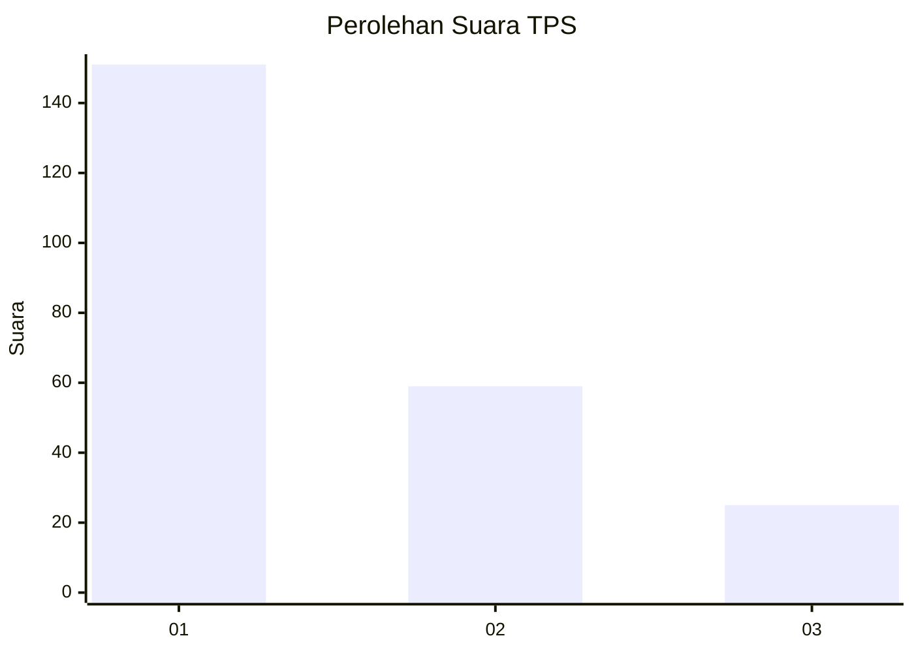
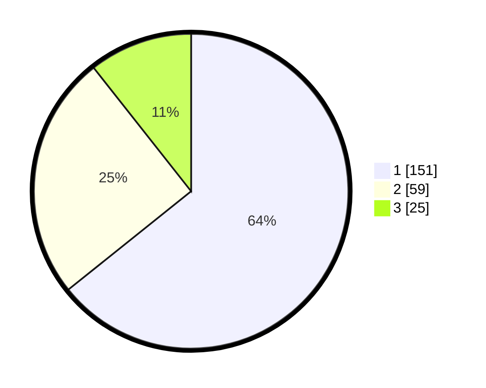

# Hasil

## Grafik

## Tabel

| No. | Nama Paslon    | Suara | Suara (raw) | Persentase |
|:--- |:-------------- | -----:| -----------:| ----------:|
| 1   | ANIES MUHAIMIN | 151   | [151][p-1]  | 64,26      |
| 2   | PRABOWO GIBRAN | 59    | [59][p-2]   | 25,11      |
| 3   | GANJAR MAHFUD  | 25    | [25][p-3]   | 10,64      |

[p-1]: https://github.com/gigit-pemilu/pemilu-2024/blob/main/pilpres/hitung-suara/sub/32-jawa-barat/sub/08-kuningan/sub/09-kuningan/sub/1006-purwawinangun/sub/020-tps/sub/paslon-1.txt
[p-2]: https://github.com/gigit-pemilu/pemilu-2024/blob/main/pilpres/hitung-suara/sub/32-jawa-barat/sub/08-kuningan/sub/09-kuningan/sub/1006-purwawinangun/sub/020-tps/sub/paslon-2.txt
[p-3]: https://github.com/gigit-pemilu/pemilu-2024/blob/main/pilpres/hitung-suara/sub/32-jawa-barat/sub/08-kuningan/sub/09-kuningan/sub/1006-purwawinangun/sub/020-tps/sub/paslon-3.txt

## Foto C Plano

https://sirekap-obj-formc.kpu.go.id/cf08/pemilu/ppwp/32/08/09/10/06/3208091006020-20240215-023500--fdbf6ec6-a4a8-43ef-9c70-9291b0c8d0a5.jpg

https://sirekap-obj-formc.kpu.go.id/cf08/pemilu/ppwp/32/08/09/10/06/3208091006020-20240215-021326--513c2273-ac29-4061-b6c4-ddd44c80d39a.jpg

https://sirekap-obj-formc.kpu.go.id/cf08/pemilu/ppwp/32/08/09/10/06/3208091006020-20240215-032138--87cacf90-5f5a-41c7-aa32-dfb36fb6b06e.jpg

## Metadata

| Key        | Value               |
| ---------- | ------------------- |
| Time Stamp | 2024-02-19 22:00:00 |

