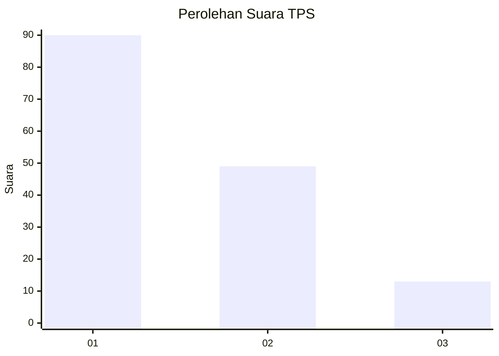
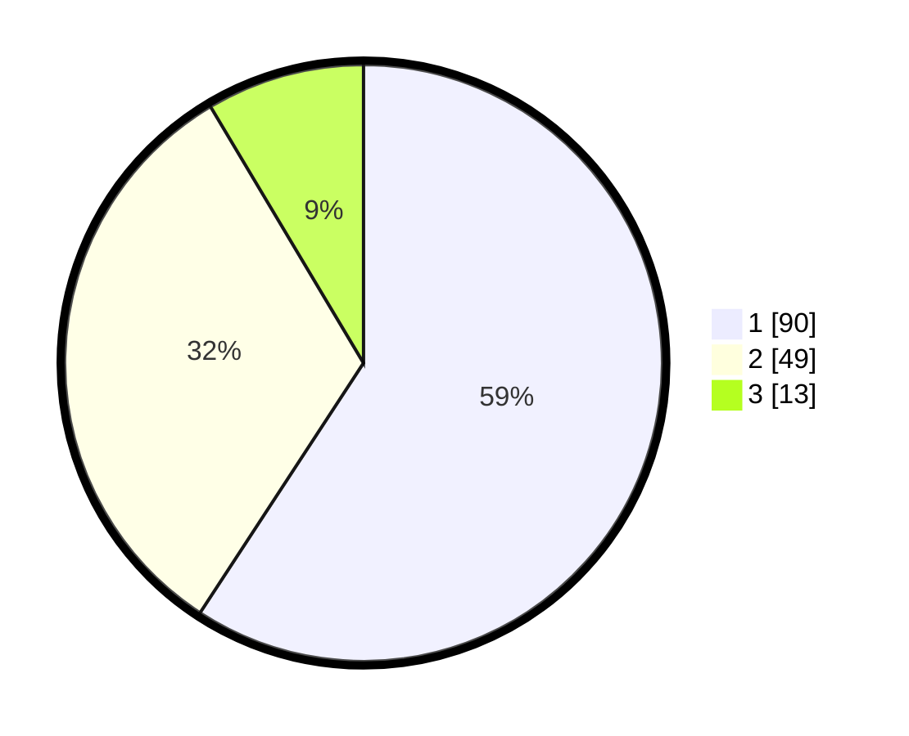

# Hasil

## Grafik

## Tabel

| No. | Nama Paslon    | Suara | Suara (raw) | Persentase |
|:--- |:-------------- | -----:| -----------:| ----------:|
| 1   | ANIES MUHAIMIN | 90    | [90][p-1]   | 59,21      |
| 2   | PRABOWO GIBRAN | 49    | [49][p-2]   | 32,24      |
| 3   | GANJAR MAHFUD  | 13    | [13][p-3]   | 8,55       |

[p-1]: https://github.com/gigit-pemilu/pemilu-2024/blob/main/pilpres/hitung-suara/sub/32-jawa-barat/sub/08-kuningan/sub/09-kuningan/sub/1009-ciporang/sub/013-tps/sub/paslon-1.txt
[p-2]: https://github.com/gigit-pemilu/pemilu-2024/blob/main/pilpres/hitung-suara/sub/32-jawa-barat/sub/08-kuningan/sub/09-kuningan/sub/1009-ciporang/sub/013-tps/sub/paslon-2.txt
[p-3]: https://github.com/gigit-pemilu/pemilu-2024/blob/main/pilpres/hitung-suara/sub/32-jawa-barat/sub/08-kuningan/sub/09-kuningan/sub/1009-ciporang/sub/013-tps/sub/paslon-3.txt

## Foto C Plano

https://sirekap-obj-formc.kpu.go.id/0218/pemilu/ppwp/32/08/09/10/09/3208091009013-20240215-000540--b131b1de-6062-445d-bb03-b15303d2a60f.jpg

https://sirekap-obj-formc.kpu.go.id/0218/pemilu/ppwp/32/08/09/10/09/3208091009013-20240215-000557--0c853581-7ad1-4523-97ee-19f64b1adb0c.jpg

https://sirekap-obj-formc.kpu.go.id/0218/pemilu/ppwp/32/08/09/10/09/3208091009013-20240215-000611--d845a78b-0555-4f41-bfde-01060b2fafa7.jpg

## Metadata

| Key        | Value               |
| ---------- | ------------------- |
| Time Stamp | 2024-02-17 18:30:00 |

