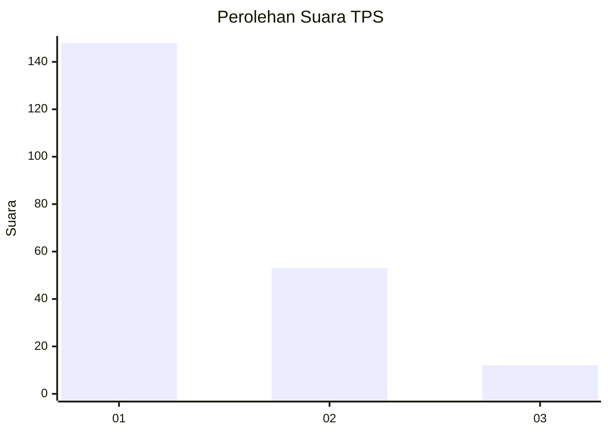
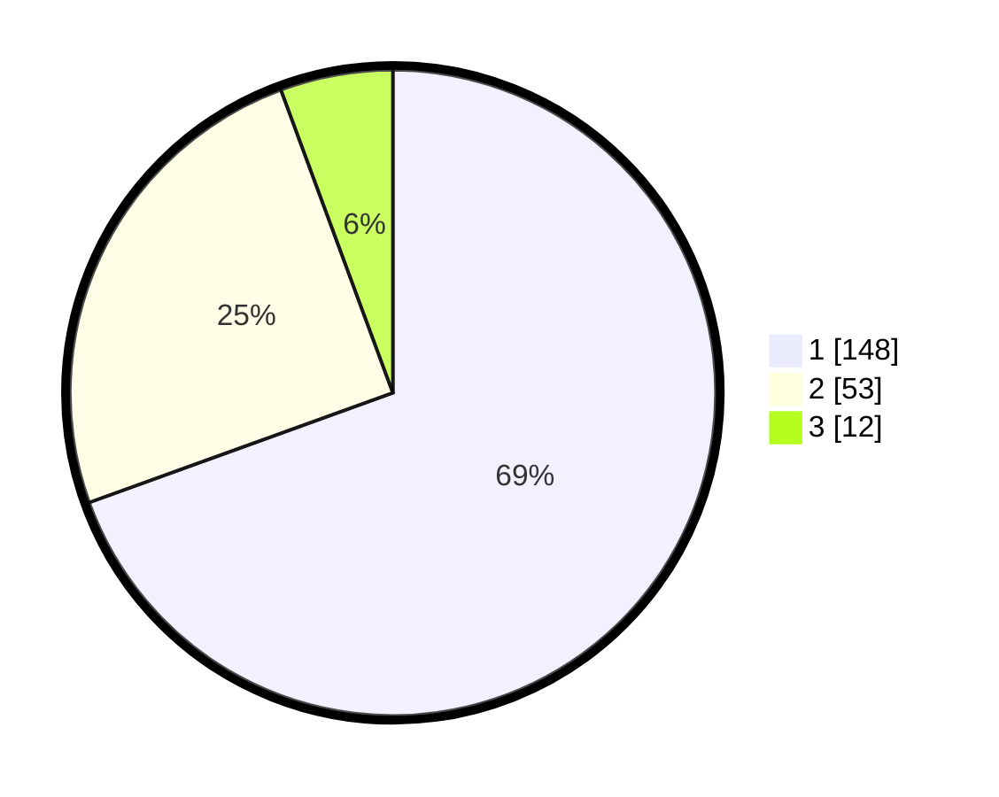

# Hasil

## Grafik

## Tabel

| No. | Nama Paslon    | Suara | Suara (raw) | Persentase |
|:--- |:-------------- | -----:| -----------:| ----------:|
| 1   | ANIES MUHAIMIN | 148   | [148][p-1]  | 69,48      |
| 2   | PRABOWO GIBRAN | 53    | [53][p-2]   | 24,88      |
| 3   | GANJAR MAHFUD  | 12    | [12][p-3]   | 5,63       |

[p-1]: https://github.com/gigit-pemilu/pemilu-2024-32-jawa-barat/blob/main/pilpres/hitung-suara/sub/32-jawa-barat/sub/08-kuningan/sub/09-kuningan/sub/1010-awirarangan/sub/027-tps/sub/paslon-1.txt
[p-2]: https://github.com/gigit-pemilu/pemilu-2024-32-jawa-barat/blob/main/pilpres/hitung-suara/sub/32-jawa-barat/sub/08-kuningan/sub/09-kuningan/sub/1010-awirarangan/sub/027-tps/sub/paslon-2.txt
[p-3]: https://github.com/gigit-pemilu/pemilu-2024-32-jawa-barat/blob/main/pilpres/hitung-suara/sub/32-jawa-barat/sub/08-kuningan/sub/09-kuningan/sub/1010-awirarangan/sub/027-tps/sub/paslon-3.txt

## Foto C Plano

https://sirekap-obj-formc.kpu.go.id/2874/pemilu/ppwp/32/08/09/10/10/3208091010027-20240214-190204--ae999b22-4a68-438c-9e37-b59b35f64822.jpg

https://sirekap-obj-formc.kpu.go.id/2874/pemilu/ppwp/32/08/09/10/10/3208091010027-20240214-190216--fe4eb80c-cc16-4ca6-b26e-eb95d5e15ed3.jpg

https://sirekap-obj-formc.kpu.go.id/2874/pemilu/ppwp/32/08/09/10/10/3208091010027-20240214-190222--1c6a755f-2a27-4689-af17-db8f73f91772.jpg

## Metadata

| Key        | Value               |
| ---------- | ------------------- |
| Time Stamp | 2024-02-19 06:16:00 |

