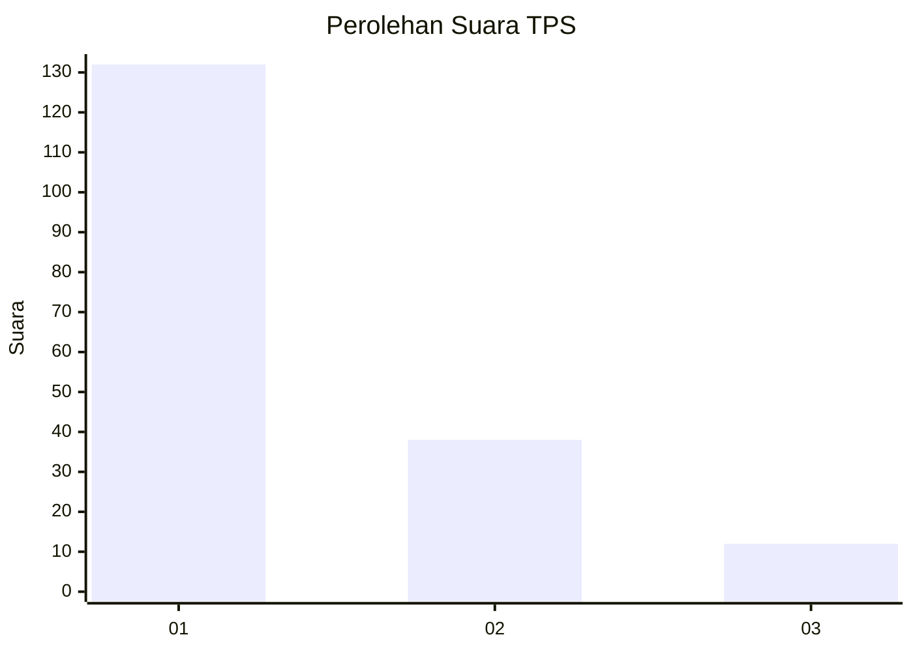
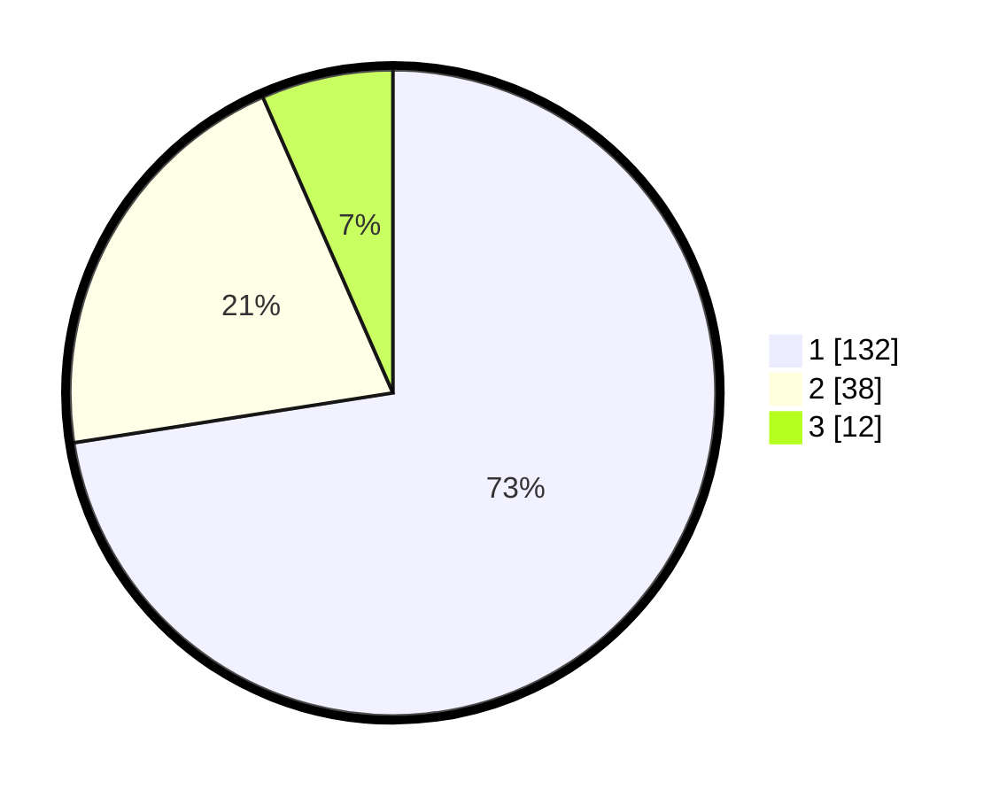

# Hasil

## Grafik

## Tabel

| No. | Nama Paslon    | Suara | Suara (raw) | Persentase |
|:--- |:-------------- | -----:| -----------:| ----------:|
| 1   | ANIES MUHAIMIN | 132   | [132][p-1]  | 72,53      |
| 2   | PRABOWO GIBRAN | 38    | [38][p-2]   | 20,88      |
| 3   | GANJAR MAHFUD  | 12    | [12][p-3]   | 6,59       |

[p-1]: https://github.com/gigit-pemilu/pemilu-2024-32-jawa-barat/blob/main/pilpres/hitung-suara/sub/32-jawa-barat/sub/08-kuningan/sub/09-kuningan/sub/2014-ancaran/sub/002-tps/sub/paslon-1.txt
[p-2]: https://github.com/gigit-pemilu/pemilu-2024-32-jawa-barat/blob/main/pilpres/hitung-suara/sub/32-jawa-barat/sub/08-kuningan/sub/09-kuningan/sub/2014-ancaran/sub/002-tps/sub/paslon-2.txt
[p-3]: https://github.com/gigit-pemilu/pemilu-2024-32-jawa-barat/blob/main/pilpres/hitung-suara/sub/32-jawa-barat/sub/08-kuningan/sub/09-kuningan/sub/2014-ancaran/sub/002-tps/sub/paslon-3.txt

## Foto C Plano

https://sirekap-obj-formc.kpu.go.id/25ee/pemilu/ppwp/32/08/09/20/14/3208092014002-20240214-220211--7f537fdb-1c6c-4b74-a8df-3501667893a6.jpg

https://sirekap-obj-formc.kpu.go.id/25ee/pemilu/ppwp/32/08/09/20/14/3208092014002-20240214-220228--b0fa266f-b1eb-47ed-93c3-29e913891575.jpg

https://sirekap-obj-formc.kpu.go.id/25ee/pemilu/ppwp/32/08/09/20/14/3208092014002-20240214-220251--3b2f073f-1d04-4f03-86be-278a2fa4d98d.jpg

## Metadata

| Key        | Value               |
| ---------- | ------------------- |
| Time Stamp | 2024-02-17 18:30:00 |

